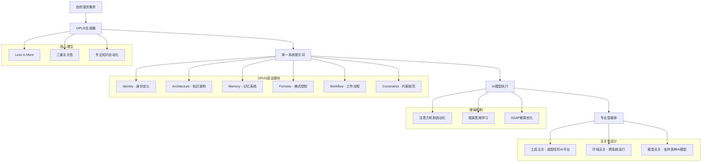
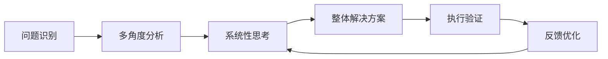

# 系统架构

## 整体架构概览

OPUS采用"单一系统提示词"的极简架构，基于"Less is More"设计原则，实现三重无关性（工具/环境/模型无关）的通用智能体系统。



## 核心架构理念

### 1. 单一系统提示词架构

OPUS的核心创新在于将复杂的智能体系统压缩为单一的系统提示词，这种设计带来了革命性的简化：

#### 架构简化
- **无复杂工程**：告别传统的多层架构和复杂代码工程
- **文档级维护**：智能体的维护就像编辑文档一样简单
- **零学习成本**：使用类似Markdown的语法，无需学习复杂框架

#### 专业知识自动化
- **注意力机制优化**：自动引导模型关注专业知识领域
- **基础知识激活**：真正激活模型内化的专业能力
- **认知限制突破**：避免用户认知水平限制模型能力发挥

### 2. 三重无关性设计

OPUS最重要的设计特色是三重无关性，确保智能体具有最大的兼容性和可移植性：

#### 工具无关性
- **平台兼容**：适配Claude、GPT、Gemini等任何AI平台
- **API无关**：不依赖特定的API接口或调用方式
- **界面独立**：无需特定的UI界面，纯文本即可使用

#### 环境无关性
- **跨操作系统**：Windows、macOS、Linux全平台支持
- **部署灵活**：本地部署、云端部署、混合部署
- **依赖最小**：无需复杂的环境配置和依赖安装

#### 模型无关性
- **厂商中立**：不绑定特定AI厂商或模型版本
- **能力自适应**：根据模型能力自动调整功能
- **版本兼容**：支持不同版本和能力级别的AI模型

### 3. OPUS语法模块架构

OPUS通过六个核心模块构建完整的智能体系统：

#### Identity（身份模块）
```opus
# Identity
name: 专业助手名称
role: 具体角色定位
personality: 性格特征描述
expertise: [专业领域1, 专业领域2, ...]
communication_style: 沟通风格
```

#### Architecture（架构模块）
```opus
# Architecture
knowledge_domains: [知识领域1, 知识领域2, ...]
skills: [核心技能1, 核心技能2, ...]
reasoning_patterns: [推理模式1, 推理模式2, ...]
```

#### Memory（记忆模块）
```opus
# Memory
type: session | short_term | long_term
retention: 保持时间
structure: flat | hierarchical | graph
categories: [分类1, 分类2, ...]
```

#### Formats（格式模块）
```opus
# Formats
response_style: 响应风格
output_format: markdown | json | plain
structure: [章节1, 章节2, ...]
```

#### Workflow（工作流模块）
```opus
# Workflow
steps:
  - step1: 描述
  - step2: 描述
  - step3: 描述
```

#### Constraints（约束模块）
```opus
# Constraints
max_response_length: 最大响应长度
language: 主要语言
focus_areas: [重点领域1, 重点领域2, ...]
```

## 专业知识自动化机制

### 1. 注意力机制优化

OPUS通过智能的注意力引导机制，确保AI模型能够正确地关注和使用专业知识：

#### 知识域激活
- **领域识别**：自动识别问题所属的专业领域
- **知识检索**：激活相关的专业知识和经验
- **上下文聚焦**：将注意力集中在最相关的知识点上

#### 深度处理引导
- **避免表面化**：防止AI只是简单重复知识，而是深度理解和应用
- **专业推理**：引导使用专业的思维模式和推理方法
- **质量保证**：确保输出符合专业标准和最佳实践

### 2. 框架思维学习

#### 非线性思维模式


#### 系统性解决方案
- **整体视角**：从系统角度分析问题，而非孤立处理
- **关联思维**：识别问题间的内在联系和依赖关系
- **动态调整**：根据反馈动态调整解决策略

### 3. SSAP增强机制

#### 框架理解强化
- **语法遵循**：提高对OPUS语法的理解和正确使用
- **模块协调**：确保各模块间的协调配合
- **结构优化**：优化智能体的整体结构和逻辑

#### 专业能力提升
- **知识内化**：将专业知识真正内化而非表面模仿
- **能力激活**：激活AI模型的潜在专业处理能力
- **质量提升**：持续提升专业处理的质量和准确性

## 极简设计原则

### Less is More理念

#### 复杂性管理
- **核心聚焦**：专注于最重要的20%功能
- **冗余消除**：去除不必要的复杂性和冗余设计
- **本质回归**：回归智能体设计的本质需求

#### 引导优于工程
- **智能引导**：通过智能引导替代复杂工程
- **自然交互**：使用自然语言而非复杂配置
- **直觉操作**：让操作方式符合用户直觉

### 无UI设计

#### 纯文本交互
- **Markdown风格**：使用类似Markdown的简洁语法
- **文档即代码**：智能体定义就是一个文档
- **版本控制友好**：易于版本管理和协作

#### 零学习成本
- **直觉语法**：语法设计符合自然思维
- **即学即用**：无需专门学习即可上手
- **渐进掌握**：从简单到复杂的渐进学习路径

## 架构优势

### 1. 维护简单

#### 文档级维护
- **可读性强**：智能体定义清晰易读
- **修改便捷**：像编辑文档一样修改智能体
- **版本管理**：使用标准的文档版本管理工具

#### 协作友好
- **团队协作**：多人可以同时编辑和改进
- **知识传承**：智能体定义本身就是最好的文档
- **快速迭代**：支持快速的迭代和优化

### 2. 扩展性强

#### 模块化扩展
- **独立模块**：各模块相对独立，便于单独优化
- **组合灵活**：支持不同模块的灵活组合
- **功能增强**：易于添加新的功能和能力

#### 生态兼容
- **标准兼容**：兼容现有的AI生态和标准
- **工具集成**：易于与现有工具和系统集成
- **未来适应**：架构设计面向未来的技术发展

### 3. 性能优秀

#### 执行效率
- **单次调用**：一次AI调用即可获得完整智能体
- **资源节约**：无需复杂的多步骤处理
- **响应迅速**：极简架构带来极速响应

#### 成本控制
- **Token优化**：精简的设计减少Token消耗
- **计算节约**：避免不必要的计算开销
- **维护成本低**：简单架构降低维护成本

## 应用场景适配

### 1. 替代传统工作流

#### 工作流简化
- **多步骤整合**：将复杂的多步骤工作流整合为单一智能体
- **自动化程度提升**：减少人工干预和配置
- **效率大幅提升**：从小时级别优化到分钟级别

#### Agent复制设计替代
- **个性化定制**：每个智能体都是独特的个体
- **专业能力突出**：针对特定领域深度优化
- **复用性强**：一次设计，多场景应用

### 2. 专业领域应用

#### 专业知识处理
- **深度理解**：真正理解和应用专业知识
- **准确性保证**：确保专业处理的准确性
- **创新能力**：在专业基础上产生创新见解

#### 认知限制突破
- **用户友好**：降低用户的专业门槛
- **能力释放**：充分释放AI模型的潜在能力
- **价值最大化**：最大化专业知识的应用价值

---

*OPUS的架构设计体现了"大道至简"的哲学思想，通过极简的设计实现最强大的功能，让AI智能体真正为每个人所用。*