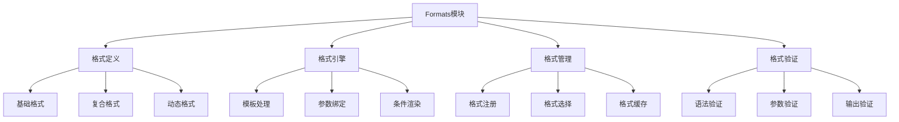

# Formats格式模块

Formats模块是OPUS智能体的输出控制中心，负责定义和管理智能体的输出格式。它确保智能体能够以结构化、一致性和用户友好的方式呈现信息。

## 设计理念

### 核心价值
- **结构化输出**：提供清晰、一致的信息结构
- **用户友好**：优化用户阅读和理解体验
- **可扩展性**：支持多种输出格式和自定义格式
- **上下文感知**：根据场景自动选择最适合的格式

### 设计原则
- **模板化**：预定义常用格式模板
- **参数化**：支持动态参数填充
- **层次化**：支持嵌套和分层格式
- **标准化**：遵循行业标准和最佳实践

## 格式架构

### 整体架构图


### 格式类型体系

#### 1. 基础格式 (Basic Formats)
最基本的格式单元，提供标准的输出结构。

```opus
# 基础信息格式
[Format.基础信息] = 📝 **{{标题}}**
📊 **内容**：{{内容}}
📅 **时间**：{{时间}}
👤 **作者**：{{作者}}

# 列表格式
[Format.列表] = 📋 **{{列表标题}}**
{{#items}}
• {{item}}
{{/items}}

# 状态格式
[Format.状态] = 🔄 **{{状态标题}}**
✅ **成功**：{{成功项}}
❌ **失败**：{{失败项}}
⏳ **进行中**：{{进行项}}
```

#### 2. 复合格式 (Composite Formats)
组合多个基础格式的复杂结构。

```opus
# 分析报告格式
[Format.分析报告] = 📊 **{{报告标题}}**
## 📝 概述
{{概述内容}}

## 📈 关键指标
{{指标列表}}

## 🔍 详细分析
{{分析内容}}

## 💡 建议
{{建议内容}}

# 任务进度格式
[Format.任务进度] = 🎯 **{{任务名称}}**
📊 **进度**：{{进度百分比}}%
📅 **期限**：{{截止日期}}
👤 **负责人**：{{负责人}}
📝 **状态**：{{当前状态}}

### 📋 子任务
{{子任务列表}}

### 🎉 完成情况
{{完成情况}}
```

#### 3. 动态格式 (Dynamic Formats)
根据条件和上下文动态调整的格式。

```opus
# 条件格式
[Format.条件格式] = 📝 **{{标题}}**
{{#if 有错误}}
❌ **错误**：{{错误信息}}
{{/if}}
{{#if 有警告}}
⚠️ **警告**：{{警告信息}}
{{/if}}
{{#if 有成功}}
✅ **成功**：{{成功信息}}
{{/if}}

# 自适应格式
[Format.自适应] = {{#if 简洁模式}}
{{简洁内容}}
{{else}}
{{详细内容}}
{{/if}}
```

## 格式定义语法

### 1. 基本语法

#### 格式声明
```opus
[Format.格式名称] = 格式内容
```

#### 参数引用
```opus
# 基本参数
{{参数名}}

# 对象参数
{{对象.属性}}

# 数组参数
{{数组[索引]}}

# 默认值
{{参数名 | 默认值}}
```

#### 条件语法
```opus
# 条件显示
{{#if 条件}}
显示内容
{{/if}}

# 条件分支
{{#if 条件1}}
内容1
{{elseif 条件2}}
内容2
{{else}}
内容3
{{/if}}

# 存在性检查
{{#if 变量}}
变量存在时显示
{{/if}}
```

#### 循环语法
```opus
# 基本循环
{{#each 数组}}
• {{this}}
{{/each}}

# 带索引循环
{{#each 数组}}
{{@index + 1}}. {{this}}
{{/each}}

# 对象循环
{{#each 对象}}
**{{@key}}**: {{this}}
{{/each}}
```

### 2. 高级语法

#### 函数调用
```opus
# 内置函数
{{format_date(时间, "YYYY-MM-DD")}}
{{upper(文本)}}
{{truncate(长文本, 100)}}

# 自定义函数
{{my_function(参数1, 参数2)}}
```

#### 格式继承
```opus
# 基础格式
[Format.基础] = 📝 **{{标题}}**
{{内容}}

# 继承格式
[Format.扩展] = {{> Format.基础}}
📅 **时间**：{{时间}}
```

#### 部分模板
```opus
# 定义部分模板
[Partial.头部] = 📝 **{{标题}}**
📅 **时间**：{{时间}}
---

# 使用部分模板
[Format.完整] = {{> Partial.头部}}
{{内容主体}}
```

## 常用格式模板

### 1. 信息展示格式

#### 基础信息格式
```opus
[Format.基础信息] = 📝 **{{标题}}**
📋 **描述**：{{描述}}
📅 **创建时间**：{{创建时间}}
👤 **创建者**：{{创建者}}
{{#if 标签}}
🏷️ **标签**：{{标签}}
{{/if}}
```

#### 详细信息格式
```opus
[Format.详细信息] = 📊 **{{标题}}**

## 📝 基本信息
- **ID**: {{id}}
- **名称**: {{名称}}
- **类型**: {{类型}}
- **状态**: {{状态}}

## 📋 详细描述
{{描述}}

{{#if 属性列表}}
## 🔧 属性
{{#each 属性列表}}
- **{{@key}}**: {{this}}
{{/each}}
{{/if}}

## 📅 时间信息
- **创建时间**: {{创建时间}}
- **更新时间**: {{更新时间}}
{{#if 过期时间}}
- **过期时间**: {{过期时间}}
{{/if}}
```

### 2. 任务管理格式

#### 任务卡片格式
```opus
[Format.任务卡片] = 🎯 **{{任务名称}}**
📊 **进度**: {{进度}}% {{#if 进度 >= 100}}✅{{else}}⏳{{/if}}
👤 **负责人**: {{负责人}}
📅 **截止日期**: {{截止日期}}
{{#if 优先级}}
🚨 **优先级**: {{优先级}}
{{/if}}

### 📝 描述
{{描述}}

{{#if 子任务}}
### 📋 子任务
{{#each 子任务}}
{{#if completed}}✅{{else}}⏳{{/if}} {{name}}
{{/each}}
{{/if}}
```

#### 任务报告格式
```opus
[Format.任务报告] = 📊 **任务执行报告**

## 📈 总体统计
- **总任务数**: {{总任务数}}
- **已完成**: {{已完成数量}} ({{完成率}}%)
- **进行中**: {{进行中数量}}
- **待开始**: {{待开始数量}}

## 🎯 关键任务
{{#each 关键任务}}
### {{名称}}
- **状态**: {{状态}}
- **进度**: {{进度}}%
- **负责人**: {{负责人}}
{{/each}}

## 📅 时间分析
- **计划时间**: {{计划时间}}
- **实际时间**: {{实际时间}}
- **时间偏差**: {{时间偏差}}

## 💡 建议
{{建议内容}}
```

### 3. 分析报告格式

#### 数据分析格式
```opus
[Format.数据分析] = 📊 **{{分析标题}}**

## 📋 数据概览
- **数据源**: {{数据源}}
- **数据量**: {{数据量}}
- **时间范围**: {{时间范围}}
- **分析维度**: {{分析维度}}

## 📈 关键指标
{{#each 关键指标}}
- **{{名称}}**: {{值}} {{#if 变化}}({{变化}}){{/if}}
{{/each}}

## 🔍 深度分析
{{#each 分析结果}}
### {{标题}}
{{内容}}
{{#if 图表}}
📊 图表：{{图表}}
{{/if}}
{{/each}}

## 💡 洞察与建议
{{#each 洞察}}
### {{标题}}
{{内容}}
{{#if 建议}}
**建议**: {{建议}}
{{/if}}
{{/each}}

## 📊 附录
{{#if 详细数据}}
### 详细数据
{{详细数据}}
{{/if}}
```

#### 错误报告格式
```opus
[Format.错误报告] = 🚨 **错误报告**

## 📋 错误概览
- **错误类型**: {{错误类型}}
- **错误级别**: {{错误级别}}
- **发生时间**: {{发生时间}}
- **影响范围**: {{影响范围}}

## 🔍 错误详情
### 错误描述
{{错误描述}}

### 错误位置
- **文件**: {{文件路径}}
- **行号**: {{行号}}
- **函数**: {{函数名}}

### 错误堆栈
```
{{错误堆栈}}
```

## 🔧 解决方案
{{#each 解决方案}}
### 方案 {{@index + 1}}
{{描述}}
{{#if 步骤}}
**步骤**:
{{#each 步骤}}
{{@index + 1}}. {{this}}
{{/each}}
{{/if}}
{{/each}}

## 📋 预防措施
{{#each 预防措施}}
- {{this}}
{{/each}}
```

### 4. 通信格式

#### 通知格式
```opus
[Format.通知] = 📢 **{{通知标题}}**

## 📝 通知内容
{{通知内容}}

## 📋 详细信息
{{#if 详细信息}}
{{详细信息}}
{{/if}}

## 🎯 相关人员
{{#each 相关人员}}
- {{姓名}} ({{角色}})
{{/each}}

## 📅 时间安排
{{#if 开始时间}}
- **开始时间**: {{开始时间}}
{{/if}}
{{#if 结束时间}}
- **结束时间**: {{结束时间}}
{{/if}}
{{#if 截止时间}}
- **截止时间**: {{截止时间}}
{{/if}}

## 📞 联系方式
{{#if 联系人}}
如有疑问，请联系：{{联系人}}
{{/if}}
```

#### 会议纪要格式
```opus
[Format.会议纪要] = 📝 **会议纪要**

## 📋 会议基本信息
- **会议主题**: {{会议主题}}
- **会议时间**: {{会议时间}}
- **会议地点**: {{会议地点}}
- **主持人**: {{主持人}}
- **记录人**: {{记录人}}

## 👥 参会人员
{{#each 参会人员}}
- {{姓名}} ({{部门}})
{{/each}}

## 📋 会议议程
{{#each 议程}}
### {{序号}}. {{标题}}
{{内容}}
{{#if 决议}}
**决议**: {{决议}}
{{/if}}
{{/each}}

## 🎯 行动项
{{#each 行动项}}
### {{标题}}
- **负责人**: {{负责人}}
- **截止时间**: {{截止时间}}
- **具体要求**: {{要求}}
{{/each}}

## 📅 下次会议
{{#if 下次会议}}
- **时间**: {{下次会议.时间}}
- **地点**: {{下次会议.地点}}
- **主要议题**: {{下次会议.议题}}
{{/if}}
```

## 格式引擎

### 1. 模板处理引擎

#### 模板编译
```opus
FN 编译模板({{模板字符串}}):
BEGIN
  {{词法分析}} = 词法分析({{模板字符串}})
  {{语法分析}} = 语法分析({{词法分析}})
  {{抽象语法树}} = 构建AST({{语法分析}})
  {{编译结果}} = 编译AST({{抽象语法树}})
  
  RETURN {{编译结果}}
END
```

#### 模板渲染
```opus
FN 渲染模板({{编译模板}}, {{数据对象}}):
BEGIN
  {{上下文}} = 创建渲染上下文({{数据对象}})
  {{渲染结果}} = 执行渲染({{编译模板}}, {{上下文}})
  {{后处理结果}} = 后处理({{渲染结果}})
  
  RETURN {{后处理结果}}
END
```

### 2. 参数绑定系统

#### 参数解析
```opus
FN 解析参数({{参数表达式}}, {{数据对象}}):
BEGIN
  {{参数路径}} = 解析参数路径({{参数表达式}})
  {{参数值}} = 获取参数值({{数据对象}}, {{参数路径}})
  {{默认值}} = 提取默认值({{参数表达式}})
  
  IF {{参数值}} 为空 AND {{默认值}} 不为空 THEN:
    {{参数值}} = {{默认值}}
  END
  
  RETURN {{参数值}}
END
```

#### 条件处理
```opus
FN 处理条件({{条件表达式}}, {{数据对象}}):
BEGIN
  {{条件值}} = 计算条件值({{条件表达式}}, {{数据对象}})
  {{布尔结果}} = 转换为布尔值({{条件值}})
  
  RETURN {{布尔结果}}
END
```

### 3. 格式验证系统

#### 语法验证
```opus
FN 验证格式语法({{格式定义}}):
BEGIN
  {{语法检查}} = 检查语法正确性({{格式定义}})
  {{参数检查}} = 检查参数有效性({{格式定义}})
  {{逻辑检查}} = 检查逻辑一致性({{格式定义}})
  
  IF 所有检查通过 THEN:
    RETURN 验证成功
  ELSE:
    RETURN 验证失败和错误信息
  END
END
```

#### 输出验证
```opus
FN 验证输出格式({{输出内容}}):
BEGIN
  {{结构检查}} = 检查输出结构({{输出内容}})
  {{格式检查}} = 检查格式一致性({{输出内容}})
  {{内容检查}} = 检查内容完整性({{输出内容}})
  
  {{验证结果}} = 综合验证结果({{结构检查}}, {{格式检查}}, {{内容检查}})
  
  RETURN {{验证结果}}
END
```

## 格式管理

### 1. 格式注册

#### 格式注册机制
```opus
FN 注册格式({{格式名称}}, {{格式定义}}):
BEGIN
  {{验证结果}} = 验证格式语法({{格式定义}})
  
  IF {{验证结果}}.成功 THEN:
    {{编译结果}} = 编译模板({{格式定义}})
    存储格式({{格式名称}}, {{编译结果}})
    更新格式索引({{格式名称}})
    
    RETURN 注册成功
  ELSE:
    RETURN 注册失败和错误信息
  END
END
```

#### 格式发现
```opus
FN 发现格式({{搜索条件}}):
BEGIN
  {{匹配格式}} = 搜索格式索引({{搜索条件}})
  {{排序结果}} = 按相关性排序({{匹配格式}})
  {{过滤结果}} = 过滤可用格式({{排序结果}})
  
  RETURN {{过滤结果}}
END
```

### 2. 格式选择

#### 智能格式选择
```opus
FN 选择格式({{输出类型}}, {{上下文信息}}):
BEGIN
  {{候选格式}} = 获取候选格式({{输出类型}})
  {{适配性评分}} = 评估格式适配性({{候选格式}}, {{上下文信息}})
  {{最佳格式}} = 选择最高评分格式({{适配性评分}})
  
  RETURN {{最佳格式}}
END
```

#### 格式适配评估
```opus
FN 评估格式适配性({{格式}}, {{上下文}}):
BEGIN
  {{类型匹配度}} = 计算类型匹配度({{格式}}, {{上下文}})
  {{复杂度匹配度}} = 计算复杂度匹配度({{格式}}, {{上下文}})
  {{用户偏好度}} = 计算用户偏好度({{格式}}, {{上下文}})
  
  {{综合评分}} = 加权计算({{类型匹配度}}, {{复杂度匹配度}}, {{用户偏好度}})
  
  RETURN {{综合评分}}
END
```

### 3. 格式缓存

#### 格式缓存管理
```opus
FN 管理格式缓存():
BEGIN
  {{缓存统计}} = 统计缓存使用情况()
  {{热点格式}} = 识别热点格式({{缓存统计}})
  {{冷格式}} = 识别冷格式({{缓存统计}})
  
  // 预热热点格式
  FOR each 格式 in {{热点格式}}:
    预编译格式({{格式}})
  END
  
  // 清理冷格式
  FOR each 格式 in {{冷格式}}:
    清理格式缓存({{格式}})
  END
END
```

## 自定义格式

### 1. 格式扩展

#### 自定义函数
```opus
# 注册自定义函数
[Function.format_currency] = 
FN format_currency({{金额}}, {{货币符号}}):
BEGIN
  {{格式化金额}} = 格式化数字({{金额}}, 2)
  RETURN {{货币符号}} + {{格式化金额}}
END

# 使用自定义函数
[Format.价格] = 💰 **价格**: {{format_currency(price, "¥")}}
```

#### 自定义过滤器
```opus
# 注册自定义过滤器
[Filter.truncate_words] = 
FN truncate_words({{文本}}, {{单词数}}):
BEGIN
  {{单词列表}} = 分割单词({{文本}})
  IF {{单词列表}}.长度 > {{单词数}} THEN:
    {{截取单词}} = 截取({{单词列表}}, {{单词数}})
    RETURN 连接({{截取单词}}) + "..."
  ELSE:
    RETURN {{文本}}
  END
END

# 使用自定义过滤器
[Format.摘要] = 📝 **摘要**: {{description | truncate_words(20)}}
```

### 2. 格式组合

#### 格式继承
```opus
# 基础格式
[Format.基础卡片] = 📋 **{{标题}}**
{{内容}}

# 继承并扩展
[Format.任务卡片] = {{> Format.基础卡片}}
🎯 **状态**: {{状态}}
📅 **截止日期**: {{截止日期}}

# 多重继承
[Format.详细任务卡片] = {{> Format.任务卡片}}
👤 **负责人**: {{负责人}}
📊 **进度**: {{进度}}%
```

#### 格式组合
```opus
# 定义格式组合
[Format.完整报告] = 
{{> Format.报告头部}}

{{> Format.执行摘要}}

{{> Format.详细分析}}

{{> Format.结论建议}}

{{> Format.附录}}
```

## 响应式格式

### 1. 设备适配

#### 屏幕尺寸适配
```opus
[Format.响应式列表] = 
{{#if 屏幕宽度 > 1200}}
{{> Format.详细列表}}
{{elseif 屏幕宽度 > 800}}
{{> Format.标准列表}}
{{else}}
{{> Format.简洁列表}}
{{/if}}
```

#### 输出媒介适配
```opus
[Format.多媒介] = 
{{#if 输出媒介 == "终端"}}
{{> Format.终端格式}}
{{elseif 输出媒介 == "网页"}}
{{> Format.HTML格式}}
{{elseif 输出媒介 == "邮件"}}
{{> Format.邮件格式}}
{{else}}
{{> Format.纯文本格式}}
{{/if}}
```

### 2. 用户偏好适配

#### 语言适配
```opus
[Format.多语言] = 
{{#if 语言 == "zh-CN"}}
📝 **标题**: {{标题}}
📋 **内容**: {{内容}}
{{elseif 语言 == "en-US"}}
📝 **Title**: {{标题}}
📋 **Content**: {{内容}}
{{/if}}
```

#### 详细程度适配
```opus
[Format.自适应详细] = 
{{#if 用户偏好.详细程度 == "简洁"}}
{{> Format.简洁版}}
{{elseif 用户偏好.详细程度 == "标准"}}
{{> Format.标准版}}
{{else}}
{{> Format.详细版}}
{{/if}}
```

## 性能优化

### 1. 编译优化

#### 预编译
```opus
FN 预编译常用格式():
BEGIN
  {{常用格式}} = 获取常用格式列表()
  
  FOR each 格式 in {{常用格式}}:
    {{编译结果}} = 编译模板({{格式}})
    缓存编译结果({{格式}}, {{编译结果}})
  END
END
```

### 2. 渲染优化

#### 惰性渲染
```opus
FN 惰性渲染({{格式}}, {{数据}}):
BEGIN
  {{渲染优先级}} = 评估渲染优先级({{格式}})
  
  IF {{渲染优先级}} == "高" THEN:
    立即渲染({{格式}}, {{数据}})
  ELSE:
    加入渲染队列({{格式}}, {{数据}})
  END
END
```

### 3. 缓存优化

#### 智能缓存
```opus
FN 智能缓存管理():
BEGIN
  {{访问模式}} = 分析访问模式()
  {{缓存策略}} = 制定缓存策略({{访问模式}})
  
  应用缓存策略({{缓存策略}})
  监控缓存效果()
END
```

## 最佳实践

### 1. 格式设计原则
- **一致性**：保持格式风格的一致性
- **可读性**：优先考虑用户阅读体验
- **简洁性**：避免不必要的复杂结构
- **可扩展性**：设计易于扩展的格式结构

### 2. 性能考虑
- **编译缓存**：缓存编译后的格式模板
- **渲染优化**：避免不必要的重复渲染
- **资源管理**：合理管理格式资源的生命周期

### 3. 维护建议
- **版本控制**：对格式进行版本管理
- **文档化**：详细记录格式的用途和参数
- **测试验证**：定期测试格式的正确性

---

*Formats模块是OPUS智能体的"表达方式"，它确保智能体能够以最适合的方式向用户展示信息，提供优秀的用户体验。*