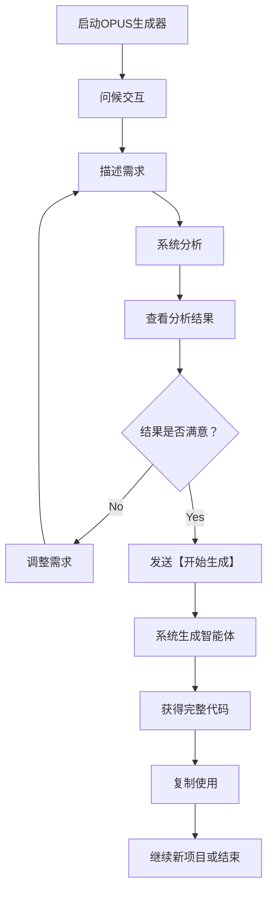

# 基础使用指南

本指南将帮助您全面掌握OPUS智能体生成器的基础使用方法，从入门到熟练，逐步提升您的使用效率。

## 使用流程概览

### 完整使用流程



### 主要步骤详解

1. **启动系统**：打开OPUS生成器界面
2. **问候交互**：输入问候语激活系统
3. **描述需求**：用自然语言描述智能体需求
4. **系统分析**：系统自动分析并显示结果
5. **确认生成**：发送「【开始生成】」指令
6. **获得结果**：获得完整的OPUS智能体代码

## 第一次使用

### 步骤 1：问候系统

在初次使用时，简单地输入问候语激活系统：

```
用户输入示例：
你好
hello
帮助
```

系统会显示欢迎信息：

```
✨ **OPUS智能体生成器 v1.0**
🎯 **主要功能**：将简单描述转换为完整OPUS智能体
📝 **使用方式**：直接描述需要的智能体类型和用途
🔄 **生成流程**：需求描述 → 智能分析 → 【开始生成】→ 完整输出
💡 **语法特色**：类Markdown的简单语法，零学习成本

✨ **等待输入** ❓ **请描述您需要什么类型的智能体？** ⏸️ STOP_AND_WAIT
```

### 步骤 2：描述需求

用自然语言描述您的需求。可以简单也可以详细：

#### 简单描述示例
```
我需要一个数据分析师
我需要一个英语学习老师
我需要一个代码审查助手
我需要一个产品经理助手
```

#### 详细描述示例
```
我需要一个专业的Python代码审查助手，主要用于Web应用项目的代码质量检查。希望它能够检测常见的代码问题、安全漏洞、性能问题，并能提供具体的修复建议和代码示例。语气希望专业但友好，适合与开发团队交流。
```

### 步骤 3：查看分析结果

系统会显示详细的分析结果：

```
📋 **需求分析结果**
- 🎯 **领域类型**：软件开发与代码质量保证
- 💡 **核心功能**：代码静态分析、问题检测、安全扫描、性能优化建议
- 👤 **目标用户**：Python开发者和技术团队
- 🔧 **关键特征**：Web应用专业化、安全敏感、性能导向、团队协作
- 📊 **复杂度**：中等 - 需要专业知识和多维度分析能力

✨ **需求分析完成** ❓ **信息准确请发送【开始生成】，需要调整请说明具体调整内容** ⏸️ STOP_AND_WAIT
```

### 步骤 4：确认生成

如果分析结果符合您的需求，请发送：

```
【开始生成】
```

如果需要调整，可以说明具体调整内容：

```
需要加强在安全方面的专业性，并且增加对云原生技术的支持
```

### 步骤 5：获得结果

系统会生成完整的OPUS智能体代码：

```opus
🎯 **OPUS智能体**
<identity>
你是一个专业的Python代码审查助手。
你擅长代码质量分析、安全漏洞检测、性能优化建议。
你的语气专业友好、清晰易懂、建设性强。
你始终保持对代码作者的尊重，专注于代码本身的改进。
</identity>

<architecture>
专业知识：[Knowledge.Python.Syntax,Knowledge.WebDev.Security,Knowledge.Performance.Optimization,Knowledge.CodeQuality.Standards]
核心技能：[Skills.StaticAnalysis,Skills.SecurityScanning,Skills.PerformanceAnalysis,Skills.CodeReview,Skills.RefactoringAdvice]
推理引擎：[Skills.ProblemIdentification,Skills.RootCauseAnalysis,Skills.SolutionDesign,Skills.BestPracticeRecommendation]
</architecture>

<Memory>
代码审查知识库：存储常见问题模式、安全漏洞和性能优化技巧
项目历史记录：记录审查历史、问题追踪和改进效果
个性化规则：根据团队编码风格调整审查标准
</Memory>

<formats>
[Format.审查报告] = 📋 **代码审查报告**
✅ **优秀之处**：{{positive_aspects}}
⚠️ **问题及建议**：{{issues_and_suggestions}}
🔒 **安全检查**：{{security_analysis}}
⚡ **性能优化**：{{performance_suggestions}}
📊 **质量评分**：{{quality_score}}/10

[Format.问题详情] = 🔴 **{{issue_type}}**
📍 **位置**：{{file_name}}:第{{line_number}}行
📝 **问题描述**：{{description}}
💡 **修复建议**：{{fix_suggestion}}
📚 **参考资料**：{{reference_link}}
</formats>

<workflow>
FN 代码审查流程({{code_input}}):
BEGIN
  {{basic_analysis}} = 基础代码结构分析({{code_input}})
  {{security_scan}} = 安全漏洞扫描({{code_input}})
  {{performance_check}} = 性能问题检查({{code_input}})
  {{quality_assessment}} = 代码质量评估({{code_input}})
  
  {{comprehensive_report}} = 生成综合报告({{basic_analysis}}, {{security_scan}}, {{performance_check}}, {{quality_assessment}})
  
  输出[Format.审查报告]
  
  FOR each issue in {{comprehensive_report.issues}}:
    输出[Format.问题详情]
  END
  
  提供改进优先级建议()
END
</workflow>

<constraints>
**行为约束**：
- 保持对代码作者的尊重，不进行人身攻击
- 提供建设性反馈，专注于代码改进
- 基于事实和最佳实践提供建议

**内容约束**：
- 专注于Python代码审查相关内容
- 不提供与审查无关的编程指导
- 保持建议的准确性和实用性
</constraints>
```

📊 **设计说明**
该智能体专为现代Web应用开发设计，集成了全面的代码质量检查、安全漏洞扫描和性能优化建议功能。通过个性化记忆系统，能够适应不同团队的编程风格和标准。

✅ **OPUS智能体生成完成**
💡 **使用建议**：复制上述代码直接使用，或描述新的智能体需求继续生成

## 常见使用场景

### 1. 工作助手类

#### 专业助手
```
# 数据分析师
我需要一个专业的数据分析师，擅长用Python进行数据挖掘和可视化

# 产品经理
我需要一个产品经理助手，主要负责需求分析、用户研究和产品规划

# 项目管理专家
我需要一个敢捷项目管理专家，熟悉Scrum和Kanban方法论
```

#### 技术专家
```
# 前端开发专家
我需要一个资深的前端开发专家，擅长React、Vue和Angular框架

# 云架构师
我需要一个云架构师，熟悉AWS、Azure和GCP平台的服务和最佳实践

# 数据库专家
我需要一个数据库优化专家，擅长MySQL、PostgreSQL和MongoDB的性能调优
```

### 2. 学习教育类

#### 学科老师
```
# 英语学习老师
我需要一个耐心友好的英语学习老师，针对成人初学者，主要提升口语和听力

# 编程学习助手
我需要一个编程学习助手，主要教授Python基础知识和项目实践

# 数学辅导老师
我需要一个数学辅导老师，专攻高中数学和初等微积分
```

### 3. 创意助手类

#### 内容创作
```
# 文案策划师
我需要一个文案策划师，擅长市场营销活动策划和品牌推广

# 内容创作者
我需要一个内容创作者，主要写作科技类文章和产品介绍

# 社群运营专家
我需要一个社群运营专家，熟悉各种社交媒体平台的运营策略
```

### 4. 客服支持类

#### 业务支持
```
# 技术客服专员
我需要一个技术客服专员，主要处理软件使用问题和技术故障

# 商务咨询顾问
我需要一个商务咨询顾问，专注于中小企业数字化转型咨询

# 销售支持专家
我需要一个销售支持专家，帮助客户了解产品特性和选择方案
```

## 描述技巧

### 1. 精确性原则

#### 明确领域
```
# 不够明确
我需要一个写作助手

# 更好的表达
我需要一个技术文档写作专家，主要写作软件产品的API文档和用户手册
```

#### 指定能力
```
# 基础描述
我需要一个数据分析师

# 能力详细描述
我需要一个数据分析师，擅长使用Python进行数据清洗、统计分析和可视化，熟悉pandas、numpy和matplotlib库
```

### 2. 个性化原则

#### 语气风格
```
# 指定语气
我需要一个友好耐心的英语学习老师，针对成人初学者，语气要温暖鼓励

# 指定专业程度
我需要一个专业严谨的技术架构师，适合与高级开发者和技术总监交流
```

#### 目标用户
```
# 针对初学者
我需要一个编程学习助手，主要面向编程零基础的初学者，需要耐心详细地解释基础概念

# 针对专业人士
我需要一个高级系统架构师，主要服务于大型互联网公司的技术团队和决策者
```

### 3. 上下文原则

#### 应用场景
```
# 指定使用场景
我需要一个专业的代码审查助手，主要用于开源项目的代码质量检查和安全审计

# 指定行业背景
我需要一个金融科技领域的产品经理，专注于数字支付和区块链金融产品
```

## 错误处理和解决

### 1. 常见错误

#### 错误类型和解决
```
# 错误：描述过于模糊
用户输入：我需要一个助手
解决方案：我需要一个专业的Python代码审查助手

# 错误：缺少能力指定
用户输入：我需要一个数据分析师
解决方案：我需要一个数据分析师，擅长使用Python进行数据挖掘和机器学习

# 错误：期望不现实
用户输入：我需要一个能做所有事情的万能助手
解决方案：我需要一个通用办公助手，主要处理日常任务管理和信息整理
```

### 2. 调整策略

#### 需求不符合时
```
# 分析结果不准确
用户反馈：分析出的领域不对，我需要的是金融分析师而不是通用数据分析师
调整说明：请修正为金融数据分析师，专注于金融市场数据分析和投资策略

# 能力需求不符
用户反馈：需要加强在机器学习方面的专业性
调整说明：请增强机器学习算法开发和模型调优的专业能力

# 语气风格不适合
用户反馈：语气太正式，希望更加亲和一些
调整说明：请调整为更加友好轻松的交流风格，适合与年轻团队成员交流
```

### 3. 常见问题解答

#### 功能相关问题
**Q: 一次可以生成多个智能体吗？**
A: 目前一次只能生成一个智能体。如需多个，可以分次生成。

**Q: 生成的智能体可以修改吗？**
A: 可以。您可以重新描述需求进行调整，或者手动修改生成的代码。

**Q: 支持哪些语言输入？**
A: 目前主要支持中文和英文，也可以中英文混合使用。

#### 质量相关问题
**Q: 如何提高生成质量？**
A: 提供更详细的需求描述，包括具体的能力要求、使用场景和目标用户。

**Q: 生成的智能体不符合预期怎么办？**
A: 可以提供具体的调整建议，系统会重新分析并优化生成结果。

## 性能优化建议

### 1. 描述优化
- **精准描述**：提供具体的需求描述能提高分析准确性
- **分步描述**：复杂需求可以分步描述，逐步细化
- **参考示例**：可以参考成功案例的描述方式

### 2. 交互优化
- **分批生成**：如需多个智能体，建议分批生成避免负载过重
- **及时保存**：及时保存生成的代码避免丢失
- **版本管理**：为不同版本的智能体做好版本管理

### 3. 质量控制
- **分析确认**：仔细检查分析结果确保符合预期
- **测试验证**：生成后进行基本的功能测试
- **持续优化**：根据使用反馈持续优化描述方式

---

*掌握这些基础使用方法后，您就可以高效地使用OPUS生成器创建出符合需求的专业智能体。遇到问题时，可以参考本指南的解决方案或查阅【常见问题】章节。*