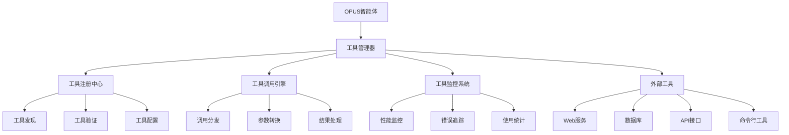

# 外部工具集成

OPUS智能体通过标准化的外部工具接口，能够集成各种第三方服务和工具，大幅扩展智能体的功能边界。本文档详细介绍外部工具的集成方法、管理机制和最佳实践。

## 工具集成架构

### 整体设计



### 核心组件

#### 1. 工具管理器
负责工具的生命周期管理和统一调度。

```opus
<architecture>
工具管理器：[ToolManager.registry, ToolManager.executor, ToolManager.monitor]
管理能力：
  - 工具自动发现和注册
  - 工具调用路由和分发
  - 工具状态监控和管理
  - 工具安全验证和控制
</architecture>
```

#### 2. 工具接口标准
定义统一的工具接口规范和调用协议。

```opus
<constraints>
**工具接口标准**：
- 统一的工具描述格式
- 标准化的参数和返回值规范
- 一致的错误处理机制
- 安全的权限控制体系
</constraints>
```

## 工具注册和发现

### 工具注册机制

```opus
FN 工具注册流程({{工具描述}}, {{工具实现}}):
BEGIN
  // 1. 工具描述验证
  {{描述验证}} = 验证工具描述格式({{工具描述}})
  IF NOT {{描述验证}}.有效 THEN:
    RETURN 注册失败("工具描述格式无效")
  END
  
  // 2. 工具实现验证
  {{实现验证}} = 验证工具实现({{工具实现}})
  IF NOT {{实现验证}}.有效 THEN:
    RETURN 注册失败("工具实现验证失败")
  END
  
  // 3. 安全性检查
  {{安全检查}} = 执行安全性检查({{工具描述}}, {{工具实现}})
  IF NOT {{安全检查}}.安全 THEN:
    RETURN 注册失败("安全检查失败")
  END
  
  // 4. 兼容性测试
  {{兼容性测试}} = 执行兼容性测试({{工具实现}})
  IF NOT {{兼容性测试}}.兼容 THEN:
    RETURN 注册失败("兼容性测试失败")
  END
  
  // 5. 工具注册
  {{工具ID}} = 生成工具唯一标识()
  {{注册信息}} = 创建工具注册信息({{工具ID}}, {{工具描述}}, {{工具实现}})
  
  存储工具注册信息({{工具ID}}, {{注册信息}})
  更新工具索引({{工具ID}}, {{工具描述}})
  
  记录注册事件({{工具ID}}, "注册成功")
  
  RETURN 注册成功({{工具ID}})
END
```

### 工具描述格式

```opus
# 标准工具描述格式
[Tool.工具名称] = {
  名称: "工具名称",
  版本: "1.0.0",
  描述: "工具功能描述",
  分类: "工具分类",
  
  参数: {
    必需参数: [
      {名称: "参数名", 类型: "参数类型", 描述: "参数描述"}
    ],
    可选参数: [
      {名称: "参数名", 类型: "参数类型", 描述: "参数描述", 默认值: "默认值"}
    ]
  },
  
  返回值: {
    类型: "返回类型",
    结构: "返回值结构描述",
    示例: "返回值示例"
  },
  
  错误码: {
    "错误码": "错误描述"
  },
  
  权限要求: ["权限1", "权限2"],
  依赖服务: ["服务1", "服务2"],
  
  配置选项: {
    "配置项": "配置说明"
  }
}
```

### 动态工具发现

```opus
FN 动态工具发现():
BEGIN
  {{发现策略}} = 获取工具发现策略()
  {{新工具列表}} = []
  
  FOR each 策略 in {{发现策略}}:
    SWITCH {{策略}}.类型:
      CASE "目录扫描":
        {{目录工具}} = 扫描工具目录({{策略}}.路径)
        合并工具列表({{新工具列表}}, {{目录工具}})
      
      CASE "服务注册中心":
        {{注册中心工具}} = 查询服务注册中心({{策略}}.端点)
        合并工具列表({{新工具列表}}, {{注册中心工具}})
      
      CASE "API发现":
        {{API工具}} = 发现API工具({{策略}}.API端点)
        合并工具列表({{新工具列表}}, {{API工具}})
      
      CASE "插件市场":
        {{市场工具}} = 查询插件市场({{策略}}.市场地址)
        合并工具列表({{新工具列表}}, {{市场工具}})
    END
  END
  
  // 去重和验证
  {{去重工具}} = 去除重复工具({{新工具列表}})
  {{验证工具}} = 验证工具有效性({{去重工具}})
  
  // 注册新发现的工具
  FOR each 工具 in {{验证工具}}:
    IF 工具未注册({{工具}}) THEN:
      {{注册结果}} = 工具注册流程({{工具}}.描述, {{工具}}.实现)
      记录发现日志({{工具}}, {{注册结果}})
    END
  END
  
  RETURN {{验证工具}}
END
```

## 常用工具类型

### 1. Web服务工具

#### HTTP API调用工具
```opus
[Tool.HttpApi] = {
  名称: "HTTP API调用器",
  描述: "调用HTTP/HTTPS API服务",
  
  参数: {
    必需参数: [
      {名称: "url", 类型: "string", 描述: "API端点URL"},
      {名称: "method", 类型: "string", 描述: "HTTP方法(GET/POST/PUT/DELETE)"}
    ],
    可选参数: [
      {名称: "headers", 类型: "object", 描述: "HTTP头部", 默认值: {}},
      {名称: "params", 类型: "object", 描述: "查询参数", 默认值: {}},
      {名称: "data", 类型: "object", 描述: "请求体数据", 默认值: null},
      {名称: "timeout", 类型: "number", 描述: "超时时间(秒)", 默认值: 30}
    ]
  },
  
  返回值: {
    类型: "object",
    结构: "{status: number, data: any, headers: object}",
    示例: "{status: 200, data: {...}, headers: {...}}"
  }
}

FN HTTP_API调用({{url}}, {{method}}, {{options}}):
BEGIN
  {{请求配置}} = 构建请求配置({{url}}, {{method}}, {{options}})
  {{安全检查}} = 验证请求安全性({{请求配置}})
  
  IF NOT {{安全检查}}.安全 THEN:
    RETURN 错误响应("请求被安全策略拒绝")
  END
  
  TRY:
    {{响应}} = 发送HTTP请求({{请求配置}})
    {{处理响应}} = 处理响应数据({{响应}})
    
    记录API调用日志({{url}}, {{method}}, {{响应}}.状态码)
    
    RETURN {{处理响应}}
  CATCH HttpError as e:
    记录错误日志({{url}}, {{method}}, {{e}})
    RETURN 错误响应({{e}}.信息)
  END
END
```

#### WebSocket连接工具
```opus
[Tool.WebSocket] = {
  名称: "WebSocket连接器",
  描述: "建立和管理WebSocket连接",
  
  参数: {
    必需参数: [
      {名称: "url", 类型: "string", 描述: "WebSocket端点URL"}
    ],
    可选参数: [
      {名称: "protocols", 类型: "array", 描述: "支持的协议", 默认值: []},
      {名称: "headers", 类型: "object", 描述: "连接头部", 默认值: {}},
      {名称: "timeout", 类型: "number", 描述: "连接超时时间", 默认值: 10}
    ]
  }
}

FN WebSocket连接管理({{url}}, {{操作}}, {{数据}}):
BEGIN
  SWITCH {{操作}}:
    CASE "连接":
      {{连接配置}} = 构建连接配置({{url}}, {{数据}})
      {{连接}} = 建立WebSocket连接({{连接配置}})
      注册连接处理器({{连接}})
      RETURN {{连接}}.ID
    
    CASE "发送":
      {{连接}} = 获取连接({{数据}}.连接ID)
      {{发送结果}} = {{连接}}.发送({{数据}}.消息)
      RETURN {{发送结果}}
    
    CASE "断开":
      {{连接}} = 获取连接({{数据}}.连接ID)
      {{连接}}.关闭()
      清理连接资源({{数据}}.连接ID)
      RETURN 断开成功
  END
END
```

### 2. 数据库工具

#### SQL数据库工具
```opus
[Tool.SqlDatabase] = {
  名称: "SQL数据库连接器",
  描述: "连接和操作SQL数据库",
  
  参数: {
    必需参数: [
      {名称: "connection_string", 类型: "string", 描述: "数据库连接字符串"},
      {名称: "query", 类型: "string", 描述: "SQL查询语句"}
    ],
    可选参数: [
      {名称: "parameters", 类型: "array", 描述: "查询参数", 默认值: []},
      {名称: "timeout", 类型: "number", 描述: "查询超时时间", 默认值: 30}
    ]
  }
}

FN SQL数据库操作({{连接字符串}}, {{查询}}, {{参数}}):
BEGIN
  {{连接}} = 获取数据库连接({{连接字符串}})
  {{查询验证}} = 验证SQL查询安全性({{查询}})
  
  IF NOT {{查询验证}}.安全 THEN:
    RETURN 错误响应("SQL查询包含不安全操作")
  END
  
  TRY:
    {{预处理语句}} = 准备预处理语句({{连接}}, {{查询}})
    {{执行结果}} = 执行查询({{预处理语句}}, {{参数}})
    {{格式化结果}} = 格式化查询结果({{执行结果}})
    
    记录数据库操作日志({{查询}}, {{执行结果}}.影响行数)
    
    RETURN {{格式化结果}}
  CATCH DatabaseError as e:
    记录数据库错误({{查询}}, {{e}})
    RETURN 错误响应({{e}}.信息)
  FINALLY:
    释放数据库连接({{连接}})
  END
END
```

#### NoSQL数据库工具
```opus
[Tool.NoSqlDatabase] = {
  名称: "NoSQL数据库连接器",
  描述: "连接和操作NoSQL数据库",
  
  参数: {
    必需参数: [
      {名称: "database_type", 类型: "string", 描述: "数据库类型(MongoDB/Redis/etc)"},
      {名称: "connection_config", 类型: "object", 描述: "连接配置"},
      {名称: "operation", 类型: "string", 描述: "操作类型"},
      {名称: "collection", 类型: "string", 描述: "集合/表名"}
    ]
  }
}

FN NoSQL数据库操作({{数据库类型}}, {{连接配置}}, {{操作}}, {{集合}}, {{数据}}):
BEGIN
  {{数据库驱动}} = 获取数据库驱动({{数据库类型}})
  {{连接}} = {{数据库驱动}}.连接({{连接配置}})
  
  SWITCH {{操作}}:
    CASE "查询":
      {{查询结果}} = {{连接}}.查询({{集合}}, {{数据}}.查询条件)
      RETURN 格式化结果({{查询结果}})
    
    CASE "插入":
      {{插入结果}} = {{连接}}.插入({{集合}}, {{数据}}.文档)
      RETURN {{插入结果}}
    
    CASE "更新":
      {{更新结果}} = {{连接}}.更新({{集合}}, {{数据}}.条件, {{数据}}.更新内容)
      RETURN {{更新结果}}
    
    CASE "删除":
      {{删除结果}} = {{连接}}.删除({{集合}}, {{数据}}.条件)
      RETURN {{删除结果}}
  END
END
```

### 3. 文件处理工具

#### 文件操作工具
```opus
[Tool.FileOperations] = {
  名称: "文件操作器",
  描述: "执行文件系统操作",
  
  参数: {
    必需参数: [
      {名称: "operation", 类型: "string", 描述: "操作类型"},
      {名称: "path", 类型: "string", 描述: "文件路径"}
    ],
    可选参数: [
      {名称: "content", 类型: "string", 描述: "文件内容"},
      {名称: "encoding", 类型: "string", 描述: "编码格式", 默认值: "utf-8"}
    ]
  }
}

FN 文件操作执行({{操作}}, {{路径}}, {{选项}}):
BEGIN
  {{路径验证}} = 验证文件路径安全性({{路径}})
  IF NOT {{路径验证}}.安全 THEN:
    RETURN 错误响应("文件路径不安全")
  END
  
  {{权限检查}} = 检查文件操作权限({{操作}}, {{路径}})
  IF NOT {{权限检查}}.允许 THEN:
    RETURN 错误响应("权限不足")
  END
  
  SWITCH {{操作}}:
    CASE "读取":
      {{文件内容}} = 读取文件({{路径}}, {{选项}}.编码)
      RETURN {{文件内容}}
    
    CASE "写入":
      {{写入结果}} = 写入文件({{路径}}, {{选项}}.内容, {{选项}}.编码)
      RETURN {{写入结果}}
    
    CASE "删除":
      {{删除结果}} = 删除文件({{路径}})
      RETURN {{删除结果}}
    
    CASE "复制":
      {{复制结果}} = 复制文件({{路径}}, {{选项}}.目标路径)
      RETURN {{复制结果}}
    
    CASE "移动":
      {{移动结果}} = 移动文件({{路径}}, {{选项}}.目标路径)
      RETURN {{移动结果}}
  END
END
```

### 4. 通信工具

#### 邮件发送工具
```opus
[Tool.EmailSender] = {
  名称: "邮件发送器",
  描述: "发送电子邮件",
  
  参数: {
    必需参数: [
      {名称: "to", 类型: "array", 描述: "收件人邮箱列表"},
      {名称: "subject", 类型: "string", 描述: "邮件主题"},
      {名称: "body", 类型: "string", 描述: "邮件正文"}
    ],
    可选参数: [
      {名称: "cc", 类型: "array", 描述: "抄送列表", 默认值: []},
      {名称: "bcc", 类型: "array", 描述: "密送列表", 默认值: []},
      {名称: "attachments", 类型: "array", 描述: "附件列表", 默认值: []}
    ]
  }
}

FN 邮件发送流程({{收件人}}, {{主题}}, {{正文}}, {{选项}}):
BEGIN
  {{邮件验证}} = 验证邮件内容({{收件人}}, {{主题}}, {{正文}})
  IF NOT {{邮件验证}}.有效 THEN:
    RETURN 发送失败({{邮件验证}}.错误信息)
  END
  
  {{邮件配置}} = 获取邮件服务配置()
  {{邮件客户端}} = 创建邮件客户端({{邮件配置}})
  
  {{邮件对象}} = 构建邮件对象({
    收件人: {{收件人}},
    主题: {{主题}},
    正文: {{正文}},
    抄送: {{选项}}.抄送,
    密送: {{选项}}.密送,
    附件: {{选项}}.附件
  })
  
  TRY:
    {{发送结果}} = {{邮件客户端}}.发送({{邮件对象}})
    记录邮件发送日志({{收件人}}, {{主题}}, {{发送结果}})
    RETURN 发送成功({{发送结果}})
  CATCH EmailError as e:
    记录发送错误({{收件人}}, {{主题}}, {{e}})
    RETURN 发送失败({{e}}.信息)
  END
END
```

## 工具调用管理

### 调用路由和分发

```opus
FN 工具调用路由({{工具名称}}, {{调用参数}}, {{调用上下文}}):
BEGIN
  // 1. 工具解析
  {{工具信息}} = 解析工具名称({{工具名称}})
  IF NOT {{工具信息}}.存在 THEN:
    RETURN 调用失败("工具不存在")
  END
  
  // 2. 参数验证
  {{参数验证}} = 验证调用参数({{调用参数}}, {{工具信息}}.参数规范)
  IF NOT {{参数验证}}.有效 THEN:
    RETURN 调用失败("参数验证失败: " + {{参数验证}}.错误信息)
  END
  
  // 3. 权限检查
  {{权限检查}} = 检查调用权限({{调用上下文}}, {{工具信息}}.权限要求)
  IF NOT {{权限检查}}.通过 THEN:
    RETURN 调用失败("权限不足")
  END
  
  // 4. 负载均衡
  {{工具实例}} = 选择工具实例({{工具名称}}, {{调用上下文}})
  IF NOT {{工具实例}}.可用 THEN:
    RETURN 调用失败("工具实例不可用")
  END
  
  // 5. 调用执行
  {{调用开始时间}} = 获取当前时间()
  {{调用结果}} = 执行工具调用({{工具实例}}, {{调用参数}})
  {{调用耗时}} = 计算调用耗时({{调用开始时间}})
  
  // 6. 结果处理
  {{处理结果}} = 处理调用结果({{调用结果}}, {{工具信息}}.返回值规范)
  
  // 7. 调用记录
  记录工具调用({{工具名称}}, {{调用参数}}, {{处理结果}}, {{调用耗时}})
  
  RETURN {{处理结果}}
END
```

### 批量工具调用

```opus
FN 批量工具调用({{调用列表}}, {{执行选项}}):
BEGIN
  {{执行计划}} = 制定批量执行计划({{调用列表}}, {{执行选项}})
  {{结果收集器}} = 创建结果收集器()
  
  IF {{执行选项}}.并行执行 THEN:
    // 并行执行
    {{并行任务}} = []
    FOR each 调用项 in {{调用列表}}:
      {{异步任务}} = 启动异步工具调用({{调用项}})
      添加任务({{并行任务}}, {{异步任务}})
    END
    
    FOR each 异步任务 in {{并行任务}}:
      {{任务结果}} = AWAIT {{异步任务}}
      {{结果收集器}}.添加结果({{任务结果}})
    END
  ELSE:
    // 顺序执行
    FOR each 调用项 in {{调用列表}}:
      {{调用结果}} = 工具调用路由({{调用项}}.工具, {{调用项}}.参数, {{调用项}}.上下文)
      {{结果收集器}}.添加结果({{调用结果}})
      
      // 检查是否需要中断
      IF {{执行选项}}.失败中断 AND {{调用结果}}.失败 THEN:
        记录批量调用中断({{调用项}}, {{调用结果}})
        BREAK
      END
    END
  END
  
  {{汇总结果}} = {{结果收集器}}.汇总结果()
  RETURN {{汇总结果}}
END
```

## 工具安全管理

### 安全策略

```opus
<constraints>
**工具安全策略**：
- 工具调用权限最小化原则
- 工具输入参数严格验证
- 工具输出结果安全检查
- 工具执行资源限制
- 工具调用审计日志记录
</constraints>
```

### 权限控制

```opus
FN 工具权限控制({{用户身份}}, {{工具名称}}, {{操作类型}}):
BEGIN
  {{用户权限}} = 获取用户权限({{用户身份}})
  {{工具权限要求}} = 获取工具权限要求({{工具名称}}, {{操作类型}})
  
  // 基础权限检查
  {{基础检查}} = 检查基础权限({{用户权限}}, {{工具权限要求}}.基础权限)
  IF NOT {{基础检查}}.通过 THEN:
    RETURN 权限拒绝("基础权限不足")
  END
  
  // 特殊权限检查
  FOR each 特殊权限 in {{工具权限要求}}.特殊权限:
    {{特殊检查}} = 检查特殊权限({{用户权限}}, {{特殊权限}})
    IF NOT {{特殊检查}}.通过 THEN:
      RETURN 权限拒绝("特殊权限不足: " + {{特殊权限}})
    END
  END
  
  // 时间限制检查
  IF {{工具权限要求}}.时间限制 存在 THEN:
    {{时间检查}} = 检查时间限制({{工具权限要求}}.时间限制)
    IF NOT {{时间检查}}.通过 THEN:
      RETURN 权限拒绝("超出时间限制")
    END
  END
  
  // 频率限制检查
  {{频率检查}} = 检查调用频率({{用户身份}}, {{工具名称}})
  IF NOT {{频率检查}}.通过 THEN:
    RETURN 权限拒绝("调用频率超限")
  END
  
  记录权限检查结果({{用户身份}}, {{工具名称}}, "权限通过")
  RETURN 权限通过()
END
```

### 安全审计

```opus
FN 工具安全审计({{审计范围}}, {{审计级别}}):
BEGIN
  {{审计结果}} = {
    权限违规: [],
    异常调用: [],
    安全事件: [],
    风险评估: {}
  }
  
  // 权限违规审计
  {{权限日志}} = 获取权限检查日志({{审计范围}})
  {{审计结果}}.权限违规 = 分析权限违规({{权限日志}})
  
  // 异常调用审计
  {{调用日志}} = 获取工具调用日志({{审计范围}})
  {{审计结果}}.异常调用 = 检测异常调用模式({{调用日志}})
  
  // 安全事件审计
  {{安全日志}} = 获取安全事件日志({{审计范围}})
  {{审计结果}}.安全事件 = 分析安全事件({{安全日志}})
  
  // 综合风险评估
  {{审计结果}}.风险评估 = 评估综合安全风险({{审计结果}})
  
  // 生成审计报告
  {{审计报告}} = 生成安全审计报告({{审计结果}})
  
  // 风险预警
  IF {{审计结果}}.风险评估.风险级别 > 中等风险 THEN:
    触发安全预警({{审计结果}}.风险评估)
  END
  
  RETURN {{审计报告}}
END
```

## 工具监控和优化

### 性能监控

```opus
FN 工具性能监控():
BEGIN
  {{监控指标}} = {
    调用统计: 统计工具调用次数(),
    响应时间: 计算平均响应时间(),
    成功率: 计算调用成功率(),
    错误分布: 分析错误类型分布(),
    资源使用: 监控资源使用情况(),
    并发度: 监控并发调用数量()
  }
  
  // 性能异常检测
  {{异常检测}} = 检测性能异常({{监控指标}})
  FOR each 异常 in {{异常检测}}.异常列表:
    处理性能异常({{异常}})
  END
  
  // 容量预警
  {{容量分析}} = 分析容量使用情况({{监控指标}})
  IF {{容量分析}}.需要扩容 THEN:
    触发容量预警({{容量分析}})
  END
  
  // 更新监控面板
  更新工具监控面板({{监控指标}})
  
  RETURN {{监控指标}}
END
```

### 自动优化

```opus
FN 工具自动优化():
BEGIN
  {{优化建议}} = []
  
  // 性能优化分析
  {{性能数据}} = 收集性能数据()
  {{性能优化}} = 分析性能优化机会({{性能数据}})
  合并优化建议({{优化建议}}, {{性能优化}})
  
  // 缓存优化分析
  {{缓存数据}} = 收集缓存使用数据()
  {{缓存优化}} = 分析缓存优化策略({{缓存数据}})
  合并优化建议({{优化建议}}, {{缓存优化}})
  
  // 负载均衡优化
  {{负载数据}} = 收集负载分布数据()
  {{负载优化}} = 分析负载均衡优化({{负载数据}})
  合并优化建议({{优化建议}}, {{负载优化}})
  
  // 执行自动优化
  FOR each 建议 in {{优化建议}}:
    IF {{建议}}.自动执行 AND {{建议}}.风险级别 <= 低风险 THEN:
      {{执行结果}} = 执行优化建议({{建议}})
      记录优化执行({{建议}}, {{执行结果}})
    ELSE:
      记录优化建议({{建议}}, "待人工确认")
    END
  END
  
  RETURN {{优化建议}}
END
```

## 最佳实践

### 工具集成原则
- **标准化接口**：使用统一的工具接口规范
- **安全优先**：严格的安全验证和权限控制
- **性能考量**：优化工具调用性能和资源使用
- **监控完备**：建立全面的监控和审计体系

### 开发建议
- **模块化设计**：将工具功能模块化，便于维护和扩展
- **错误处理**：实现完善的错误处理和恢复机制
- **文档维护**：及时更新工具文档和使用示例
- **测试覆盖**：确保工具的充分测试覆盖

### 运维建议
- **版本管理**：建立工具版本管理和升级机制
- **容量规划**：合理规划工具服务的容量和性能
- **故障预案**：制定工具故障的应急处理预案
- **安全审计**：定期进行安全审计和风险评估

---

*外部工具集成为OPUS智能体提供了无限的扩展可能，通过标准化的集成框架和完善的管理机制，让智能体能够安全、高效地利用各种外部资源和服务。*