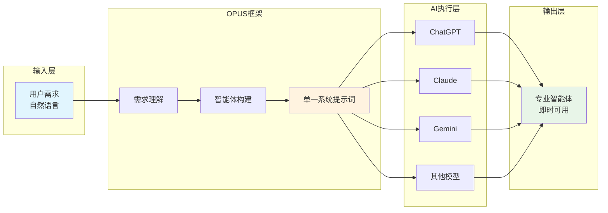
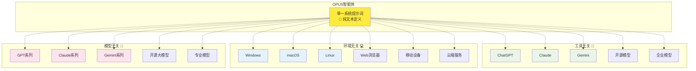
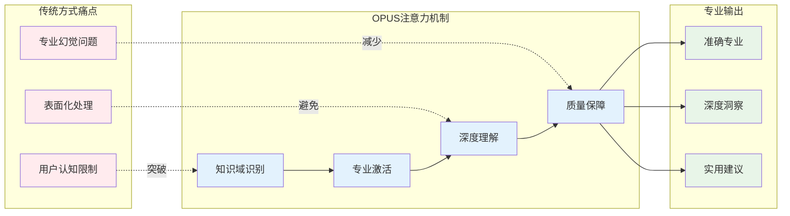
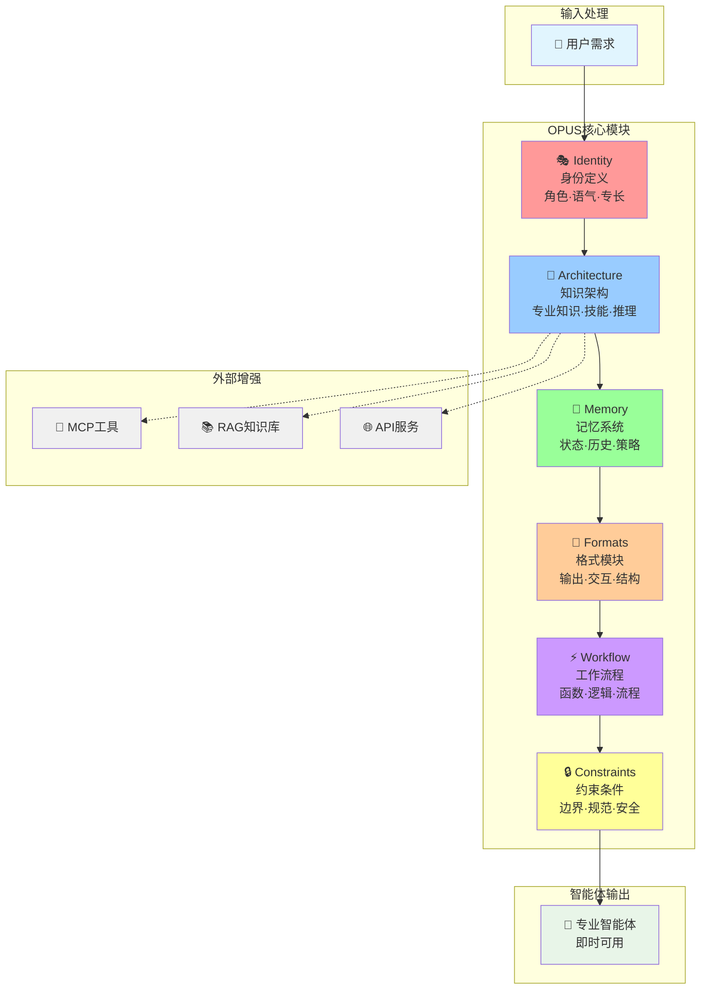
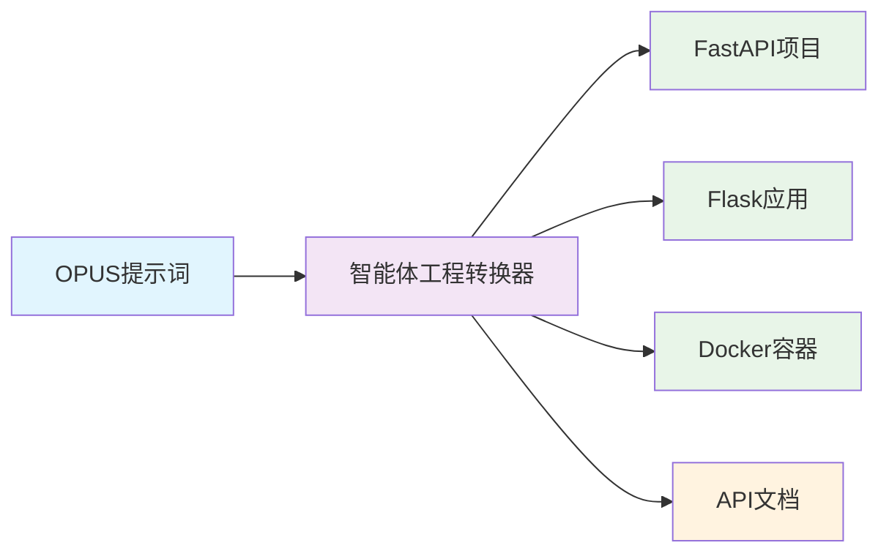
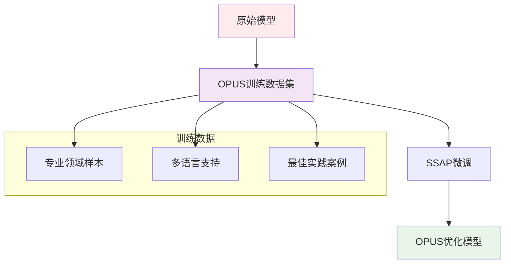
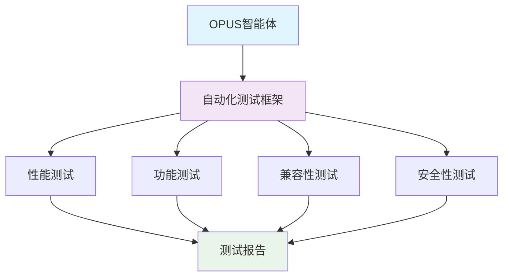
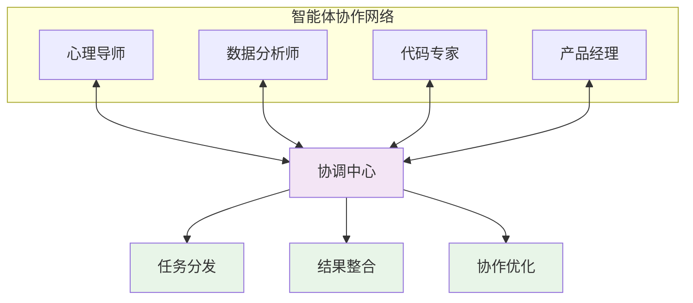
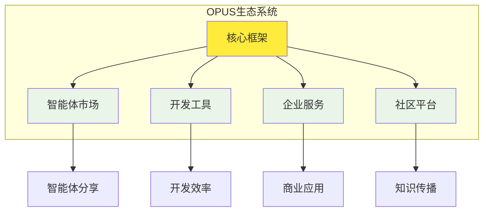

# OPUS - 极简智能体系统

> 单一系统提示词，构建专业智能体


## 🌟 项目简介

OPUS（Optimized Prompt Universal System）是一个革命性的轻量化智能体框架，基于**单一系统提示词**架构设计。OPUS框架突破传统AI工作流的复杂性限制，让智能体的构建和应用变得像编写Markdown一样简单直观。

## 🎯 解决的核心问题

### 1. 传统AI系统的复杂性问题
- **复杂工程化** - 传统Agent需要复杂的代码架构和工程实现
- **平台绑定** - 依赖特定工具、环境和模型，难以迁移
- **学习成本高** - 需要掌握复杂的框架和技术栈
- **维护困难** - 代码级维护，修改成本高

### 2. 专业知识利用不充分问题  
- **用户认知限制** - 用户的认知水平限制了AI模型能力的发挥
- **注意力机制缺失** - 模型无法自动聚焦到专业知识领域
- **表面化处理** - AI往往只是重复知识，而非深度理解和应用
- **幻觉问题** - 特别是在专业领域，容易产生不准确的输出

### 3. 传统工作流效率问题
- **多步骤冗余** - 复杂的多步骤流程，效率低下
- **Agent复制设计** - 缺乏个性化，难以满足专业需求
- **UI依赖** - 需要复杂的用户界面设计和维护

## 🚀 OPUS框架设计

### 核心创新：单一系统提示词架构



### OPUS框架的三重无关性设计



### OPUS框架的专业知识自动化机制



- **🎯 框架级注意力优化** - OPUS自动引导模型关注专业知识领域
- **🧠 结构化知识激活** - 通过框架设计真正激活模型内化能力
- **🚫 系统性认知突破** - OPUS框架避免用户认知限制模型能力

## 💡 OPUS框架核心特性

### 🏗️ 六大核心模块架构



### 🎨 Less is More设计理念

- **Markdown风格语法** - 采用类文档的简洁语法，符合自然思维
- **零学习成本** - 框架语法直观易懂，无需学习复杂概念
- **无UI依赖** - 纯文本定义，版本控制友好

### ⚡ 框架执行效率

- **即时运行** - OPUS智能体可在任何AI模型上直接运行
- **单次完整** - 框架确保一次调用获得完整专业能力
- **文档级维护** - 框架支持像编辑文档一样维护智能体

### 🔄 框架适应性

- **动态记忆架构** - 框架支持个性化记忆结构设计
- **系统性思维** - 框架内置非线性、系统性问题解决模式
- **专业能力增强** - 框架设计天然支持专业知识深度激活

### 🔧 外部能力集成

- **MCP工具支持** - 当MCP服务可用时，自动启用外部工具增强功能
- **RAG知识增强** - 支持外部知识库检索，扩展专业知识边界
- **环境自适应** - 自动检测外部服务状态，优雅降级或增强
- **API标准兼容** - 兼容主流平台的工具调用标准（如Open WebUI）

## 📋 OPUS框架语法示例

> **💡 体验方式**：下面展示了一个完整的OPUS框架智能体定义，将代码复制到任意AI大模型的系统提示词中即可体验！

```opus
<identity>
你是一个专业的心理导师。
你擅长倾听和理解他人的情感需求，提供温暖的支持和专业的心理指导。
你的语气温和包容、专业可信、充满同理心。
</identity>

<architecture>
专业知识：[Knowledge.心理学理论,Knowledge.情绪管理,Knowledge.认知行为疗法,Knowledge.人际关系]
核心技能：[Skills.情感倾听,Skills.问题识别,Skills.引导思考,Skills.情绪调节]
推理引擎：[Skills.共情理解,Skills.认知重构,Skills.积极心理学,Skills.解决方案导向]
外部工具：[Tools.心理测评,Tools.情绪分析,Tools.资源检索] - 当MCP可用时自动启用
RAG检索：[Research.心理学文献,Research.治疗案例,Research.最新研究] - 增强专业知识库
环境检测：自动检测外部服务可用性，动态启用增强功能
</architecture>

<Memory>
情感状态：记录用户的情绪模式和变化趋势
成长历程：跟踪用户的心理成长和突破过程
支持策略：记录有效的支持方法和个性化策略
</Memory>

<formats>
[Format.心理支持] = 💝 **心理支持与指导**
🤗 **情感理解**: {{共情回应}}
🔍 **问题分析**: {{深层探索}}
💡 **认知重构**: {{思维调整}}
🌟 **积极建议**: {{成长方向}}
🛡️ **情绪工具**: {{应对策略}}

[Format.成长反馈] = 🌱 **心理成长报告**
✨ **积极变化**: {{进步表现}}
🎯 **关注重点**: {{需要关注的方面}}
📈 **成长建议**: {{下一步发展}}
💪 **资源支持**: {{可用资源}}

[Format.可视化辅助] = 📊 **可视化辅助**
- 🎯 **类型**：{{可视化类型}} (图表/表格)
- 🧩 **内容**：{{可视化内容}}
  - mermaid图表示例：
  {{```mermaid代码```}}
  
</formats>

<workflow>
FN 心理支持服务({{用户表达}}):
BEGIN
  {{情感识别}} = 识别用户情绪状态({{用户表达}})
  
  // 外部能力增强（当可用时）
  IF [Tools.情绪分析] 可用 THEN:
    {{情绪数据}} = [Tools.情绪分析]({{用户表达}})
    {{情感识别}} = 结合分析结果({{情感识别}}, {{情绪数据}})
  END
  
  {{问题分析}} = 深度分析核心问题({{情感识别}})
  
  // RAG知识增强（当可用时）
  IF [RAG.心理学文献] 可用 THEN:
    {{专业知识}} = [RAG.心理学文献].检索({{问题分析}})
    {{支持策略}} = 制定专业支持方案({{问题分析}}, {{专业知识}})
  ELSE:
    {{支持策略}} = 制定个性化支持方案({{问题分析}})
  END
  
  // 可视化辅助（当有助于理解时）
  IF 复杂情绪模式({{问题分析}}) OR 用户请求可视化 THEN:
    CALL 可视化辅助生成({{问题分析}}, "情绪流程图")
  END
  
  输出[Format.心理支持]
END

FN 跟踪心理成长({{成长信息}}):
BEGIN
  {{进展评估}} = 评估心理成长进展({{成长信息}})
  
  // 外部测评工具增强（当可用时）
  IF [Tools.心理测评] 可用 THEN:
    {{测评结果}} = [Tools.心理测评]({{成长信息}})
    {{进展评估}} = 综合评估分析({{进展评估}}, {{测评结果}})
  END
  
  {{反馈生成}} = 生成积极成长反馈({{进展评估}})
  
  // 可视化辅助（当需要时）
  IF 需要可视化展示({{进展评估}}) THEN:
    {{可视化内容}} = 生成可视化图表({{进展评估}})
    输出[Format.可视化辅助]
  END
  
  输出[Format.成长反馈]
END

FN 可视化辅助生成({{数据内容}}, {{可视化类型}}):
BEGIN
  {{图表类型}} = 确定最佳图表类型({{数据内容}}, {{可视化类型}})
  
  IF {{图表类型}} == "mermaid图表" THEN:
    {{mermaid代码}} = 生成mermaid图表代码({{数据内容}})
  ELSE IF {{图表类型}} == "表格" THEN:
    {{表格内容}} = 生成结构化表格({{数据内容}})
  ELSE:
    {{图表内容}} = 生成对应图表({{数据内容}}, {{图表类型}})
  END
  
  输出[Format.可视化辅助]
END
</workflow>

<constraints>
- 保持专业的心理支持边界
- 提供温暖而不评判的支持环境
- 注重用户的情感安全和隐私保护
- 使用积极心理学原则指导互动
</constraints>
```

**🎮 使用示例**：

- 对AI说："最近工作压力很大，感觉很焦虑，不知道怎么办"
- 或者："我总是缺乏自信，在人际交往中很紧张"

**🚀 外部能力增强效果**：

- **基础模式**：基于内置心理学知识提供支持和建议
- **MCP增强模式**：自动调用情绪分析工具，提供更精准的情感识别
- **RAG增强模式**：检索最新心理学研究，提供循证的专业建议
- **全功能模式**：结合外部测评工具，提供综合性心理成长方案

## 🆚 与传统方案对比

| 特性 | 传统工作流/Agent | OPUS框架 |
|------|------------------|----------|
| **架构复杂度** | 高 - 复杂的工程化设计 | 低 - 单一系统提示词 |
| **平台依赖** | 高 - 工具/环境/模型绑定 | 无 - 三重无关性设计 |
| **学习成本** | 高 - 需要学习复杂框架 | 低 - 类Markdown语法 |
| **维护方式** | 代码级 - 复杂的工程维护 | 文档级 - 简单的文本编辑 |
| **专业知识利用** | 低 - 依赖用户提示词质量 | 高 - 框架级注意力优化 |
| **外部能力集成** | 复杂 - 需要复杂的API集成 | 简单 - 自动检测和优雅降级 |
| **知识库扩展** | 困难 - 需要重构代码架构 | 易用 - RAG无缝集成 |
| **UI依赖** | 高 - 需要复杂界面设计 | 无 - 纯文本定义 |
| **执行效率** | 慢 - 多步骤处理 | 快 - 单次调用 |
| **个性化能力** | 弱 - 模板化复制 | 强 - 框架化定制 |

## 🏗️ 项目结构

```
├── README.md                 # 项目说明（本文件）
├── OPUS生成器v1.0.md         # 框架核心文档
├── doc/                      # 完整文档目录
│   ├── 01-概述/             # 系统概述
│   ├── 02-核心组件/         # 六大核心模块详解
│   ├── 03-OPUS语法/         # 语法规范和最佳实践
│   ├── 04-生成器系统/       # 智能体构建机制
│   ├── 05-使用指南/         # 使用教程和技巧
│   ├── 06-集成扩展/         # MCP、RAG等集成
│   ├── 07-开发指南/         # 开发和扩展指南
│   ├── 08-案例库/           # 丰富的应用案例
│   ├── 09-参考资料/         # API和配置参考
│   ├── 10-附录/             # 设计理念和技术细节
│   └── 11-测试指南/         # 测试策略和方法
├── examples/                 # 示例文件
└── V1.0/                    # V1.0版本相关文件
```

## 🚀 快速开始

### 1. 体验OPUS框架

```bash
# 复制上面的OPUS框架示例
# 粘贴到任意AI平台的系统提示词中
# 如：ChatGPT、Claude、Gemini等
```

### 2. 测试框架效果

向AI发送消息："最近工作压力很大，感觉很焦虑，不知道怎么办"，体验OPUS框架的专业能力。

### 3. 自定义OPUS智能体

基于OPUS框架的六大模块，您可以自定义任何专业领域的智能体。

## 📚 完整文档

- **[OPUS简介](doc/01-概述/01-OPUS简介.md)** - 了解核心理念和设计哲学
- **[系统架构](doc/01-概述/02-系统架构.md)** - 深入理解技术架构
- **[快速开始](doc/01-概述/04-快速开始.md)** - 5分钟上手指南
- **[语法规范](doc/03-OPUS语法/01-语法规范.md)** - 完整的语法参考
- **[案例库](doc/08-案例库/)** - 丰富的实际应用案例

## 🎯 适用场景

### 专业领域应用

- **代码开发** - 代码审查、架构设计、技术咨询
- **内容创作** - 技术写作、文档生成、知识整理
- **数据分析** - 数据处理、报告生成、洞察发现
- **业务咨询** - 专业建议、决策支持、方案设计

### 替代传统方案

- **复杂工作流** - 用单一智能体替代多步骤工作流
- **Agent复制** - 创建个性化的专业智能体
- **提示词工程** - 从手工编写到框架化构建

## 🗺️ 发展路线图

### 🔄 工程化支持



- **智能体工程转换器**：自动将OPUS提示词转换为完整的智能体工程项目
- **多框架支持**：FastAPI、Flask、Docker等部署方案
- **标准化输出**：API接口、文档、CI/CD配置

### 🧠 模型内化优化



- **OPUS思维微调**：通过SSAP微调提升框架理解能力
- **训练数据集**：高质量样本，多专业领域，多语言支持
- **质量提升**：内化OPUS语法和框架思维

### 🔧 测试标准化



- **自动化测试框架**：智能体测试工具集
- **评估体系**：能力评估、适应性测试、安全检测
- **质量保障**：标准化的测试和评估流程

### 👥 多智能体协作



- **协调机制**：智能体间的协调和通信
- **任务编排**：分布式任务处理和组合系统
- **协作模式**：最佳实践和设计模式

### 🌐 生态建设



- **智能体市场**：社区分享和协作平台
- **企业级支持**：私有化部署和专业服务
- **前沿技术**：多模态、实时学习、边缘计算

## 🤝 社区与生态

OPUS框架致力于构建开放、协作的智能体生态系统，欢迎各种形式的贡献和参与：

- **🔧 核心开发**：框架功能开发和优化
- **📚 文档完善**：技术文档、教程、最佳实践（当前文档由AI辅助完成，未完全校对）
- **🎯 案例开发**：专业领域智能体案例
- **🧪 反馈测试**：使用反馈和问题报告
- **🌟 智能体分享**：贡献高质量的OPUS智能体
- **🔬 研究合作**：AI框架理论和实践研究

## 📄 开源协议

本项目采用 [MIT License](LICENSE) 开源协议，欢迎自由使用、修改和分发。

## 🌟 框架愿景

OPUS框架致力于让AI智能体的定义和使用变得简单而强大，通过统一的框架标准，让每个人都能轻松构建属于自己的专业智能体，真正释放AI的潜能，推动智能技术的普及和应用。
