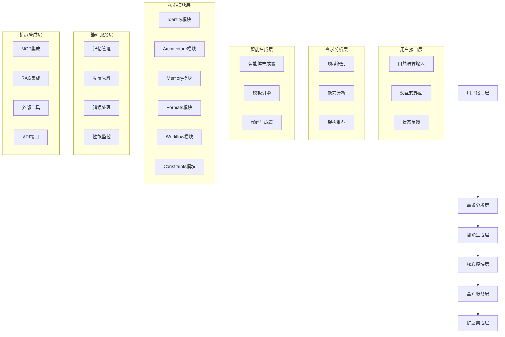
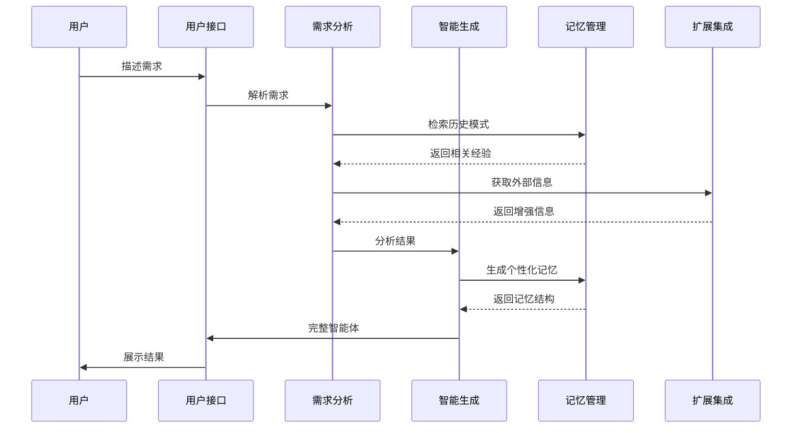
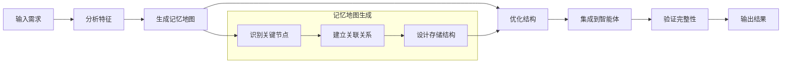

# 系统架构

## 整体架构概览

OPUS采用分层模块化架构，确保系统的可扩展性、可维护性和高性能。



## 核心架构层次

### 1. 用户接口层

#### 自然语言处理
- **意图识别**：分析用户输入的真实意图
- **上下文理解**：结合历史交互理解当前需求
- **语义解析**：将自然语言转换为结构化需求

#### 交互管理
- **会话状态**：维护完整的对话上下文
- **反馈机制**：提供清晰的进度和状态信息
- **错误处理**：友好的错误提示和修复建议

### 2. 需求分析层

#### 智能分析引擎
```python
# 需求分析流程
class RequirementAnalyzer:
    def analyze(self, user_input):
        # 1. 领域识别
        domain = self.identify_domain(user_input)
        
        # 2. 能力分析
        capabilities = self.extract_capabilities(user_input)
        
        # 3. 架构推荐
        architecture = self.recommend_architecture(domain, capabilities)
        
        return AnalysisResult(domain, capabilities, architecture)
```

#### 领域识别算法
- **关键词匹配**：基于预训练的领域词典
- **语义相似度**：使用embedding计算语义距离
- **上下文推理**：结合对话历史推断领域

### 3. 智能生成层

#### 生成器架构
```python
# 智能体生成器核心
class OpusGenerator:
    def __init__(self):
        self.modules = {
            'identity': IdentityGenerator(),
            'architecture': ArchitectureGenerator(),
            'memory': MemoryGenerator(),
            'formats': FormatsGenerator(),
            'workflow': WorkflowGenerator(),
            'constraints': ConstraintsGenerator()
        }
    
    def generate(self, requirements):
        # 并行生成各模块
        results = {}
        for name, generator in self.modules.items():
            results[name] = generator.generate(requirements)
        
        # 整合生成结果
        return self.integrate_modules(results)
```

#### 模板引擎
- **动态模板**：根据需求动态选择和组合模板
- **参数化生成**：支持参数化的模板定制
- **质量控制**：自动验证生成结果的完整性

### 4. 核心模块层

#### Identity模块
```opus
<identity>
{{身份定义}} = f(domain, role, constraints)
{{专业特征}} = f(capabilities, specialization)
{{语气风格}} = f(target_audience, formality)
</identity>
```

#### Architecture模块
```opus
<architecture>
专业知识：[{{domain_knowledge}}]
核心技能：[{{core_skills}}]
推理引擎：[{{reasoning_capabilities}}]
外部工具：[{{external_tools}}] # 可选
RAG检索：[{{rag_config}}] # 可选
</architecture>
```

#### Memory模块
```opus
<Memory>
记忆架构：{{memory_structure}}
动态操作：{{memory_operations}}
存储策略：{{storage_strategy}}
</Memory>
```

### 5. 基础服务层

#### 记忆管理系统
```python
class MemoryManager:
    def __init__(self):
        self.storage = {}
        self.index = {}
        self.cache = {}
    
    def store(self, path, data):
        """按路径存储数据"""
        self.storage[path] = data
        self.update_index(path, data)
    
    def retrieve(self, path):
        """按路径检索数据"""
        return self.storage.get(path)
    
    def locate(self, context):
        """根据上下文定位相关数据"""
        return self.search_by_context(context)
```

#### 配置管理
- **环境检测**：自动检测可用的外部服务
- **动态配置**：根据环境动态调整配置
- **版本管理**：支持配置版本控制和回滚

### 6. 扩展集成层

#### MCP集成架构
```python
class MCPIntegration:
    def __init__(self):
        self.servers = {}
        self.tools = {}
    
    def detect_servers(self):
        """检测可用的MCP服务器"""
        return self.scan_available_servers()
    
    def configure_tools(self, requirements):
        """根据需求配置工具"""
        return self.select_optimal_tools(requirements)
```

#### RAG集成架构
```python
class RAGIntegration:
    def __init__(self):
        self.vector_db = None
        self.retrievers = {}
    
    def setup_retrieval(self, domain):
        """设置领域相关的检索系统"""
        return self.configure_domain_retrieval(domain)
```

## 数据流架构

### 生成流程


### 记忆流程


## 性能优化架构

### 并行处理
```python
class ParallelProcessor:
    def __init__(self):
        self.thread_pool = ThreadPoolExecutor(max_workers=6)
    
    def parallel_generate(self, requirements):
        """并行生成各模块"""
        futures = {}
        for module_name, generator in self.generators.items():
            future = self.thread_pool.submit(generator.generate, requirements)
            futures[module_name] = future
        
        # 收集结果
        results = {}
        for module_name, future in futures.items():
            results[module_name] = future.result()
        
        return results
```

### 缓存策略
```python
class CacheManager:
    def __init__(self):
        self.cache = {}
        self.ttl = 3600  # 1小时
    
    def get_cached_result(self, key):
        """获取缓存结果"""
        if key in self.cache:
            result, timestamp = self.cache[key]
            if time.time() - timestamp < self.ttl:
                return result
        return None
    
    def cache_result(self, key, result):
        """缓存结果"""
        self.cache[key] = (result, time.time())
```

## 错误处理架构

### 错误分类
```python
class ErrorHandler:
    def __init__(self):
        self.error_types = {
            'parse_error': ParseErrorHandler(),
            'generation_error': GenerationErrorHandler(),
            'integration_error': IntegrationErrorHandler(),
            'validation_error': ValidationErrorHandler()
        }
    
    def handle_error(self, error):
        """统一错误处理"""
        error_type = self.classify_error(error)
        handler = self.error_types.get(error_type)
        if handler:
            return handler.handle(error)
        else:
            return self.default_handler(error)
```

### 容错机制
- **优雅降级**：在部分功能失败时保持核心功能可用
- **重试策略**：对临时性错误实施智能重试
- **回滚机制**：在生成失败时回滚到上一个稳定状态

## 可扩展性设计

### 插件架构
```python
class PluginManager:
    def __init__(self):
        self.plugins = {}
    
    def register_plugin(self, name, plugin):
        """注册插件"""
        self.plugins[name] = plugin
    
    def execute_plugin(self, name, *args, **kwargs):
        """执行插件"""
        if name in self.plugins:
            return self.plugins[name].execute(*args, **kwargs)
```

### 模块扩展
- **标准接口**：定义统一的模块接口规范
- **动态加载**：支持运行时动态加载新模块
- **版本兼容**：确保向后兼容性

## 安全架构

### 安全控制
```python
class SecurityManager:
    def __init__(self):
        self.validators = [
            InputValidator(),
            OutputValidator(),
            ContentValidator()
        ]
    
    def validate_input(self, input_data):
        """验证输入安全性"""
        for validator in self.validators:
            if not validator.validate(input_data):
                raise SecurityException("Input validation failed")
```

### 权限控制
- **角色管理**：基于角色的访问控制
- **功能限制**：根据用户权限限制功能访问
- **审计日志**：记录所有敏感操作

---

*OPUS的架构设计始终遵循"简单优雅、高效可靠"的原则，确保系统在提供强大功能的同时保持易用性和可维护性。*