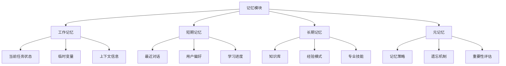

# Memory记忆模块

Memory模块是OPUS智能体的核心组件之一，负责存储、管理和检索智能体的知识、经验和状态信息。它不仅是简单的数据存储，更是智能体个性化和持续学习的基础。

## 设计理念

### 核心价值
- **持久记忆**：保存重要的交互历史和学习成果
- **个性化**：根据用户偏好和使用习惯自动调整
- **智能检索**：快速找到相关的历史信息和知识
- **动态更新**：实时更新和优化记忆内容

### 设计原则
- **分层存储**：按重要性和访问频率分层管理
- **语义检索**：支持基于语义的智能检索
- **自动整理**：定期清理和优化记忆结构
- **隐私保护**：确保敏感信息的安全性

## 记忆架构

### 整体架构图


### 记忆层次结构

#### 1. 工作记忆 (Working Memory)
- **功能**: 存储当前任务的临时信息
- **容量**: 限制在7±2个信息单元
- **生命周期**: 任务完成后自动清理
- **特点**: 快速访问、实时更新

```opus
<Memory>
工作记忆：
  当前任务：{{current_task}}
  临时变量：{{temp_variables}}
  上下文状态：{{context_state}}
  处理步骤：{{process_steps}}
</Memory>
```

#### 2. 短期记忆 (Short-term Memory)
- **功能**: 存储近期的交互历史和用户偏好
- **容量**: 可配置大小（默认100-1000条）
- **生命周期**: 数天到数周
- **特点**: 支持快速检索和模式识别

```opus
<Memory>
短期记忆：
  最近对话：记录最近的对话历史和用户反馈
  用户偏好：学习用户的使用习惯和偏好设置
  学习进度：追踪用户的学习进度和掌握情况
  问题模式：识别常见问题和解决方案
</Memory>
```

#### 3. 长期记忆 (Long-term Memory)
- **功能**: 存储核心知识和专业技能
- **容量**: 理论上无限制
- **生命周期**: 永久保存
- **特点**: 结构化存储、语义关联

```opus
<Memory>
长期记忆：
  专业知识：存储领域专业知识和技能
  成功模式：保存成功的处理模式和策略
  经验积累：积累的实践经验和最佳实践
  关联网络：知识间的语义关联和推理路径
</Memory>
```

#### 4. 元记忆 (Meta-Memory)
- **功能**: 管理记忆本身的策略和机制
- **容量**: 小而精
- **生命周期**: 系统级别
- **特点**: 自我监控和优化

```opus
<Memory>
元记忆：
  记忆策略：记忆的存储和检索策略
  遗忘机制：自动清理过期和无用信息
  重要性评估：评估信息的重要性和保留价值
  性能监控：监控记忆系统的性能和效率
</Memory>
```

## 记忆类型详解

### 1. 事实记忆 (Factual Memory)
存储具体的事实信息和数据。

```opus
<Memory>
事实记忆：
  用户信息：{{user_profile}}
  项目数据：{{project_data}}
  配置参数：{{config_params}}
  统计数据：{{statistics}}
</Memory>
```

### 2. 程序记忆 (Procedural Memory)
存储操作步骤和处理流程。

```opus
<Memory>
程序记忆：
  操作流程：{{operation_procedures}}
  解决方案：{{solution_templates}}
  最佳实践：{{best_practices}}
  错误处理：{{error_handling}}
</Memory>
```

### 3. 情景记忆 (Episodic Memory)
存储具体的交互场景和体验。

```opus
<Memory>
情景记忆：
  交互历史：{{interaction_history}}
  成功案例：{{success_cases}}
  失败教训：{{failure_lessons}}
  用户反馈：{{user_feedback}}
</Memory>
```

### 4. 语义记忆 (Semantic Memory)
存储概念间的关系和语义联系。

```opus
<Memory>
语义记忆：
  概念关系：{{concept_relationships}}
  分类体系：{{taxonomy}}
  推理规则：{{reasoning_rules}}
  关联网络：{{association_network}}
</Memory>
```

## 记忆操作

### 1. 存储操作 (Storage Operations)

#### 基本存储
```opus
FN 存储信息({{信息类型}}, {{信息内容}}, {{重要性}}):
BEGIN
  {{存储位置}} = 确定存储位置({{信息类型}}, {{重要性}})
  {{存储格式}} = 格式化信息({{信息内容}})
  {{索引键}} = 生成索引键({{信息内容}})
  
  保存到存储位置({{存储位置}}, {{存储格式}}, {{索引键}})
  更新索引({{索引键}}, {{存储位置}})
END
```

#### 关联存储
```opus
FN 关联存储({{新信息}}, {{关联信息}}):
BEGIN
  {{相似度}} = 计算相似度({{新信息}}, {{关联信息}})
  {{关联强度}} = 评估关联强度({{相似度}})
  
  IF {{关联强度}} > 阈值 THEN:
    建立关联链接({{新信息}}, {{关联信息}}, {{关联强度}})
    更新语义网络({{新信息}}, {{关联信息}})
  END
END
```

### 2. 检索操作 (Retrieval Operations)

#### 精确检索
```opus
FN 精确检索({{查询条件}}):
BEGIN
  {{结果集}} = 索引查询({{查询条件}})
  {{排序结果}} = 按相关性排序({{结果集}})
  RETURN {{排序结果}}
END
```

#### 模糊检索
```opus
FN 模糊检索({{查询内容}}):
BEGIN
  {{语义向量}} = 生成语义向量({{查询内容}})
  {{候选集}} = 语义相似度搜索({{语义向量}})
  {{过滤结果}} = 过滤和排序({{候选集}})
  RETURN {{过滤结果}}
END
```

#### 关联检索
```opus
FN 关联检索({{种子信息}}):
BEGIN
  {{直接关联}} = 获取直接关联({{种子信息}})
  {{间接关联}} = 获取间接关联({{种子信息}})
  {{综合结果}} = 合并和排序({{直接关联}}, {{间接关联}})
  RETURN {{综合结果}}
END
```

### 3. 更新操作 (Update Operations)

#### 信息更新
```opus
FN 更新信息({{信息ID}}, {{新内容}}):
BEGIN
  {{原信息}} = 获取原信息({{信息ID}})
  {{合并信息}} = 智能合并({{原信息}}, {{新内容}})
  {{重要性}} = 重新评估重要性({{合并信息}})
  
  更新存储({{信息ID}}, {{合并信息}}, {{重要性}})
  更新关联链接({{信息ID}})
END
```

#### 批量更新
```opus
FN 批量更新({{更新列表}}):
BEGIN
  FOR each 更新项 in {{更新列表}}:
    {{验证结果}} = 验证更新({{更新项}})
    IF {{验证结果}}.有效 THEN:
      更新信息({{更新项}}.ID, {{更新项}}.内容)
    END
  END
  重建索引()
END
```

### 4. 删除操作 (Deletion Operations)

#### 软删除
```opus
FN 软删除({{信息ID}}):
BEGIN
  标记为删除({{信息ID}})
  更新状态({{信息ID}}, "已删除")
  // 保留数据用于可能的恢复
END
```

#### 硬删除
```opus
FN 硬删除({{信息ID}}):
BEGIN
  {{关联信息}} = 获取关联信息({{信息ID}})
  删除关联链接({{信息ID}})
  物理删除({{信息ID}})
  清理索引({{信息ID}})
  
  // 处理关联信息的孤立状态
  FOR each 关联项 in {{关联信息}}:
    检查并处理孤立状态({{关联项}})
  END
END
```

## 记忆管理

### 1. 容量管理

#### 动态容量调整
```opus
FN 动态容量调整():
BEGIN
  {{当前使用率}} = 计算内存使用率()
  {{性能指标}} = 评估性能指标()
  
  IF {{当前使用率}} > 90% THEN:
    执行记忆清理()
    {{新容量}} = 计算新容量需求()
    申请额外容量({{新容量}})
  END
END
```

#### 分层容量管理
```opus
<Memory>
容量配置：
  工作记忆：最大10MB，超出自动清理
  短期记忆：最大100MB，按时间窗口管理
  长期记忆：最大1GB，按重要性分层
  元记忆：最大10MB，系统级别管理
</Memory>
```

### 2. 遗忘机制

#### 时间衰减遗忘
```opus
FN 时间衰减遗忘():
BEGIN
  {{当前时间}} = 获取当前时间()
  {{过期阈值}} = 计算过期阈值()
  
  FOR each 记忆项 in 短期记忆:
    {{访问时间}} = 获取最后访问时间({{记忆项}})
    {{时间差}} = {{当前时间}} - {{访问时间}}
    
    IF {{时间差}} > {{过期阈值}} THEN:
      {{重要性}} = 评估重要性({{记忆项}})
      IF {{重要性}} < 保留阈值 THEN:
        软删除({{记忆项}})
      END
    END
  END
END
```

#### 重要性遗忘
```opus
FN 重要性遗忘():
BEGIN
  {{记忆项列表}} = 获取所有记忆项()
  {{重要性排序}} = 按重要性排序({{记忆项列表}})
  {{保留数量}} = 计算保留数量()
  
  FOR i = {{保留数量}} TO {{记忆项列表}}.长度:
    {{记忆项}} = {{重要性排序}}[i]
    软删除({{记忆项}})
  END
END
```

### 3. 优化策略

#### 访问频率优化
```opus
FN 访问频率优化():
BEGIN
  {{访问统计}} = 统计访问频率()
  {{热点数据}} = 识别热点数据({{访问统计}})
  {{冷数据}} = 识别冷数据({{访问统计}})
  
  // 热点数据缓存优化
  FOR each 热点项 in {{热点数据}}:
    提升缓存优先级({{热点项}})
  END
  
  // 冷数据压缩存储
  FOR each 冷数据项 in {{冷数据}}:
    IF 符合压缩条件({{冷数据项}}) THEN:
      压缩存储({{冷数据项}})
    END
  END
END
```

#### 语义聚类优化
```opus
FN 语义聚类优化():
BEGIN
  {{语义向量}} = 生成语义向量(所有记忆项)
  {{聚类结果}} = 执行聚类分析({{语义向量}})
  
  FOR each 聚类 in {{聚类结果}}:
    {{聚类中心}} = 计算聚类中心({{聚类}})
    {{聚类索引}} = 创建聚类索引({{聚类中心}})
    优化聚类内存储({{聚类}})
  END
END
```

## 个性化记忆

### 1. 用户偏好学习

#### 交互模式学习
```opus
FN 学习交互模式():
BEGIN
  {{交互历史}} = 获取交互历史()
  {{模式分析}} = 分析交互模式({{交互历史}})
  {{偏好特征}} = 提取偏好特征({{模式分析}})
  
  更新用户偏好模型({{偏好特征}})
  调整交互策略({{偏好特征}})
END
```

#### 学习进度追踪
```opus
<Memory>
学习进度：
  掌握程度：{{skill_mastery_levels}}
  学习路径：{{learning_paths}}
  难点识别：{{difficulty_areas}}
  提升建议：{{improvement_suggestions}}
</Memory>
```

### 2. 上下文适应

#### 环境感知记忆
```opus
FN 环境感知记忆():
BEGIN
  {{当前环境}} = 检测当前环境()
  {{历史环境}} = 获取历史环境数据()
  {{环境变化}} = 分析环境变化({{当前环境}}, {{历史环境}})
  
  IF {{环境变化}} > 阈值 THEN:
    调整记忆策略({{当前环境}})
    更新上下文模型({{当前环境}})
  END
END
```

#### 任务适应性记忆
```opus
FN 任务适应性记忆({{任务类型}}):
BEGIN
  {{任务特征}} = 分析任务特征({{任务类型}})
  {{相关记忆}} = 检索相关记忆({{任务特征}})
  {{适应策略}} = 生成适应策略({{任务特征}}, {{相关记忆}})
  
  应用适应策略({{适应策略}})
  记录适应效果({{适应策略}})
END
```

## 记忆同步

### 1. 多设备同步

#### 增量同步
```opus
FN 增量同步():
BEGIN
  {{本地变更}} = 获取本地变更()
  {{远程变更}} = 获取远程变更()
  {{冲突检测}} = 检测同步冲突({{本地变更}}, {{远程变更}})
  
  IF {{冲突检测}}.有冲突 THEN:
    {{解决方案}} = 解决冲突({{冲突检测}})
    应用解决方案({{解决方案}})
  END
  
  上传本地变更({{本地变更}})
  下载远程变更({{远程变更}})
END
```

#### 选择性同步
```opus
FN 选择性同步({{同步配置}}):
BEGIN
  {{同步范围}} = 确定同步范围({{同步配置}})
  {{优先级}} = 评估同步优先级({{同步范围}})
  
  FOR each 同步项 in {{同步范围}}:
    IF {{同步项}}.优先级 >= {{优先级}}.阈值 THEN:
      执行同步({{同步项}})
    END
  END
END
```

### 2. 版本控制

#### 记忆版本管理
```opus
<Memory>
版本控制：
  当前版本：{{current_version}}
  历史版本：{{version_history}}
  变更日志：{{change_log}}
  回滚点：{{rollback_points}}
</Memory>
```

## 安全与隐私

### 1. 数据加密

#### 敏感信息加密
```opus
FN 存储敏感信息({{信息内容}}, {{敏感级别}}):
BEGIN
  {{加密级别}} = 确定加密级别({{敏感级别}})
  {{加密密钥}} = 生成加密密钥({{加密级别}})
  {{加密数据}} = 加密({{信息内容}}, {{加密密钥}})
  
  存储加密数据({{加密数据}})
  安全存储密钥({{加密密钥}})
END
```

### 2. 访问控制

#### 权限管理
```opus
<Memory>
访问控制：
  读权限：{{read_permissions}}
  写权限：{{write_permissions}}
  删除权限：{{delete_permissions}}
  管理权限：{{admin_permissions}}
</Memory>
```

### 3. 数据匿名化

#### 自动匿名化
```opus
FN 自动匿名化():
BEGIN
  {{敏感数据}} = 识别敏感数据()
  {{匿名化策略}} = 选择匿名化策略({{敏感数据}})
  {{匿名化结果}} = 执行匿名化({{敏感数据}}, {{匿名化策略}})
  
  替换原始数据({{匿名化结果}})
  记录匿名化操作({{匿名化策略}})
END
```

## 性能优化

### 1. 索引优化

#### 多级索引
```opus
<Memory>
索引结构：
  主索引：按时间和重要性的复合索引
  语义索引：基于词向量的语义索引
  关联索引：记录信息间关联关系的索引
  用户索引：按用户偏好的个性化索引
</Memory>
```

### 2. 缓存策略

#### 智能缓存
```opus
FN 智能缓存管理():
BEGIN
  {{访问模式}} = 分析访问模式()
  {{预测需求}} = 预测访问需求({{访问模式}})
  {{缓存策略}} = 制定缓存策略({{预测需求}})
  
  应用缓存策略({{缓存策略}})
  监控缓存效果()
END
```

### 3. 压缩技术

#### 语义压缩
```opus
FN 语义压缩({{原始数据}}):
BEGIN
  {{语义提取}} = 提取语义信息({{原始数据}})
  {{压缩表示}} = 生成压缩表示({{语义提取}})
  {{压缩比}} = 计算压缩比({{原始数据}}, {{压缩表示}})
  
  IF {{压缩比}} > 阈值 THEN:
    保存压缩表示({{压缩表示}})
    标记原始数据为可清理()
  END
END
```

## 监控与调试

### 1. 性能监控

#### 关键指标
```opus
<Memory>
性能指标：
  访问速度：平均响应时间和峰值响应时间
  存储效率：空间利用率和压缩比
  命中率：缓存命中率和检索成功率
  并发性能：并发访问处理能力
</Memory>
```

### 2. 调试工具

#### 记忆状态检查
```opus
FN 记忆状态检查():
BEGIN
  {{内存使用}} = 检查内存使用情况()
  {{索引状态}} = 检查索引完整性()
  {{数据一致性}} = 验证数据一致性()
  {{性能指标}} = 收集性能指标()
  
  生成状态报告({{内存使用}}, {{索引状态}}, {{数据一致性}}, {{性能指标}})
END
```

## 最佳实践

### 1. 设计原则
- **分层设计**：根据访问频率和重要性分层存储
- **语义组织**：按语义关系组织记忆结构
- **渐进式遗忘**：平滑的遗忘机制避免突然丢失
- **个性化适应**：根据用户特点调整记忆策略

### 2. 实施建议
- **容量规划**：合理规划各层记忆的容量分配
- **索引优化**：建立高效的多维索引体系
- **安全保护**：确保敏感信息的安全存储
- **性能监控**：持续监控和优化性能指标

### 3. 常见问题
- **内存泄漏**：定期清理无用的记忆项
- **检索效率**：优化索引结构和查询算法
- **数据一致性**：确保多设备间的数据同步
- **隐私保护**：严格控制敏感信息的访问

---

*Memory模块是OPUS智能体的"大脑"，它不仅存储信息，更重要的是能够智能地管理和利用这些信息，使智能体具备真正的学习和适应能力。*