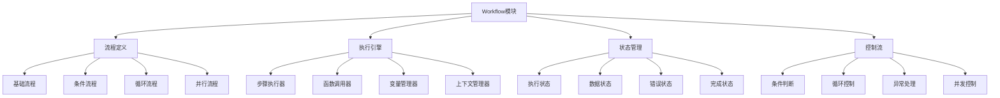

# Workflow工作流模块

Workflow模块是OPUS智能体的"行为引擎"，负责定义和控制智能体的处理逻辑、决策流程和任务执行顺序。它将智能体的能力转化为具体的可执行流程。

## 设计理念

### 核心价值
- **流程化**：将复杂任务分解为可管理的步骤
- **逻辑性**：确保处理流程的逻辑一致性和正确性
- **灵活性**：支持条件分支和动态流程调整
- **可追踪性**：提供完整的执行过程追踪和调试

### 设计原则
- **模块化**：每个工作流模块负责特定功能
- **可组合**：支持工作流的嵌套和组合
- **可扩展**：易于添加新的流程步骤和逻辑
- **容错性**：具备良好的错误处理和恢复机制

## 工作流架构

### 整体架构图



### 工作流类型体系

#### 1. 顺序工作流 (Sequential Workflow)
按照预定义顺序依次执行步骤。

```opus
FN 顺序处理流程({{输入数据}}):
BEGIN
  {{步骤1结果}} = 数据预处理({{输入数据}})
  {{步骤2结果}} = 业务逻辑处理({{步骤1结果}})
  {{步骤3结果}} = 结果格式化({{步骤2结果}})
  {{最终结果}} = 输出生成({{步骤3结果}})
  
  RETURN {{最终结果}}
END
```

#### 2. 条件工作流 (Conditional Workflow)
根据条件分支执行不同的处理路径。

```opus
FN 条件处理流程({{输入数据}}):
BEGIN
  {{分析结果}} = 输入分析({{输入数据}})
  
  IF {{分析结果}}.类型 == "简单查询" THEN:
    {{结果}} = 简单查询处理({{输入数据}})
  ELSEIF {{分析结果}}.类型 == "复杂分析" THEN:
    {{结果}} = 复杂分析处理({{输入数据}})
  ELSE:
    {{结果}} = 通用处理({{输入数据}})
  END
  
  RETURN {{结果}}
END
```

#### 3. 循环工作流 (Iterative Workflow)
对集合数据进行循环处理。

```opus
FN 批量处理流程({{数据集合}}):
BEGIN
  {{处理结果}} = []
  
  FOR each 数据项 in {{数据集合}}:
    {{单项结果}} = 单项处理({{数据项}})
    {{验证结果}} = 验证处理结果({{单项结果}})
    
    IF {{验证结果}}.有效 THEN:
      添加到结果集({{处理结果}}, {{单项结果}})
    ELSE:
      记录错误({{数据项}}, {{验证结果}}.错误信息)
    END
  END
  
  RETURN {{处理结果}}
END
```

#### 4. 并行工作流 (Parallel Workflow)
并行执行多个独立的处理步骤。

```opus
FN 并行处理流程({{输入数据}}):
BEGIN
  // 启动并行任务
  {{任务A}} = ASYNC 数据分析任务({{输入数据}})
  {{任务B}} = ASYNC 验证任务({{输入数据}})
  {{任务C}} = ASYNC 格式化任务({{输入数据}})
  
  // 等待所有任务完成
  {{分析结果}} = AWAIT {{任务A}}
  {{验证结果}} = AWAIT {{任务B}}
  {{格式结果}} = AWAIT {{任务C}}
  
  // 合并结果
  {{最终结果}} = 合并结果({{分析结果}}, {{验证结果}}, {{格式结果}})
  
  RETURN {{最终结果}}
END
```

## 工作流语法

### 1. 基本语法结构

#### 函数定义
```opus
FN 函数名(参数列表):
BEGIN
  // 函数体
  执行步骤
  RETURN 返回值
END
```

#### 变量赋值
```opus
{{变量名}} = 表达式
{{结果}} = 函数调用(参数)
{{状态}} = 计算表达式({{输入}})
```

#### 条件控制
```opus
IF 条件表达式 THEN:
  执行语句
ELSEIF 其他条件 THEN:
  执行语句
ELSE:
  默认执行语句
END
```

### 2. 高级控制结构

#### 循环控制
```opus
# FOR循环
FOR each 元素 in 集合:
  处理语句
END

# WHILE循环
WHILE 条件表达式 DO:
  循环体
END

# 计数循环
FOR i = 1 TO 数量 DO:
  处理语句(i)
END
```

#### 异常处理
```opus
TRY:
  可能出错的操作
CATCH 异常类型 as 异常变量:
  异常处理逻辑
FINALLY:
  清理操作
END
```

#### 并发控制
```opus
# 异步执行
{{任务}} = ASYNC 异步函数(参数)
{{结果}} = AWAIT {{任务}}

# 并行执行
PARALLEL:
  {{任务1}} = 执行任务1()
  {{任务2}} = 执行任务2()
  {{任务3}} = 执行任务3()
END

# 等待所有任务完成
{{结果1}} = AWAIT {{任务1}}
{{结果2}} = AWAIT {{任务2}}
{{结果3}} = AWAIT {{任务3}}
```

## 常用工作流模式

### 1. 请求处理模式

#### 标准请求处理
```opus
FN 标准请求处理({{用户请求}}):
BEGIN
  // 1. 请求验证
  {{验证结果}} = 验证请求({{用户请求}})
  IF NOT {{验证结果}}.有效 THEN:
    RETURN 错误响应({{验证结果}}.错误信息)
  END
  
  // 2. 权限检查
  {{权限检查}} = 检查权限({{用户请求}}.用户, {{用户请求}}.操作)
  IF NOT {{权限检查}}.允许 THEN:
    RETURN 权限错误响应()
  END
  
  // 3. 业务处理
  {{处理结果}} = 业务逻辑处理({{用户请求}})
  
  // 4. 结果格式化
  {{格式化结果}} = 格式化响应({{处理结果}})
  
  // 5. 日志记录
  记录操作日志({{用户请求}}, {{处理结果}})
  
  RETURN {{格式化结果}}
END
```

#### 异步请求处理
```opus
FN 异步请求处理({{用户请求}}):
BEGIN
  // 创建任务ID
  {{任务ID}} = 生成任务ID()
  
  // 异步启动处理任务
  {{处理任务}} = ASYNC 长时间处理任务({{用户请求}}, {{任务ID}})
  
  // 立即返回任务状态
  RETURN 任务创建响应({{任务ID}}, "处理中")
END

FN 长时间处理任务({{请求}}, {{任务ID}}):
BEGIN
  TRY:
    更新任务状态({{任务ID}}, "执行中")
    {{结果}} = 复杂业务处理({{请求}})
    更新任务状态({{任务ID}}, "完成", {{结果}})
  CATCH Exception as e:
    更新任务状态({{任务ID}}, "失败", {{e}}.信息)
  END
END
```

### 2. 数据处理模式

#### ETL数据处理
```opus
FN ETL数据处理({{数据源}}):
BEGIN
  // Extract - 数据提取
  {{原始数据}} = 提取数据({{数据源}})
  IF {{原始数据}} 为空 THEN:
    RETURN 错误("数据源为空")
  END
  
  // Transform - 数据转换
  {{清洗数据}} = 数据清洗({{原始数据}})
  {{标准化数据}} = 数据标准化({{清洗数据}})
  {{验证数据}} = 数据验证({{标准化数据}})
  
  // Load - 数据加载
  {{加载结果}} = 加载数据({{验证数据}})
  
  // 生成处理报告
  {{处理报告}} = 生成ETL报告({{原始数据}}, {{验证数据}}, {{加载结果}})
  
  RETURN {{处理报告}}
END
```

#### 批量数据处理
```opus
FN 批量数据处理({{数据列表}}, {{批次大小}}):
BEGIN
  {{总数量}} = {{数据列表}}.长度
  {{处理结果}} = []
  {{错误记录}} = []
  
  FOR i = 0 TO {{总数量}} STEP {{批次大小}}:
    {{批次数据}} = 获取批次数据({{数据列表}}, i, {{批次大小}})
    
    TRY:
      {{批次结果}} = 处理批次数据({{批次数据}})
      合并结果({{处理结果}}, {{批次结果}})
    CATCH BatchError as e:
      记录批次错误({{错误记录}}, i, {{e}})
    END
    
    // 进度报告
    {{进度}} = (i + {{批次大小}}) / {{总数量}} * 100
    报告进度({{进度}})
  END
  
  RETURN 处理总结({{处理结果}}, {{错误记录}})
END
```

### 3. 分析处理模式

#### 多维分析工作流
```opus
FN 多维分析工作流({{分析请求}}):
BEGIN
  // 1. 分析准备
  {{数据集}} = 准备分析数据({{分析请求}})
  {{分析维度}} = 确定分析维度({{分析请求}})
  
  // 2. 并行分析
  PARALLEL:
    {{趋势分析}} = ASYNC 趋势分析({{数据集}}, {{分析维度}})
    {{分布分析}} = ASYNC 分布分析({{数据集}}, {{分析维度}})
    {{相关性分析}} = ASYNC 相关性分析({{数据集}}, {{分析维度}})
    {{异常检测}} = ASYNC 异常检测({{数据集}}, {{分析维度}})
  END
  
  // 3. 结果汇总
  {{趋势结果}} = AWAIT {{趋势分析}}
  {{分布结果}} = AWAIT {{分布分析}}
  {{相关性结果}} = AWAIT {{相关性分析}}
  {{异常结果}} = AWAIT {{异常检测}}
  
  // 4. 综合分析
  {{综合洞察}} = 综合分析结果({{趋势结果}}, {{分布结果}}, {{相关性结果}}, {{异常结果}})
  
  // 5. 生成报告
  {{分析报告}} = 生成分析报告({{综合洞察}})
  
  RETURN {{分析报告}}
END
```

#### 决策支持工作流
```opus
FN 决策支持工作流({{决策请求}}):
BEGIN
  // 1. 问题分析
  {{问题分析}} = 分析决策问题({{决策请求}})
  {{关键因素}} = 识别关键因素({{问题分析}})
  
  // 2. 数据收集
  {{历史数据}} = 收集历史数据({{关键因素}})
  {{实时数据}} = 收集实时数据({{关键因素}})
  {{外部数据}} = 收集外部数据({{关键因素}})
  
  // 3. 方案生成
  {{候选方案}} = 生成候选方案({{问题分析}}, {{关键因素}})
  
  // 4. 方案评估
  {{评估结果}} = []
  FOR each 方案 in {{候选方案}}:
    {{风险评估}} = 评估风险({{方案}}, {{历史数据}})
    {{收益评估}} = 评估收益({{方案}}, {{实时数据}})
    {{可行性评估}} = 评估可行性({{方案}}, {{外部数据}})
    
    {{方案评分}} = 综合评分({{风险评估}}, {{收益评估}}, {{可行性评估}})
    添加评估结果({{评估结果}}, {{方案}}, {{方案评分}})
  END
  
  // 5. 推荐生成
  {{排序方案}} = 按评分排序({{评估结果}})
  {{推荐方案}} = 选择前N个方案({{排序方案}}, 3)
  {{决策建议}} = 生成决策建议({{推荐方案}})
  
  RETURN {{决策建议}}
END
```

### 4. 对话处理模式

#### 多轮对话管理
```opus
FN 多轮对话管理({{用户输入}}, {{对话上下文}}):
BEGIN
  // 1. 输入理解
  {{意图识别}} = 识别用户意图({{用户输入}})
  {{实体提取}} = 提取关键实体({{用户输入}})
  
  // 2. 上下文更新
  {{更新上下文}} = 更新对话上下文({{对话上下文}}, {{意图识别}}, {{实体提取}})
  
  // 3. 对话状态判断
  {{对话状态}} = 判断对话状态({{更新上下文}})
  
  IF {{对话状态}} == "信息收集" THEN:
    {{响应}} = 生成信息收集响应({{更新上下文}})
  ELSEIF {{对话状态}} == "确认执行" THEN:
    {{响应}} = 生成确认响应({{更新上下文}})
  ELSEIF {{对话状态}} == "执行任务" THEN:
    {{任务结果}} = 执行用户任务({{更新上下文}})
    {{响应}} = 生成任务结果响应({{任务结果}})
  ELSE:
    {{响应}} = 生成通用响应({{更新上下文}})
  END
  
  // 4. 对话历史记录
  记录对话历史({{用户输入}}, {{响应}}, {{更新上下文}})
  
  RETURN {{响应}}, {{更新上下文}}
END
```

#### 任务导向对话
```opus
FN 任务导向对话({{用户输入}}, {{任务状态}}):
BEGIN
  // 1. 任务进度检查
  {{当前步骤}} = 获取当前任务步骤({{任务状态}})
  {{所需信息}} = 获取步骤所需信息({{当前步骤}})
  
  // 2. 信息提取和验证
  {{提取信息}} = 从输入提取信息({{用户输入}}, {{所需信息}})
  {{验证结果}} = 验证提取信息({{提取信息}}, {{所需信息}})
  
  // 3. 根据验证结果决定下一步
  IF {{验证结果}}.完整 THEN:
    {{更新任务状态}} = 更新任务信息({{任务状态}}, {{提取信息}})
    {{下一步骤}} = 确定下一步骤({{更新任务状态}})
    
    IF {{下一步骤}} == "任务完成" THEN:
      {{执行结果}} = 执行任务({{更新任务状态}})
      {{响应}} = 生成完成响应({{执行结果}})
    ELSE:
      {{响应}} = 生成下一步骤引导({{下一步骤}})
    END
  ELSE:
    {{缺失信息}} = 识别缺失信息({{验证结果}})
    {{响应}} = 生成信息收集响应({{缺失信息}})
  END
  
  RETURN {{响应}}, {{更新任务状态}}
END
```

## 状态管理

### 1. 执行状态追踪

#### 状态定义
```opus
<Memory>
执行状态：
  当前步骤：{{current_step}}
  步骤状态：{{step_status}} // 等待、执行中、完成、失败
  执行上下文：{{execution_context}}
  错误信息：{{error_info}}
  开始时间：{{start_time}}
  持续时间：{{duration}}
</Memory>
```

#### 状态转换
```opus
FN 更新执行状态({{新状态}}, {{状态数据}}):
BEGIN
  {{当前时间}} = 获取当前时间()
  {{状态历史}} = 获取状态历史()
  
  // 记录状态变化
  添加状态记录({{状态历史}}, {
    时间: {{当前时间}},
    旧状态: {{当前状态}},
    新状态: {{新状态}},
    数据: {{状态数据}}
  })
  
  // 更新当前状态
  设置当前状态({{新状态}})
  设置状态数据({{状态数据}})
  
  // 触发状态变化事件
  触发状态变化事件({{新状态}}, {{状态数据}})
END
```

### 2. 数据状态管理

#### 变量作用域
```opus
FN 管理变量作用域({{变量名}}, {{变量值}}, {{作用域}}):
BEGIN
  {{作用域栈}} = 获取作用域栈()
  
  IF {{作用域}} == "局部" THEN:
    {{当前作用域}} = 获取当前作用域({{作用域栈}})
    设置局部变量({{当前作用域}}, {{变量名}}, {{变量值}})
  ELSEIF {{作用域}} == "全局" THEN:
    设置全局变量({{变量名}}, {{变量值}})
  ELSE:
    {{目标作用域}} = 查找作用域({{作用域栈}}, {{作用域}})
    设置作用域变量({{目标作用域}}, {{变量名}}, {{变量值}})
  END
END
```

#### 数据流追踪
```opus
FN 追踪数据流({{变量名}}, {{操作类型}}):
BEGIN
  {{追踪记录}} = 获取数据流追踪()
  {{当前时间}} = 获取当前时间()
  {{调用栈}} = 获取调用栈()
  
  {{记录项}} = {
    时间: {{当前时间}},
    变量: {{变量名}},
    操作: {{操作类型}},
    位置: {{调用栈}}.当前位置,
    值: 获取变量值({{变量名}})
  }
  
  添加追踪记录({{追踪记录}}, {{记录项}})
END
```

## 错误处理

### 1. 异常处理策略

#### 分层异常处理
```opus
FN 分层异常处理({{异常}}, {{处理层级}}):
BEGIN
  IF {{处理层级}} == "步骤级" THEN:
    // 尝试步骤内恢复
    {{恢复结果}} = 尝试步骤恢复({{异常}})
    IF {{恢复结果}}.成功 THEN:
      RETURN {{恢复结果}}.数据
    ELSE:
      抛出异常到上层({{异常}})
    END
  ELSEIF {{处理层级}} == "流程级" THEN:
    // 尝试流程重试或降级
    {{重试结果}} = 尝试流程重试({{异常}})
    IF {{重试结果}}.成功 THEN:
      RETURN {{重试结果}}.数据
    ELSE:
      {{降级结果}} = 尝试降级处理({{异常}})
      RETURN {{降级结果}}
    END
  ELSE:
    // 系统级异常处理
    记录严重错误({{异常}})
    通知系统管理员({{异常}})
    RETURN 系统错误响应({{异常}})
  END
END
```

#### 重试机制
```opus
FN 重试机制({{操作函数}}, {{参数}}, {{重试配置}}):
BEGIN
  {{重试次数}} = 0
  {{最大重试}} = {{重试配置}}.最大次数
  {{退避策略}} = {{重试配置}}.退避策略
  
  WHILE {{重试次数}} < {{最大重试}} DO:
    TRY:
      {{结果}} = {{操作函数}}({{参数}})
      RETURN {{结果}}
    CATCH RetryableException as e:
      {{重试次数}} = {{重试次数}} + 1
      {{等待时间}} = 计算等待时间({{退避策略}}, {{重试次数}})
      等待({{等待时间}})
      记录重试日志({{重试次数}}, {{e}})
    CATCH NonRetryableException as e:
      抛出异常({{e}})
    END
  END
  
  抛出异常("重试次数已用尽")
END
```

### 2. 错误恢复

#### 检查点恢复
```opus
FN 检查点恢复({{检查点ID}}):
BEGIN
  {{检查点数据}} = 加载检查点({{检查点ID}})
  
  IF {{检查点数据}} 存在 THEN:
    恢复执行状态({{检查点数据}}.状态)
    恢复变量值({{检查点数据}}.变量)
    恢复执行位置({{检查点数据}}.位置)
    
    记录恢复日志({{检查点ID}})
    RETURN 恢复成功
  ELSE:
    RETURN 恢复失败("检查点不存在")
  END
END

FN 创建检查点({{检查点ID}}):
BEGIN
  {{当前状态}} = 获取当前执行状态()
  {{当前变量}} = 获取所有变量值()
  {{当前位置}} = 获取当前执行位置()
  
  {{检查点数据}} = {
    状态: {{当前状态}},
    变量: {{当前变量}},
    位置: {{当前位置}},
    时间: 获取当前时间()
  }
  
  保存检查点({{检查点ID}}, {{检查点数据}})
END
```

## 性能优化

### 1. 执行优化

#### 并行执行优化
```opus
FN 并行执行优化({{任务列表}}):
BEGIN
  {{依赖图}} = 分析任务依赖({{任务列表}})
  {{执行计划}} = 生成并行执行计划({{依赖图}})
  {{执行器池}} = 创建执行器池()
  
  {{结果映射}} = {}
  
  FOR each 执行层 in {{执行计划}}:
    {{并行任务}} = []
    
    FOR each 任务 in {{执行层}}:
      {{任务参数}} = 准备任务参数({{任务}}, {{结果映射}})
      {{异步任务}} = 提交异步任务({{执行器池}}, {{任务}}, {{任务参数}})
      添加任务({{并行任务}}, {{异步任务}})
    END
    
    // 等待当前层所有任务完成
    FOR each 异步任务 in {{并行任务}}:
      {{任务结果}} = AWAIT {{异步任务}}
      {{结果映射}}[{{任务}}.ID] = {{任务结果}}
    END
  END
  
  释放执行器池({{执行器池}})
  RETURN {{结果映射}}
END
```

#### 惰性求值
```opus
FN 惰性求值({{表达式}}, {{上下文}}):
BEGIN
  {{缓存键}} = 生成缓存键({{表达式}}, {{上下文}})
  
  IF 缓存存在({{缓存键}}) THEN:
    RETURN 获取缓存值({{缓存键}})
  END
  
  {{求值函数}} = 创建求值函数({{表达式}}, {{上下文}})
  
  RETURN 惰性值对象({
    求值函数: {{求值函数}},
    缓存键: {{缓存键}},
    已求值: false,
    值: null
  })
END

FN 获取惰性值({{惰性值对象}}):
BEGIN
  IF {{惰性值对象}}.已求值 THEN:
    RETURN {{惰性值对象}}.值
  END
  
  {{计算值}} = {{惰性值对象}}.求值函数()
  {{惰性值对象}}.值 = {{计算值}}
  {{惰性值对象}}.已求值 = true
  
  缓存值({{惰性值对象}}.缓存键, {{计算值}})
  
  RETURN {{计算值}}
END
```

### 2. 内存优化

#### 对象池化
```opus
FN 对象池化管理():
BEGIN
  {{对象池}} = 创建对象池()
  
  FN 获取对象({{对象类型}}):
  BEGIN
    {{对象}} = {{对象池}}.获取({{对象类型}})
    IF {{对象}} 为空 THEN:
      {{对象}} = 创建新对象({{对象类型}})
    END
    RETURN {{对象}}
  END
  
  FN 释放对象({{对象}}, {{对象类型}}):
  BEGIN
    重置对象状态({{对象}})
    {{对象池}}.释放({{对象类型}}, {{对象}})
  END
  
  RETURN {获取对象, 释放对象}
END
```

## 调试和监控

### 1. 执行追踪

#### 详细执行日志
```opus
FN 记录执行日志({{步骤名称}}, {{参数}}, {{结果}}):
BEGIN
  {{日志项}} = {
    时间: 获取当前时间(),
    步骤: {{步骤名称}},
    输入: {{参数}},
    输出: {{结果}},
    持续时间: 计算执行时间(),
    内存使用: 获取内存使用情况(),
    线程ID: 获取当前线程ID()
  }
  
  写入执行日志({{日志项}})
  
  // 性能分析
  IF 执行时间过长({{日志项}}.持续时间) THEN:
    记录性能警告({{步骤名称}}, {{日志项}}.持续时间)
  END
END
```

### 2. 性能监控

#### 实时性能监控
```opus
FN 实时性能监控():
BEGIN
  {{监控器}} = 创建性能监控器()
  
  {{监控器}}.监控指标({
    CPU使用率: 获取CPU使用率(),
    内存使用率: 获取内存使用率(),
    执行队列长度: 获取执行队列长度(),
    平均响应时间: 计算平均响应时间(),
    错误率: 计算错误率()
  })
  
  IF 发现性能异常() THEN:
    触发性能告警()
    启动自动优化()
  END
END
```

## 最佳实践

### 1. 设计原则
- **单一职责**：每个工作流函数只负责一个明确的任务
- **可测试性**：设计易于单元测试的工作流结构
- **可读性**：使用清晰的命名和注释
- **容错性**：考虑各种异常情况和恢复机制

### 2. 性能考虑
- **并行化**：识别可以并行执行的独立任务
- **缓存策略**：缓存计算密集型操作的结果
- **资源管理**：合理管理内存和计算资源
- **惰性加载**：延迟加载不是立即需要的资源

### 3. 维护建议
- **模块化**：将复杂工作流分解为可重用的模块
- **版本控制**：对工作流进行版本管理
- **文档化**：详细记录工作流的逻辑和参数
- **监控告警**：建立完善的监控和告警机制

---

*Workflow模块是OPUS智能体的"执行大脑"，它将抽象的智能能力转化为具体可执行的逻辑流程，确保智能体能够高效、可靠地完成各种复杂任务。*