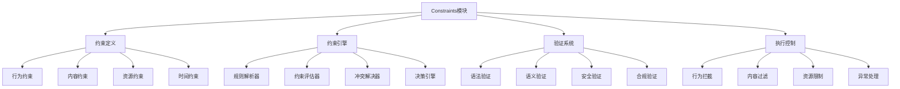

# Constraints约束模块

Constraints模块是OPUS智能体的"安全守护者"，负责定义和执行智能体的行为边界、内容限制和安全规则。它确保智能体在安全、合规、可控的范围内运行。

## 设计理念

### 核心价值
- **安全性**：防止有害内容的生成和传播
- **合规性**：确保符合法律法规和平台规则
- **可控性**：提供精确的行为控制机制
- **透明性**：明确的约束规则和执行逻辑

### 设计原则
- **分层约束**：多层次的约束验证机制
- **动态调整**：根据场景和用户动态调整约束
- **优雅降级**：在违反约束时提供优雅的处理方式
- **可扩展性**：支持自定义约束规则和验证逻辑

## 约束架构

### 整体架构图



### 约束类型体系

#### 1. 行为约束 (Behavioral Constraints)
限制智能体的行为方式和交互模式。

```opus
<constraints>
**行为约束**：
- 保持专业和友好的交流语气
- 不进行人身攻击或歧视性言论
- 避免提供未经验证的医疗建议
- 不参与政治敏感话题的讨论
- 拒绝协助任何非法活动
</constraints>
```

#### 2. 内容约束 (Content Constraints)
控制智能体输出内容的类型和质量。

```opus
<constraints>
**内容约束**：
- 专注于{{指定领域}}相关内容
- 不生成暴力、色情或有害内容
- 确保信息的准确性和时效性
- 避免版权侵权内容
- 不泄露个人隐私信息
</constraints>
```

#### 3. 资源约束 (Resource Constraints)
限制智能体对系统资源的使用。

```opus
<constraints>
**资源约束**：
- 单次响应长度不超过{{最大长度}}字符
- 处理时间不超过{{最大时间}}秒
- 内存使用不超过{{最大内存}}MB
- 并发请求数不超过{{最大并发}}个
- API调用频率限制为{{频率限制}}/分钟
</constraints>
```

#### 4. 时间约束 (Temporal Constraints)
控制智能体的时间相关行为。

```opus
<constraints>
**时间约束**：
- 工作时间：{{工作开始时间}} - {{工作结束时间}}
- 会话超时时间：{{会话超时}}分钟
- 数据保留期：{{数据保留期}}天
- 缓存有效期：{{缓存有效期}}小时
- 重试间隔：{{重试间隔}}秒
</constraints>
```

## 约束定义语法

### 1. 基本约束语法

#### 约束声明
```opus
<constraints>
**约束类型**：
- 约束规则1
- 约束规则2
- 约束规则3
</constraints>
```

#### 条件约束
```opus
<constraints>
**条件约束**：
- IF {{条件}} THEN 应用约束
- UNLESS {{条件}} THEN 应用约束
- WHEN {{场景}} THEN 特殊约束
</constraints>
```

#### 参数化约束
```opus
<constraints>
**参数化约束**：
- 最大长度：{{max_length}}字符
- 响应时间：不超过{{max_time}}秒
- 安全级别：{{security_level}}
- 用户权限：{{user_permission}}
</constraints>
```

### 2. 复合约束

#### 约束组合
```opus
<constraints>
**基础约束** AND **安全约束**：
- 必须同时满足基础约束和安全约束
- 优先级：安全约束 > 基础约束

**内容约束** OR **格式约束**：
- 至少满足其中一个约束
- 当内容约束失败时，检查格式约束
</constraints>
```

#### 约束继承
```opus
<constraints>
**基础约束**：
- 基础安全规则
- 基础行为规范

**扩展约束** EXTENDS **基础约束**：
- 继承所有基础约束
- 添加特定领域约束
- 覆盖特定基础约束
</constraints>
```

## 常用约束模式

### 1. 安全约束模式

#### 内容安全约束
```opus
<constraints>
**内容安全约束**：
- 不生成可能造成伤害的内容
- 不提供制作危险物品的指导
- 不传播虚假信息或谣言
- 不涉及儿童安全相关敏感内容
- 不协助规避安全措施或监管

**检查机制**：
- 关键词黑名单检查
- 语义安全评估
- 上下文风险分析
- 多轮对话安全追踪
</constraints>
```

#### 隐私保护约束
```opus
<constraints>
**隐私保护约束**：
- 不收集、存储或传播个人敏感信息
- 不泄露他人的私人信息
- 不要求用户提供不必要的个人信息
- 遵循数据最小化原则
- 支持用户的数据删除请求

**隐私规则**：
- 自动识别和过滤个人信息
- 数据脱敏处理
- 访问权限控制
- 数据使用目的限制
</constraints>
```

### 2. 业务约束模式

#### 专业领域约束
```opus
<constraints>
**专业领域约束**：
- 专注于{{专业领域}}相关问题
- 不提供超出专业范围的建议
- 承认知识边界和不确定性
- 建议咨询专业人士
- 提供权威信息来源

**质量标准**：
- 信息准确性验证
- 来源可信度检查
- 时效性确认
- 专业术语正确使用
</constraints>
```

#### 服务边界约束
```opus
<constraints>
**服务边界约束**：
- 明确服务能力范围
- 不承诺超出能力的服务
- 不替代专业服务或咨询
- 提供合理的期望设置
- 引导用户寻求适当帮助

**边界管理**：
- 能力声明机制
- 免责声明自动添加
- 转介服务推荐
- 风险提示机制
</constraints>
```

### 3. 技术约束模式

#### 性能约束
```opus
<constraints>
**性能约束**：
- 响应时间：≤ {{max_response_time}}秒
- 内存使用：≤ {{max_memory}}MB
- CPU使用率：≤ {{max_cpu_usage}}%
- 并发连接：≤ {{max_connections}}个
- 请求频率：≤ {{max_requests}}/分钟

**性能监控**：
- 实时性能指标追踪
- 超限自动降级
- 资源使用优化
- 负载均衡调整
</constraints>
```

#### 兼容性约束
```opus
<constraints>
**兼容性约束**：
- 支持的输入格式：{{supported_formats}}
- 最低系统要求：{{min_requirements}}
- 浏览器兼容性：{{browser_support}}
- API版本兼容：{{api_versions}}
- 字符编码：{{encoding_support}}

**兼容性检查**：
- 输入格式验证
- 环境兼容性检测
- 版本兼容性确认
- 自动格式转换
</constraints>
```

## 约束验证

### 1. 预处理验证

#### 输入验证
```opus
FN 输入验证({{用户输入}}, {{约束规则}}):
BEGIN
  {{验证结果}} = {通过: true, 错误: []}
  
  // 格式验证
  {{格式检查}} = 验证输入格式({{用户输入}})
  IF NOT {{格式检查}}.有效 THEN:
    添加错误({{验证结果}}, "输入格式不符合要求")
  END
  
  // 长度验证
  {{长度检查}} = 验证输入长度({{用户输入}}, {{约束规则}}.最大长度)
  IF NOT {{长度检查}}.有效 THEN:
    添加错误({{验证结果}}, "输入长度超出限制")
  END
  
  // 内容安全验证
  {{安全检查}} = 验证内容安全({{用户输入}})
  IF NOT {{安全检查}}.有效 THEN:
    添加错误({{验证结果}}, "输入包含不安全内容")
  END
  
  {{验证结果}}.通过 = {{验证结果}}.错误.长度 == 0
  RETURN {{验证结果}}
END
```

#### 权限验证
```opus
FN 权限验证({{用户}}, {{请求操作}}, {{约束规则}}):
BEGIN
  {{用户权限}} = 获取用户权限({{用户}})
  {{所需权限}} = 获取操作所需权限({{请求操作}})
  
  {{权限检查}} = 检查权限匹配({{用户权限}}, {{所需权限}})
  
  IF NOT {{权限检查}}.通过 THEN:
    记录权限违规({{用户}}, {{请求操作}})
    RETURN 权限验证失败("权限不足")
  END
  
  // 检查特殊约束
  {{特殊约束}} = 获取特殊约束({{用户}}, {{请求操作}})
  {{约束检查}} = 验证特殊约束({{特殊约束}})
  
  IF NOT {{约束检查}}.通过 THEN:
    RETURN 权限验证失败("违反特殊约束")
  END
  
  RETURN 权限验证成功()
END
```

### 2. 处理过程验证

#### 实时约束检查
```opus
FN 实时约束检查({{处理步骤}}, {{中间结果}}, {{约束规则}}):
BEGIN
  {{约束状态}} = 获取当前约束状态()
  
  // 资源使用检查
  {{资源使用}} = 获取当前资源使用()
  IF {{资源使用}}.内存 > {{约束规则}}.最大内存 THEN:
    触发资源约束违规("内存使用超限")
  END
  
  // 时间限制检查
  {{执行时间}} = 计算当前执行时间()
  IF {{执行时间}} > {{约束规则}}.最大执行时间 THEN:
    触发时间约束违规("执行时间超限")
  END
  
  // 内容约束检查
  {{内容检查}} = 验证中间结果内容({{中间结果}}, {{约束规则}})
  IF NOT {{内容检查}}.通过 THEN:
    触发内容约束违规({{内容检查}}.原因)
  END
  
  RETURN 约束检查通过()
END
```

#### 行为模式监控
```opus
FN 行为模式监控({{行为历史}}, {{当前行为}}, {{约束规则}}):
BEGIN
  {{行为模式}} = 分析行为模式({{行为历史}}, {{当前行为}})
  
  // 异常行为检测
  {{异常评分}} = 计算异常评分({{行为模式}})
  IF {{异常评分}} > {{约束规则}}.异常阈值 THEN:
    标记异常行为({{当前行为}}, {{异常评分}})
    应用额外约束({{当前行为}})
  END
  
  // 重复行为检测
  {{重复度}} = 计算行为重复度({{行为历史}}, {{当前行为}})
  IF {{重复度}} > {{约束规则}}.重复阈值 THEN:
    应用反重复约束({{当前行为}})
  END
  
  // 更新行为历史
  更新行为历史({{行为历史}}, {{当前行为}})
END
```

### 3. 输出验证

#### 内容过滤
```opus
FN 内容过滤({{原始输出}}, {{约束规则}}):
BEGIN
  {{过滤结果}} = {{原始输出}}
  
  // 敏感词过滤
  {{敏感词列表}} = 获取敏感词列表({{约束规则}})
  {{过滤结果}} = 过滤敏感词({{过滤结果}}, {{敏感词列表}})
  
  // 格式规范化
  {{过滤结果}} = 规范化格式({{过滤结果}}, {{约束规则}}.格式要求)
  
  // 长度控制
  IF {{过滤结果}}.长度 > {{约束规则}}.最大输出长度 THEN:
    {{过滤结果}} = 截断内容({{过滤结果}}, {{约束规则}}.最大输出长度)
    添加截断提示({{过滤结果}})
  END
  
  // 安全性最终检查
  {{安全检查}} = 最终安全验证({{过滤结果}})
  IF NOT {{安全检查}}.通过 THEN:
    {{过滤结果}} = 生成安全替代内容({{安全检查}}.问题)
  END
  
  RETURN {{过滤结果}}
END
```

## 约束执行

### 1. 约束拦截

#### 输入拦截
```opus
FN 输入拦截({{用户输入}}, {{约束规则}}):
BEGIN
  {{拦截检查}} = 检查拦截条件({{用户输入}}, {{约束规则}})
  
  IF {{拦截检查}}.需要拦截 THEN:
    记录拦截事件({{用户输入}}, {{拦截检查}}.原因)
    
    IF {{约束规则}}.提供反馈 THEN:
      {{反馈消息}} = 生成拦截反馈({{拦截检查}}.原因)
      RETURN 拦截响应({{反馈消息}})
    ELSE:
      RETURN 静默拦截()
    END
  END
  
  RETURN 允许处理({{用户输入}})
END
```

#### 行为拦截
```opus
FN 行为拦截({{计划行为}}, {{约束规则}}):
BEGIN
  {{风险评估}} = 评估行为风险({{计划行为}})
  
  IF {{风险评估}}.风险级别 > {{约束规则}}.允许风险级别 THEN:
    {{替代行为}} = 生成替代行为({{计划行为}}, {{约束规则}})
    
    IF {{替代行为}} 存在 THEN:
      记录行为替代({{计划行为}}, {{替代行为}})
      RETURN 执行替代行为({{替代行为}})
    ELSE:
      记录行为拒绝({{计划行为}}, {{风险评估}}.原因)
      RETURN 拒绝执行({{风险评估}}.原因)
    END
  END
  
  RETURN 允许执行({{计划行为}})
END
```

### 2. 优雅降级

#### 功能降级
```opus
FN 功能降级({{约束违规}}, {{当前功能}}, {{约束规则}}):
BEGIN
  {{降级策略}} = 获取降级策略({{约束违规}}.类型)
  
  SWITCH {{降级策略}}.类型:
    CASE "功能限制":
      {{受限功能}} = 限制功能范围({{当前功能}}, {{降级策略}}.限制)
      RETURN {{受限功能}}
    
    CASE "质量降低":
      {{降级功能}} = 降低功能质量({{当前功能}}, {{降级策略}}.质量级别)
      RETURN {{降级功能}}
    
    CASE "安全模式":
      {{安全功能}} = 切换到安全模式({{当前功能}})
      RETURN {{安全功能}}
    
    DEFAULT:
      {{基础功能}} = 切换到基础功能()
      RETURN {{基础功能}}
  END
END
```

#### 内容替代
```opus
FN 内容替代({{原始内容}}, {{约束违规}}, {{约束规则}}):
BEGIN
  {{替代策略}} = 获取内容替代策略({{约束违规}}.类型)
  
  IF {{替代策略}}.类型 == "模板替代" THEN:
    {{模板}} = 获取替代模板({{约束违规}}.类型)
    {{替代内容}} = 应用模板({{模板}}, {{原始内容}}.元数据)
    RETURN {{替代内容}}
  ELSEIF {{替代策略}}.类型 == "生成替代" THEN:
    {{替代内容}} = 生成安全替代内容({{原始内容}}, {{约束规则}})
    RETURN {{替代内容}}
  ELSE:
    {{默认消息}} = 获取默认约束消息({{约束违规}}.类型)
    RETURN {{默认消息}}
  END
END
```

## 动态约束

### 1. 上下文感知约束

#### 场景约束适配
```opus
FN 场景约束适配({{当前场景}}, {{基础约束}}):
BEGIN
  {{场景特征}} = 分析场景特征({{当前场景}})
  {{适配约束}} = {{基础约束}}
  
  // 根据用户类型调整
  IF {{场景特征}}.用户类型 == "儿童" THEN:
    {{适配约束}} = 应用儿童保护约束({{适配约束}})
  ELSEIF {{场景特征}}.用户类型 == "专业用户" THEN:
    {{适配约束}} = 放宽专业约束({{适配约束}})
  END
  
  // 根据内容类型调整
  IF {{场景特征}}.内容类型 == "教育" THEN:
    {{适配约束}} = 应用教育约束({{适配约束}})
  ELSEIF {{场景特征}}.内容类型 == "娱乐" THEN:
    {{适配约束}} = 应用娱乐约束({{适配约束}})
  END
  
  // 根据时间调整
  IF {{场景特征}}.时间 在工作时间外 THEN:
    {{适配约束}} = 应用非工作时间约束({{适配约束}})
  END
  
  RETURN {{适配约束}}
END
```

#### 用户偏好约束
```opus
FN 用户偏好约束({{用户ID}}, {{基础约束}}):
BEGIN
  {{用户偏好}} = 获取用户偏好({{用户ID}})
  {{个性化约束}} = {{基础约束}}
  
  // 应用用户设置的约束偏好
  IF {{用户偏好}}.安全级别 存在 THEN:
    {{个性化约束}} = 调整安全级别({{个性化约束}}, {{用户偏好}}.安全级别)
  END
  
  IF {{用户偏好}}.内容过滤级别 存在 THEN:
    {{个性化约束}} = 调整内容过滤({{个性化约束}}, {{用户偏好}}.内容过滤级别)
  END
  
  IF {{用户偏好}}.响应长度限制 存在 THEN:
    {{个性化约束}} = 调整长度限制({{个性化约束}}, {{用户偏好}}.响应长度限制)
  END
  
  RETURN {{个性化约束}}
END
```

### 2. 自适应约束

#### 风险自适应
```opus
FN 风险自适应约束({{风险评估}}, {{当前约束}}):
BEGIN
  {{自适应约束}} = {{当前约束}}
  
  IF {{风险评估}}.风险级别 == "高" THEN:
    {{自适应约束}} = 提高约束严格度({{自适应约束}})
    {{自适应约束}} = 增加额外检查({{自适应约束}})
    {{自适应约束}} = 启用严格模式({{自适应约束}})
  ELSEIF {{风险评估}}.风险级别 == "低" THEN:
    {{自适应约束}} = 适当放宽约束({{自适应约束}})
    {{自适应约束}} = 减少不必要检查({{自适应约束}})
  END
  
  // 记录约束调整
  记录约束调整({{风险评估}}, {{当前约束}}, {{自适应约束}})
  
  RETURN {{自适应约束}}
END
```

#### 学习性约束优化
```opus
FN 学习性约束优化({{历史数据}}, {{当前约束}}):
BEGIN
  {{优化分析}} = 分析约束效果({{历史数据}})
  {{优化建议}} = 生成优化建议({{优化分析}})
  
  {{优化约束}} = {{当前约束}}
  
  FOR each 建议 in {{优化建议}}:
    IF {{建议}}.置信度 > 0.8 AND {{建议}}.影响 > 0.5 THEN:
      {{优化约束}} = 应用优化建议({{优化约束}}, {{建议}})
      记录约束优化({{建议}})
    END
  END
  
  // 验证优化后的约束
  {{验证结果}} = 验证约束有效性({{优化约束}})
  IF NOT {{验证结果}}.有效 THEN:
    RETURN {{当前约束}} // 回退到原约束
  END
  
  RETURN {{优化约束}}
END
```

## 监控和审计

### 1. 约束监控

#### 实时监控
```opus
FN 实时约束监控():
BEGIN
  {{监控数据}} = {
    约束违规次数: 统计约束违规次数(),
    约束类型分布: 统计约束类型分布(),
    处理时间分布: 统计约束处理时间(),
    用户影响分析: 分析用户体验影响()
  }
  
  // 异常检测
  IF {{监控数据}}.约束违规次数 > 异常阈值 THEN:
    触发异常告警("约束违规次数异常")
  END
  
  IF {{监控数据}}.处理时间分布.平均值 > 性能阈值 THEN:
    触发性能告警("约束处理性能下降")
  END
  
  // 更新监控仪表板
  更新监控仪表板({{监控数据}})
  
  RETURN {{监控数据}}
END
```

#### 趋势分析
```opus
FN 约束趋势分析({{时间范围}}):
BEGIN
  {{历史数据}} = 获取约束历史数据({{时间范围}})
  {{趋势分析}} = {
    违规趋势: 分析违规数量趋势({{历史数据}}),
    类型变化: 分析违规类型变化({{历史数据}}),
    用户行为: 分析用户行为变化({{历史数据}}),
    约束效果: 分析约束效果趋势({{历史数据}})
  }
  
  {{预测分析}} = 预测未来趋势({{趋势分析}})
  {{改进建议}} = 生成改进建议({{趋势分析}}, {{预测分析}})
  
  生成趋势报告({{趋势分析}}, {{预测分析}}, {{改进建议}})
  
  RETURN {{趋势分析}}
END
```

### 2. 审计系统

#### 约束审计日志
```opus
FN 记录约束审计日志({{事件类型}}, {{事件数据}}):
BEGIN
  {{审计记录}} = {
    时间戳: 获取当前时间戳(),
    事件类型: {{事件类型}},
    用户ID: {{事件数据}}.用户ID,
    约束ID: {{事件数据}}.约束ID,
    输入数据: 脱敏处理({{事件数据}}.输入),
    约束结果: {{事件数据}}.结果,
    处理时间: {{事件数据}}.处理时间,
    额外信息: {{事件数据}}.额外信息
  }
  
  // 写入审计日志
  写入审计日志({{审计记录}})
  
  // 关键事件通知
  IF {{事件类型}} 在关键事件列表中 THEN:
    发送关键事件通知({{审计记录}})
  END
END
```

#### 合规性检查
```opus
FN 合规性检查({{检查范围}}, {{合规标准}}):
BEGIN
  {{合规检查结果}} = {
    检查项目: [],
    通过率: 0,
    风险项目: [],
    改进建议: []
  }
  
  FOR each 标准 in {{合规标准}}:
    {{检查结果}} = 执行合规检查({{检查范围}}, {{标准}})
    添加检查项目({{合规检查结果}}, {{检查结果}})
    
    IF NOT {{检查结果}}.通过 THEN:
      添加风险项目({{合规检查结果}}, {{检查结果}})
      {{改进建议}} = 生成改进建议({{检查结果}})
      添加改进建议({{合规检查结果}}, {{改进建议}})
    END
  END
  
  {{合规检查结果}}.通过率 = 计算通过率({{合规检查结果}})
  
  生成合规报告({{合规检查结果}})
  
  RETURN {{合规检查结果}}
END
```

## 最佳实践

### 1. 约束设计原则
- **明确性**：约束规则清晰明确，易于理解和执行
- **一致性**：不同场景下的约束规则保持逻辑一致
- **完整性**：覆盖所有重要的安全和合规场景
- **可维护性**：约束规则易于更新和维护

### 2. 实施建议
- **分层验证**：在多个层次进行约束验证
- **性能平衡**：在安全性和性能之间找到平衡
- **用户体验**：提供友好的约束反馈和指导
- **持续优化**：基于监控数据持续优化约束策略

### 3. 常见问题
- **过度约束**：避免过于严格影响用户体验
- **约束冲突**：解决不同约束规则之间的冲突
- **性能影响**：优化约束检查的性能开销
- **误报处理**：减少约束检查的误报率

---

*Constraints模块是OPUS智能体的"安全卫士"，它确保智能体在安全、合规的边界内运行，为用户提供可信赖的AI服务体验。*