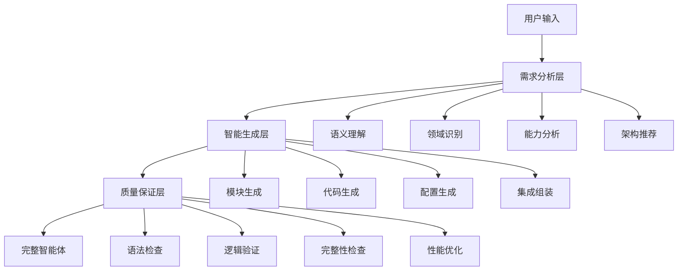
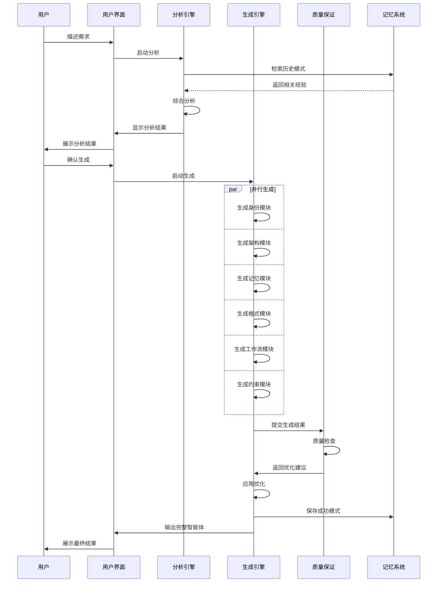

# 生成器概述

OPUS生成器是系统的核心引擎，负责将用户的自然语言需求转换为完整可用的智能体。它采用智能分析、动态生成、质量保证的三层架构，确保生成的智能体既专业又实用。

## 系统架构

### 整体设计理念



### 核心组件

#### 1. 需求分析引擎
- **语义理解**：深度解析用户意图和需求
- **领域识别**：自动识别专业领域和应用场景
- **能力分析**：提取核心能力需求和技能要求
- **架构推荐**：基于最佳实践推荐最优架构

#### 2. 智能生成引擎
- **模板引擎**：基于模板的快速生成
- **内容生成**：AI辅助的内容创作
- **代码生成**：自动化的代码片段生成
- **配置管理**：智能化的配置生成

#### 3. 质量保证系统
- **语法检查**：OPUS语法规范验证
- **逻辑验证**：业务逻辑一致性检查
- **完整性检查**：模块完整性验证
- **性能优化**：生成结果的性能调优

## 工作流程

### 标准生成流程

```opus
FN 标准生成流程(用户输入):
BEGIN
  // 第一阶段：需求分析
  会话状态检查()
  需求语义分析(用户输入)
  领域特征识别()
  能力需求提取()
  架构模式推荐()
  
  // 第二阶段：生成确认
  显示分析结果()
  等待用户确认()
  
  // 第三阶段：智能生成
  IF 用户确认 THEN:
    启动并行生成引擎()
    生成身份模块()
    生成架构模块()
    生成记忆模块()
    生成格式模块()
    生成工作流模块()
    生成约束模块()
    
    // 第四阶段：质量保证
    集成所有模块()
    执行质量检查()
    优化生成结果()
    
    // 第五阶段：输出交付
    格式化输出()
    提供使用指导()
  END
END
```

### 生成时序图



## 核心技术

### 1. 智能分析技术

#### 语义理解算法
```python
class SemanticAnalyzer:
    def __init__(self):
        self.domain_keywords = self.load_domain_keywords()
        self.skill_patterns = self.load_skill_patterns()
        self.context_embeddings = self.load_context_embeddings()
    
    def analyze_user_input(self, user_input):
        # 关键词提取
        keywords = self.extract_keywords(user_input)
        
        # 领域识别
        domain = self.identify_domain(keywords)
        
        # 能力分析
        capabilities = self.analyze_capabilities(user_input)
        
        # 复杂度评估
        complexity = self.assess_complexity(capabilities)
        
        return AnalysisResult(domain, capabilities, complexity)
```

#### 领域识别机制
- **关键词匹配**：基于预训练的领域词典
- **语义相似度**：使用embedding计算语义距离
- **上下文推理**：结合对话历史进行推理
- **多维度评分**：综合多个指标进行决策

### 2. 动态生成技术

#### 模板引擎架构
```python
class TemplateEngine:
    def __init__(self):
        self.templates = self.load_templates()
        self.generators = {
            'identity': IdentityGenerator(),
            'architecture': ArchitectureGenerator(),
            'memory': MemoryGenerator(),
            'formats': FormatsGenerator(),
            'workflow': WorkflowGenerator(),
            'constraints': ConstraintsGenerator()
        }
    
    def generate_agent(self, requirements):
        # 并行生成各模块
        with ThreadPoolExecutor(max_workers=6) as executor:
            futures = {}
            for module_name, generator in self.generators.items():
                future = executor.submit(generator.generate, requirements)
                futures[module_name] = future
            
            # 收集生成结果
            results = {}
            for module_name, future in futures.items():
                results[module_name] = future.result()
        
        # 集成生成结果
        return self.integrate_modules(results)
```

#### 内容生成策略
- **模板驱动**：基于预定义模板快速生成
- **规则引擎**：基于业务规则的智能生成
- **AI辅助**：利用AI模型增强生成质量
- **上下文感知**：根据上下文调整生成策略

### 3. 质量保证技术

#### 多层验证机制
```python
class QualityAssurance:
    def __init__(self):
        self.validators = [
            SyntaxValidator(),
            LogicValidator(),
            CompletenessValidator(),
            ConsistencyValidator(),
            PerformanceValidator()
        ]
    
    def validate_agent(self, agent):
        validation_results = []
        
        for validator in self.validators:
            result = validator.validate(agent)
            validation_results.append(result)
            
            if not result.is_valid:
                # 尝试自动修复
                fixed_agent = validator.auto_fix(agent)
                if fixed_agent:
                    agent = fixed_agent
                else:
                    # 记录无法修复的问题
                    self.log_validation_issue(result)
        
        return ValidationReport(validation_results), agent
```

#### 质量检查项目
- **语法检查**：OPUS语法规范符合性
- **逻辑检查**：模块间逻辑一致性
- **完整性检查**：必需模块和内容完整性
- **一致性检查**：风格和命名一致性
- **性能检查**：生成结果的性能优化

## 生成器特性

### 1. 智能化特性

#### 自适应生成
- **需求感知**：根据需求复杂度调整生成策略
- **领域适配**：针对不同领域优化生成模式
- **用户偏好**：学习用户偏好调整生成风格
- **上下文感知**：结合对话历史优化生成

#### 学习优化
- **模式学习**：从成功案例中学习最佳模式
- **反馈整合**：整合用户反馈改进生成质量
- **持续优化**：基于使用数据持续改进
- **A/B测试**：通过测试优化生成策略

### 2. 扩展性特性

#### 模块化设计
- **插件架构**：支持自定义生成器插件
- **模板扩展**：支持自定义模板和格式
- **规则扩展**：支持自定义业务规则
- **集成扩展**：支持外部系统集成

#### 配置灵活性
- **生成策略配置**：可配置的生成策略
- **质量标准配置**：可调整的质量检查标准
- **输出格式配置**：可定制的输出格式
- **性能参数配置**：可调节的性能参数

### 3. 可靠性特性

#### 错误处理
- **异常捕获**：全面的异常处理机制
- **优雅降级**：在部分功能失效时保持基本功能
- **错误恢复**：自动错误恢复和重试机制
- **状态保持**：生成过程状态的持久化

#### 稳定性保证
- **资源管理**：有效的资源分配和释放
- **并发控制**：安全的并发处理机制
- **负载均衡**：智能的负载分配
- **监控告警**：实时的性能监控和告警

## 性能优化

### 1. 生成速度优化

#### 并行处理
- **模块并行**：多个模块同时生成
- **任务分片**：大任务分解为小任务并行处理
- **异步处理**：非阻塞的异步处理模式
- **资源池化**：复用生成器资源

#### 缓存策略
- **结果缓存**：缓存常用生成结果
- **模板缓存**：缓存编译后的模板
- **分析缓存**：缓存需求分析结果
- **智能预取**：预测性的缓存预取

### 2. 内存优化

#### 内存管理
- **对象池**：重用对象减少内存分配
- **惰性加载**：按需加载资源
- **内存监控**：实时内存使用监控
- **垃圾回收**：主动的内存垃圾回收

#### 资源优化
- **资源复用**：最大化资源利用率
- **动态调整**：根据负载动态调整资源
- **资源隔离**：避免资源竞争
- **优雅关闭**：确保资源正确释放

### 3. 质量与速度平衡

#### 动态策略
- **快速模式**：牺牲部分质量换取速度
- **标准模式**：平衡质量和速度
- **精细模式**：最大化质量不考虑速度
- **自适应模式**：根据需求自动选择策略

#### 优化算法
- **启发式优化**：基于经验的快速优化
- **遗传算法**：进化式的参数优化
- **梯度下降**：基于梯度的性能优化
- **强化学习**：基于反馈的策略优化

## 监控与调试

### 1. 性能监控

#### 关键指标
- **生成速度**：平均生成时间和峰值时间
- **成功率**：生成成功率和失败率
- **质量评分**：生成结果的质量评分
- **用户满意度**：用户反馈和评价

#### 监控工具
- **实时监控**：实时性能数据监控
- **历史分析**：历史性能数据分析
- **告警系统**：异常情况自动告警
- **报表生成**：定期性能报表生成

### 2. 调试工具

#### 调试功能
- **步骤追踪**：详细的生成步骤追踪
- **状态检查**：实时的系统状态检查
- **日志分析**：详细的日志分析工具
- **性能分析**：性能瓶颈分析工具

#### 问题诊断
- **错误定位**：快速错误定位和诊断
- **根因分析**：深入的根因分析
- **修复建议**：自动的修复建议
- **预防措施**：问题预防措施建议

## 未来发展

### 1. 技术演进

#### AI增强
- **大语言模型集成**：集成更强大的语言模型
- **多模态生成**：支持图像、音频等多模态生成
- **自然语言编程**：更自然的编程语言支持
- **智能调试**：AI辅助的调试和优化

#### 性能提升
- **量子计算**：利用量子计算提升性能
- **边缘计算**：支持边缘计算部署
- **分布式处理**：大规模分布式处理
- **硬件优化**：针对特定硬件的优化

### 2. 功能扩展

#### 领域扩展
- **垂直领域**：更多垂直领域的深度支持
- **行业定制**：针对特定行业的定制化
- **国际化**：多语言和多文化支持
- **合规性**：满足各地法规要求

#### 生态建设
- **开发者社区**：建设活跃的开发者社区
- **插件市场**：建立丰富的插件市场
- **培训体系**：完善的培训和认证体系
- **合作伙伴**：广泛的合作伙伴网络

---

*OPUS生成器代表了智能体生成技术的前沿，它不仅是一个工具，更是一个能够理解、学习、创造的智能系统。随着技术的不断进步，它将为用户带来更加智能、高效、个性化的智能体生成体验。*