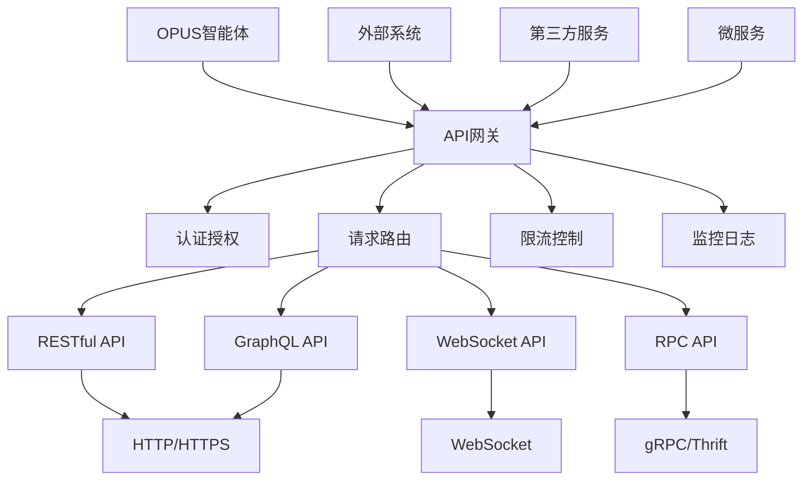

# API接口集成

OPUS智能体通过标准化的API接口，能够与各种外部系统和服务进行集成。本文档详细介绍API接口的设计规范、集成方法和最佳实践。

## API接口架构

### 整体设计



### 核心组件

#### 1. API网关
统一的API入口和管理中心。

```opus
<architecture>
API网关：[Gateway.router, Gateway.auth, Gateway.limiter, Gateway.monitor]
网关能力：
  - 统一的API路由和转发
  - 认证授权和权限控制
  - 请求限流和熔断保护
  - API版本管理和兼容性
</architecture>
```

#### 2. 接口标准
定义统一的API接口规范和协议。

```opus
<constraints>
**API接口标准**：
- RESTful设计原则
- 统一的请求响应格式
- 标准化的错误处理
- 完整的API文档和规范
</constraints>
```

## RESTful API设计

### API设计原则

```opus
# RESTful API设计规范

## 资源命名规范
- 使用名词而非动词
- 使用复数形式
- 使用小写字母和连字符
- 保持URL简洁明了

## HTTP方法语义
- GET: 获取资源
- POST: 创建资源
- PUT: 完整更新资源
- PATCH: 部分更新资源
- DELETE: 删除资源

## 状态码规范
- 200: 成功
- 201: 创建成功
- 400: 客户端错误
- 401: 未授权
- 403: 禁止访问
- 404: 资源不存在
- 500: 服务器错误
```

### API端点设计

```opus
# OPUS智能体API端点设计

## 智能体管理API
GET    /api/v1/agents                    # 获取智能体列表
POST   /api/v1/agents                    # 创建新智能体
GET    /api/v1/agents/{id}               # 获取特定智能体
PUT    /api/v1/agents/{id}               # 更新智能体
DELETE /api/v1/agents/{id}               # 删除智能体

## 对话交互API
POST   /api/v1/agents/{id}/chat          # 发送消息
GET    /api/v1/agents/{id}/sessions      # 获取会话列表
POST   /api/v1/agents/{id}/sessions      # 创建新会话
GET    /api/v1/agents/{id}/sessions/{sid} # 获取特定会话
DELETE /api/v1/agents/{id}/sessions/{sid} # 删除会话

## 知识管理API
GET    /api/v1/agents/{id}/knowledge     # 获取知识库
POST   /api/v1/agents/{id}/knowledge     # 添加知识
PUT    /api/v1/agents/{id}/knowledge/{kid} # 更新知识
DELETE /api/v1/agents/{id}/knowledge/{kid} # 删除知识

## 工具集成API
GET    /api/v1/tools                     # 获取可用工具
POST   /api/v1/agents/{id}/tools         # 为智能体配置工具
GET    /api/v1/agents/{id}/tools         # 获取智能体工具
DELETE /api/v1/agents/{id}/tools/{tid}   # 移除工具配置
```

### 请求响应格式

```opus
# 标准请求格式
{
  "data": {
    // 业务数据
  },
  "meta": {
    "timestamp": "2024-01-01T00:00:00Z",
    "request_id": "uuid",
    "client_version": "1.0.0"
  }
}

# 标准响应格式
{
  "success": true,
  "data": {
    // 响应数据
  },
  "error": null,
  "meta": {
    "timestamp": "2024-01-01T00:00:00Z",
    "request_id": "uuid",
    "server_version": "1.0.0",
    "execution_time": 150
  }
}

# 错误响应格式
{
  "success": false,
  "data": null,
  "error": {
    "code": "ERROR_CODE",
    "message": "错误描述",
    "details": {
      // 错误详情
    }
  },
  "meta": {
    "timestamp": "2024-01-01T00:00:00Z",
    "request_id": "uuid",
    "server_version": "1.0.0"
  }
}
```

### API实现示例

```opus
FN API智能体对话处理({{智能体ID}}, {{消息内容}}, {{会话选项}}):
BEGIN
  // 1. 请求验证
  {{验证结果}} = 验证API请求({{智能体ID}}, {{消息内容}})
  IF NOT {{验证结果}}.有效 THEN:
    RETURN API错误响应(400, "请求参数无效", {{验证结果}}.错误详情)
  END
  
  // 2. 智能体检查
  {{智能体}} = 获取智能体({{智能体ID}})
  IF NOT {{智能体}} 存在 THEN:
    RETURN API错误响应(404, "智能体不存在")
  END
  
  // 3. 权限验证
  {{权限检查}} = 验证访问权限({{智能体ID}})
  IF NOT {{权限检查}}.通过 THEN:
    RETURN API错误响应(403, "访问权限不足")
  END
  
  // 4. 会话管理
  {{会话}} = 获取或创建会话({{智能体ID}}, {{会话选项}})
  
  // 5. 消息处理
  {{处理开始时间}} = 获取当前时间()
  {{处理结果}} = {{智能体}}.处理消息({{消息内容}}, {{会话}})
  {{处理耗时}} = 计算处理耗时({{处理开始时间}})
  
  // 6. 响应构建
  {{响应数据}} = {
    消息ID: {{处理结果}}.消息ID,
    回复内容: {{处理结果}}.回复,
    会话ID: {{会话}}.ID,
    置信度: {{处理结果}}.置信度
  }
  
  {{响应元数据}} = {
    处理耗时: {{处理耗时}},
    智能体版本: {{智能体}}.版本,
    处理模式: {{处理结果}}.模式
  }
  
  // 7. 日志记录
  记录API调用日志({{智能体ID}}, "对话处理", {{处理耗时}}, {{处理结果}}.状态)
  
  RETURN API成功响应({{响应数据}}, {{响应元数据}})
END
```

## GraphQL API设计

### Schema定义

```graphql
# OPUS智能体GraphQL Schema

type Agent {
  id: ID!
  name: String!
  description: String
  version: String!
  status: AgentStatus!
  createdAt: DateTime!
  updatedAt: DateTime!
  
  # 关联数据
  sessions: [Session!]!
  knowledge: [Knowledge!]!
  tools: [Tool!]!
}

type Session {
  id: ID!
  agentId: ID!
  status: SessionStatus!
  createdAt: DateTime!
  lastActiveAt: DateTime!
  
  # 关联数据
  messages: [Message!]!
}

type Message {
  id: ID!
  sessionId: ID!
  content: String!
  type: MessageType!
  timestamp: DateTime!
  metadata: JSON
}

type Query {
  # 智能体查询
  agent(id: ID!): Agent
  agents(filter: AgentFilter, sort: AgentSort, pagination: Pagination): AgentConnection!
  
  # 会话查询
  session(id: ID!): Session
  sessions(agentId: ID!, filter: SessionFilter): [Session!]!
  
  # 消息查询
  messages(sessionId: ID!, pagination: Pagination): MessageConnection!
}

type Mutation {
  # 智能体管理
  createAgent(input: CreateAgentInput!): Agent!
  updateAgent(id: ID!, input: UpdateAgentInput!): Agent!
  deleteAgent(id: ID!): Boolean!
  
  # 对话交互
  sendMessage(input: SendMessageInput!): Message!
  createSession(agentId: ID!): Session!
  closeSession(id: ID!): Boolean!
  
  # 知识管理
  addKnowledge(agentId: ID!, input: AddKnowledgeInput!): Knowledge!
  updateKnowledge(id: ID!, input: UpdateKnowledgeInput!): Knowledge!
  removeKnowledge(id: ID!): Boolean!
}

type Subscription {
  # 实时消息
  messageAdded(sessionId: ID!): Message!
  
  # 智能体状态变化
  agentStatusChanged(agentId: ID!): Agent!
  
  # 系统事件
  systemEvent(types: [EventType!]): SystemEvent!
}
```

### Resolver实现

```opus
FN GraphQL_Agent_Resolver({{parent}}, {{args}}, {{context}}, {{info}}):
BEGIN
  {{字段选择}} = 分析字段选择({{info}})
  {{数据加载策略}} = 优化数据加载策略({{字段选择}})
  
  SWITCH {{info}}.字段名:
    CASE "agent":
      {{智能体}} = 获取智能体({{args}}.id, {{数据加载策略}})
      RETURN {{智能体}}
    
    CASE "agents":
      {{过滤条件}} = 构建过滤条件({{args}}.filter)
      {{排序规则}} = 构建排序规则({{args}}.sort)
      {{分页参数}} = 处理分页参数({{args}}.pagination)
      
      {{智能体列表}} = 查询智能体列表({{过滤条件}}, {{排序规则}}, {{分页参数}})
      {{连接对象}} = 构建连接对象({{智能体列表}}, {{分页参数}})
      
      RETURN {{连接对象}}
    
    CASE "sendMessage":
      {{消息输入}} = {{args}}.input
      {{会话验证}} = 验证会话权限({{消息输入}}.sessionId, {{context}}.用户)
      
      IF NOT {{会话验证}}.通过 THEN:
        抛出GraphQL错误("会话访问权限不足")
      END
      
      {{处理结果}} = 处理消息发送({{消息输入}})
      RETURN {{处理结果}}.消息
  END
END
```

### 实时订阅

```opus
FN GraphQL_Subscription_处理({{订阅类型}}, {{参数}}, {{上下文}}):
BEGIN
  {{订阅管理器}} = 获取订阅管理器()
  
  SWITCH {{订阅类型}}:
    CASE "messageAdded":
      {{会话ID}} = {{参数}}.sessionId
      {{权限检查}} = 验证会话订阅权限({{会话ID}}, {{上下文}}.用户)
      
      IF NOT {{权限检查}}.通过 THEN:
        抛出GraphQL错误("订阅权限不足")
      END
      
      {{订阅流}} = {{订阅管理器}}.创建消息订阅({{会话ID}})
      RETURN {{订阅流}}
    
    CASE "agentStatusChanged":
      {{智能体ID}} = {{参数}}.agentId
      {{订阅流}} = {{订阅管理器}}.创建状态订阅({{智能体ID}})
      RETURN {{订阅流}}
    
    CASE "systemEvent":
      {{事件类型}} = {{参数}}.types
      {{订阅流}} = {{订阅管理器}}.创建系统事件订阅({{事件类型}})
      RETURN {{订阅流}}
  END
END
```

## WebSocket API设计

### 连接管理

```opus
FN WebSocket连接管理():
BEGIN
  {{连接管理器}} = 创建连接管理器()
  
  // 连接建立处理
  {{连接管理器}}.onConnection = FN({{websocket}}, {{请求}}):
  BEGIN
    {{认证结果}} = 验证WebSocket认证({{请求}})
    IF NOT {{认证结果}}.通过 THEN:
      {{websocket}}.关闭(4001, "认证失败")
      RETURN
    END
    
    {{连接ID}} = 生成连接ID()
    {{连接信息}} = 创建连接信息({{连接ID}}, {{websocket}}, {{认证结果}}.用户)
    
    注册连接({{连接ID}}, {{连接信息}})
    发送连接确认({{websocket}}, {{连接ID}})
    
    记录连接日志({{连接ID}}, "连接建立")
  END
  
  // 消息处理
  {{连接管理器}}.onMessage = FN({{连接ID}}, {{消息}}):
  BEGIN
    {{解析消息}} = 解析WebSocket消息({{消息}})
    {{处理结果}} = 处理WebSocket请求({{连接ID}}, {{解析消息}})
    
    发送响应消息({{连接ID}}, {{处理结果}})
  END
  
  // 连接断开处理
  {{连接管理器}}.onDisconnection = FN({{连接ID}}, {{原因}}):
  BEGIN
    清理连接资源({{连接ID}})
    取消相关订阅({{连接ID}})
    
    记录连接日志({{连接ID}}, "连接断开: " + {{原因}})
  END
  
  RETURN {{连接管理器}}
END
```

### 消息协议

```opus
# WebSocket消息协议格式

## 请求消息格式
{
  "id": "request-id",
  "type": "request",
  "method": "method-name",
  "params": {
    // 请求参数
  },
  "timestamp": "2024-01-01T00:00:00Z"
}

## 响应消息格式
{
  "id": "request-id",
  "type": "response",
  "success": true,
  "data": {
    // 响应数据
  },
  "error": null,
  "timestamp": "2024-01-01T00:00:00Z"
}

## 推送消息格式
{
  "id": "push-id",
  "type": "push",
  "event": "event-name",
  "data": {
    // 推送数据
  },
  "timestamp": "2024-01-01T00:00:00Z"
}

## 订阅消息格式
{
  "id": "subscription-id",
  "type": "subscribe",
  "channel": "channel-name",
  "params": {
    // 订阅参数
  }
}
```

### 实时通信实现

```opus
FN WebSocket实时对话({{连接ID}}, {{智能体ID}}, {{消息内容}}):
BEGIN
  {{连接信息}} = 获取连接信息({{连接ID}})
  {{智能体}} = 获取智能体({{智能体ID}})
  
  // 权限验证
  {{权限检查}} = 验证智能体访问权限({{智能体ID}}, {{连接信息}}.用户)
  IF NOT {{权限检查}}.通过 THEN:
    发送错误消息({{连接ID}}, "权限不足")
    RETURN
  END
  
  // 获取或创建会话
  {{会话}} = 获取或创建WebSocket会话({{连接ID}}, {{智能体ID}})
  
  // 发送消息处理状态
  发送状态消息({{连接ID}}, "processing", "正在处理消息...")
  
  // 异步处理消息
  {{异步处理}} = ASYNC {{智能体}}.处理消息({{消息内容}}, {{会话}})
  
  // 处理结果回调
  {{异步处理}}.onProgress = FN({{进度信息}}):
  BEGIN
    发送进度消息({{连接ID}}, {{进度信息}})
  END
  
  {{异步处理}}.onComplete = FN({{处理结果}}):
  BEGIN
    发送完成消息({{连接ID}}, {{处理结果}})
    更新会话状态({{会话}}.ID, "active")
  END
  
  {{异步处理}}.onError = FN({{错误信息}}):
  BEGIN
    发送错误消息({{连接ID}}, {{错误信息}})
    记录处理错误({{智能体ID}}, {{错误信息}})
  END
  
  启动异步处理({{异步处理}})
END
```

## API安全和认证

### 认证机制

```opus
FN API认证处理({{请求}}, {{认证配置}}):
BEGIN
  {{认证类型}} = 检测认证类型({{请求}})
  
  SWITCH {{认证类型}}:
    CASE "API_KEY":
      {{API密钥}} = 提取API密钥({{请求}})
      {{验证结果}} = 验证API密钥({{API密钥}})
      RETURN {{验证结果}}
    
    CASE "JWT":
      {{JWT令牌}} = 提取JWT令牌({{请求}})
      {{验证结果}} = 验证JWT令牌({{JWT令牌}}, {{认证配置}}.JWT密钥)
      RETURN {{验证结果}}
    
    CASE "OAUTH":
      {{访问令牌}} = 提取OAuth令牌({{请求}})
      {{验证结果}} = 验证OAuth令牌({{访问令牌}}, {{认证配置}}.OAuth配置)
      RETURN {{验证结果}}
    
    CASE "BASIC":
      {{基础认证}} = 提取基础认证({{请求}})
      {{验证结果}} = 验证用户名密码({{基础认证}}.用户名, {{基础认证}}.密码)
      RETURN {{验证结果}}
    
    DEFAULT:
      RETURN 认证失败("不支持的认证类型")
  END
END
```

### 权限控制

```opus
FN API权限控制({{用户信息}}, {{API端点}}, {{操作类型}}):
BEGIN
  {{用户角色}} = 获取用户角色({{用户信息}})
  {{API权限要求}} = 获取API权限要求({{API端点}}, {{操作类型}})
  
  // 角色权限检查
  {{角色检查}} = 检查角色权限({{用户角色}}, {{API权限要求}}.角色要求)
  IF NOT {{角色检查}}.通过 THEN:
    RETURN 权限拒绝("角色权限不足")
  END
  
  // 资源权限检查
  IF {{API权限要求}}.资源权限 存在 THEN:
    {{资源ID}} = 提取资源ID({{API端点}})
    {{资源检查}} = 检查资源权限({{用户信息}}, {{资源ID}}, {{操作类型}})
    IF NOT {{资源检查}}.通过 THEN:
      RETURN 权限拒绝("资源权限不足")
    END
  END
  
  // 特殊权限检查
  FOR each 特殊权限 in {{API权限要求}}.特殊权限:
    {{特殊检查}} = 检查特殊权限({{用户信息}}, {{特殊权限}})
    IF NOT {{特殊检查}}.通过 THEN:
      RETURN 权限拒绝("特殊权限不足: " + {{特殊权限}})
    END
  END
  
  记录权限检查结果({{用户信息}}, {{API端点}}, "权限通过")
  RETURN 权限通过()
END
```

### 限流和熔断

```opus
FN API限流控制({{用户ID}}, {{API端点}}, {{限流配置}}):
BEGIN
  {{限流键}} = 生成限流键({{用户ID}}, {{API端点}})
  {{当前计数}} = 获取当前调用计数({{限流键}})
  
  // 检查各级限流
  {{限流检查结果}} = []
  
  // 每秒限流
  IF {{限流配置}}.每秒限制 存在 THEN:
    {{每秒计数}} = 获取每秒计数({{限流键}})
    IF {{每秒计数}} >= {{限流配置}}.每秒限制 THEN:
      添加限流结果({{限流检查结果}}, "每秒限流超限")
    END
  END
  
  // 每分钟限流
  IF {{限流配置}}.每分钟限制 存在 THEN:
    {{每分钟计数}} = 获取每分钟计数({{限流键}})
    IF {{每分钟计数}} >= {{限流配置}}.每分钟限制 THEN:
      添加限流结果({{限流检查结果}}, "每分钟限流超限")
    END
  END
  
  // 每小时限流
  IF {{限流配置}}.每小时限制 存在 THEN:
    {{每小时计数}} = 获取每小时计数({{限流键}})
    IF {{每小时计数}} >= {{限流配置}}.每小时限制 THEN:
      添加限流结果({{限流检查结果}}, "每小时限流超限")
    END
  END
  
  IF {{限流检查结果}}.长度 > 0 THEN:
    记录限流事件({{用户ID}}, {{API端点}}, {{限流检查结果}})
    RETURN 限流拒绝({{限流检查结果}})
  END
  
  // 更新计数器
  增加调用计数({{限流键}})
  
  RETURN 限流通过()
END
```

## API文档和版本管理

### 自动文档生成

```opus
FN API文档自动生成({{API规范}}, {{文档配置}}):
BEGIN
  {{文档构建器}} = 创建文档构建器({{文档配置}})
  
  // 解析API规范
  {{端点列表}} = 解析API端点({{API规范}})
  {{数据模型}} = 解析数据模型({{API规范}})
  {{认证信息}} = 解析认证配置({{API规范}})
  
  // 生成文档内容
  {{文档内容}} = {{文档构建器}}.构建({
    端点: {{端点列表}},
    模型: {{数据模型}},
    认证: {{认证信息}},
    示例: 生成API示例({{端点列表}})
  })
  
  // 生成交互式文档
  {{交互文档}} = 生成Swagger文档({{API规范}})
  {{测试界面}} = 生成API测试界面({{端点列表}})
  
  // 多格式输出
  {{文档输出}} = {
    HTML: 生成HTML文档({{文档内容}}),
    Markdown: 生成Markdown文档({{文档内容}}),
    PDF: 生成PDF文档({{文档内容}}),
    Swagger: {{交互文档}},
    测试界面: {{测试界面}}
  }
  
  RETURN {{文档输出}}
END
```

### API版本管理

```opus
FN API版本管理({{新版本规范}}, {{版本策略}}):
BEGIN
  {{当前版本}} = 获取当前API版本()
  {{版本差异}} = 分析版本差异({{当前版本}}, {{新版本规范}})
  
  // 兼容性检查
  {{兼容性分析}} = 分析向后兼容性({{版本差异}})
  IF {{兼容性分析}}.破坏性变更 存在 THEN:
    {{版本号}} = 递增主版本号({{当前版本}})
    记录破坏性变更({{兼容性分析}}.破坏性变更)
  ELSEIF {{版本差异}}.新功能 存在 THEN:
    {{版本号}} = 递增次版本号({{当前版本}})
  ELSE:
    {{版本号}} = 递增补丁版本号({{当前版本}})
  END
  
  // 版本发布准备
  {{发布计划}} = 制定版本发布计划({{版本号}}, {{版本差异}})
  {{迁移指南}} = 生成版本迁移指南({{版本差异}})
  {{弃用计划}} = 制定API弃用计划({{版本差异}}.弃用API)
  
  // 版本部署
  {{部署结果}} = 部署新版本({{版本号}}, {{新版本规范}})
  {{兼容性层}} = 维护版本兼容性层({{当前版本}}, {{版本号}})
  
  // 文档更新
  更新API文档({{版本号}}, {{新版本规范}})
  发布版本说明({{版本号}}, {{版本差异}}, {{迁移指南}})
  
  RETURN 版本发布成功({{版本号}}, {{发布计划}})
END
```

## 最佳实践

### API设计原则
- **一致性**：保持API接口的设计一致性
- **简洁性**：API接口简洁明了，易于使用
- **可扩展性**：设计时考虑未来的扩展需求
- **向后兼容**：新版本保持向后兼容性

### 性能优化
- **缓存策略**：合理使用API响应缓存
- **分页处理**：大数据集合使用分页返回
- **字段选择**：支持客户端选择返回字段
- **压缩传输**：启用响应内容压缩

### 安全考虑
- **HTTPS使用**：强制使用HTTPS传输
- **输入验证**：严格验证所有输入参数
- **输出过滤**：过滤敏感信息输出
- **审计日志**：记录详细的API访问日志

---

*API接口集成为OPUS智能体提供了标准化的外部交互能力，通过完善的API设计和管理体系，让智能体能够安全、高效地与各种外部系统集成。*