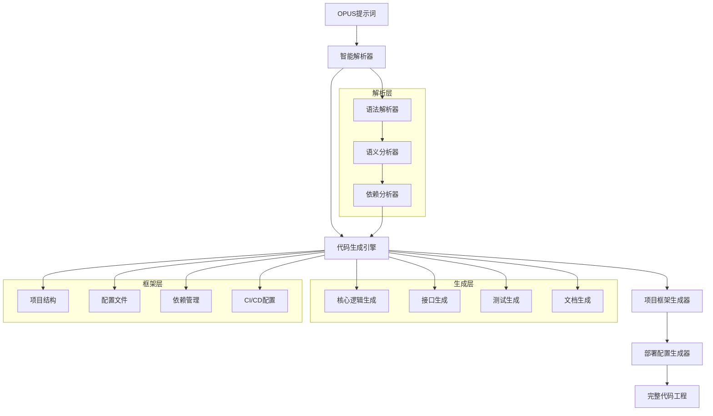
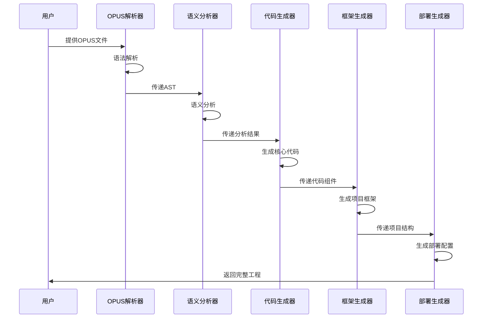

# OPUS代码工程转换方案

## 🎯 项目概述

OPUS代码工程转换器是一个先进的开发框架，能够将OPUS提示词智能地转换为可执行的代码工程，实现智能体的代码化部署和产品化应用。

### 核心价值
- **提示词 → 代码工程**：自动化转换流程
- **智能体产品化**：从概念到产品的完整链路
- **企业级部署**：支持大规模生产环境
- **多平台适配**：适配不同的AI平台和框架

## 🏗️ 系统架构

### 整体架构图


### 技术栈设计
```python
# 核心技术栈
TECHNOLOGY_STACK = {
    "parser": {
        "language": "Python 3.11+",
        "framework": "FastAPI",
        "libs": ["pydantic", "typing-extensions", "ast-tools"]
    },
    "generator": {
        "template_engine": "Jinja2",
        "code_formatter": "black + isort",
        "ast_manipulation": "astroid + ast"
    },
    "output_frameworks": {
        "web": ["FastAPI", "Flask", "Django"],
        "ai_frameworks": ["LangChain", "CrewAI", "AutoGen"],
        "deployment": ["Docker", "Kubernetes", "Serverless"]
    }
}
```

## 🔧 核心组件设计

### 1. OPUS解析引擎

#### 语法解析器
```python
class OpusParser:
    """OPUS语法解析器"""
    
    def __init__(self):
        self.syntax_rules = OpusSyntaxRules()
        self.ast_builder = OpusASTBuilder()
    
    def parse(self, opus_content: str) -> OpusAST:
        """解析OPUS内容为抽象语法树"""
        tokens = self.tokenize(opus_content)
        ast = self.ast_builder.build(tokens)
        return self.validate_ast(ast)
    
    def extract_components(self, ast: OpusAST) -> Dict[str, Any]:
        """提取OPUS组件"""
        return {
            "identity": self.extract_identity(ast),
            "architecture": self.extract_architecture(ast),
            "memory": self.extract_memory(ast),
            "formats": self.extract_formats(ast),
            "workflow": self.extract_workflow(ast),
            "constraints": self.extract_constraints(ast)
        }
```

#### 语义分析器
```python
class SemanticAnalyzer:
    """语义分析器"""
    
    def analyze(self, components: Dict[str, Any]) -> AnalysisResult:
        """分析OPUS组件语义"""
        return AnalysisResult(
            domain=self.identify_domain(components),
            capabilities=self.extract_capabilities(components),
            dependencies=self.analyze_dependencies(components),
            complexity=self.assess_complexity(components),
            api_requirements=self.identify_api_needs(components)
        )
    
    def identify_domain(self, components: Dict[str, Any]) -> str:
        """识别应用领域"""
        knowledge = components["architecture"].get("专业知识", [])
        skills = components["architecture"].get("核心技能", [])
        return self.domain_classifier.classify(knowledge + skills)
    
    def extract_capabilities(self, components: Dict[str, Any]) -> List[str]:
        """提取核心能力"""
        workflow = components.get("workflow", {})
        return self.capability_extractor.extract(workflow)
```

### 2. 代码生成引擎

#### 核心架构生成器
```python
class CoreGenerator:
    """核心代码生成器"""
    
    def __init__(self):
        self.template_manager = TemplateManager()
        self.code_formatter = CodeFormatter()
    
    def generate_agent_class(self, analysis: AnalysisResult) -> str:
        """生成智能体核心类"""
        template = self.template_manager.get_template("agent_class.py.j2")
        
        context = {
            "class_name": self.generate_class_name(analysis),
            "identity": analysis.identity,
            "capabilities": analysis.capabilities,
            "memory_system": analysis.memory_config,
            "workflow_methods": self.generate_workflow_methods(analysis)
        }
        
        code = template.render(context)
        return self.code_formatter.format(code)
    
    def generate_workflow_methods(self, analysis: AnalysisResult) -> List[str]:
        """生成工作流方法"""
        methods = []
        for workflow in analysis.workflows:
            method_code = self.generate_method_from_workflow(workflow)
            methods.append(method_code)
        return methods
```

#### API接口生成器
```python
class APIGenerator:
    """API接口生成器"""
    
    def generate_fastapi_app(self, analysis: AnalysisResult) -> str:
        """生成FastAPI应用"""
        template = self.template_manager.get_template("fastapi_app.py.j2")
        
        endpoints = self.generate_endpoints(analysis.capabilities)
        middleware = self.generate_middleware(analysis.constraints)
        
        return template.render({
            "endpoints": endpoints,
            "middleware": middleware,
            "agent_class": analysis.agent_class_name
        })
    
    def generate_endpoints(self, capabilities: List[str]) -> List[Dict]:
        """根据能力生成API端点"""
        endpoints = []
        for capability in capabilities:
            endpoint = {
                "path": f"/{capability.lower().replace(' ', '_')}",
                "method": "POST",
                "handler": f"handle_{capability.lower().replace(' ', '_')}",
                "request_model": f"{capability}Request",
                "response_model": f"{capability}Response"
            }
            endpoints.append(endpoint)
        return endpoints
```

### 3. 项目框架生成器

#### 项目结构生成器
```python
class ProjectStructureGenerator:
    """项目结构生成器"""
    
    def generate_structure(self, analysis: AnalysisResult) -> ProjectStructure:
        """生成完整项目结构"""
        
        structure = ProjectStructure()
        
        # 核心代码目录
        structure.add_directory("src/")
        structure.add_file("src/agent.py", self.generate_agent_code(analysis))
        structure.add_file("src/api.py", self.generate_api_code(analysis))
        structure.add_file("src/models.py", self.generate_models_code(analysis))
        
        # 配置目录
        structure.add_directory("config/")
        structure.add_file("config/settings.py", self.generate_settings(analysis))
        structure.add_file("config/logging.yaml", self.generate_logging_config())
        
        # 测试目录
        structure.add_directory("tests/")
        structure.add_file("tests/test_agent.py", self.generate_tests(analysis))
        
        # 部署配置
        structure.add_file("Dockerfile", self.generate_dockerfile(analysis))
        structure.add_file("docker-compose.yml", self.generate_docker_compose())
        structure.add_file("requirements.txt", self.generate_requirements(analysis))
        
        # 文档
        structure.add_file("README.md", self.generate_readme(analysis))
        structure.add_file("API.md", self.generate_api_docs(analysis))
        
        return structure
```

#### 配置生成器
```python
class ConfigGenerator:
    """配置文件生成器"""
    
    def generate_settings(self, analysis: AnalysisResult) -> str:
        """生成设置文件"""
        template = self.template_manager.get_template("settings.py.j2")
        
        config = {
            "agent_config": self.extract_agent_config(analysis),
            "api_config": self.extract_api_config(analysis),
            "memory_config": self.extract_memory_config(analysis),
            "external_services": self.extract_external_services(analysis)
        }
        
        return template.render(config)
    
    def generate_environment_config(self, analysis: AnalysisResult) -> Dict[str, str]:
        """生成环境配置"""
        env_vars = {
            "AGENT_NAME": analysis.agent_name,
            "LOG_LEVEL": "INFO",
            "API_PORT": "8000"
        }
        
        # 添加外部服务配置
        if analysis.has_mcp_integration:
            env_vars.update(self.generate_mcp_env_vars(analysis))
        
        if analysis.has_rag_integration:
            env_vars.update(self.generate_rag_env_vars(analysis))
        
        return env_vars
```

### 4. 智能体运行时

#### 核心运行时类
```python
class AgentRuntime:
    """智能体运行时"""
    
    def __init__(self, config: AgentConfig):
        self.config = config
        self.memory = self.initialize_memory()
        self.tools = self.initialize_tools()
        self.formats = self.initialize_formats()
    
    def initialize_memory(self) -> MemorySystem:
        """初始化记忆系统"""
        memory_config = self.config.memory_config
        return MemorySystemFactory.create(memory_config)
    
    def initialize_tools(self) -> ToolManager:
        """初始化工具系统"""
        if self.config.has_mcp_integration:
            return MCPToolManager(self.config.mcp_config)
        return DefaultToolManager()
    
    def process_request(self, request: AgentRequest) -> AgentResponse:
        """处理用户请求"""
        # 1. 记忆检索
        context = self.memory.retrieve_context(request.query)
        
        # 2. 工作流执行
        result = self.execute_workflow(request, context)
        
        # 3. 记忆更新
        self.memory.store_interaction(request, result)
        
        # 4. 格式化响应
        return self.formats.format_response(result, request.format_type)
```

#### 记忆系统实现
```python
class DynamicMemorySystem:
    """动态记忆系统"""
    
    def __init__(self, memory_config: Dict[str, Any]):
        self.storage = self.initialize_storage(memory_config)
        self.indexer = MemoryIndexer()
        self.retriever = ContextualRetriever()
    
    def store(self, path: str, data: Any) -> None:
        """按路径存储数据"""
        self.storage.store(path, data)
        self.indexer.index(path, data)
    
    def retrieve(self, path: str) -> Any:
        """按路径检索数据"""
        return self.storage.retrieve(path)
    
    def locate(self, context: str) -> List[MemoryItem]:
        """根据上下文定位相关记忆"""
        return self.retriever.retrieve_by_context(context)
    
    def generate_memory_map(self, agent_profile: Dict[str, Any]) -> MemoryMap:
        """为智能体生成个性化记忆地图"""
        map_generator = MemoryMapGenerator()
        return map_generator.generate(agent_profile)
```

## 🚀 生成流程设计

### 转换流程图


### 详细转换步骤

#### 第一阶段：解析与分析
```python
class ConversionPipeline:
    """转换流水线"""
    
    def convert_opus_to_project(self, opus_file: str) -> ProjectOutput:
        """将OPUS文件转换为代码项目"""
        
        # 1. 解析OPUS文件
        parser = OpusParser()
        ast = parser.parse(opus_file)
        components = parser.extract_components(ast)
        
        # 2. 语义分析
        analyzer = SemanticAnalyzer()
        analysis = analyzer.analyze(components)
        
        # 3. 生成代码
        generator = CodeGenerator()
        code_components = generator.generate_all(analysis)
        
        # 4. 生成项目框架
        framework_gen = ProjectFrameworkGenerator()
        project_structure = framework_gen.generate(analysis, code_components)
        
        # 5. 生成部署配置
        deploy_gen = DeploymentGenerator()
        deployment_config = deploy_gen.generate(analysis)
        
        return ProjectOutput(
            structure=project_structure,
            deployment=deployment_config,
            documentation=self.generate_documentation(analysis)
        )
```

#### 第二阶段：代码生成
```python
class CodeGenerationPhase:
    """代码生成阶段"""
    
    def generate_agent_implementation(self, analysis: AnalysisResult) -> AgentImplementation:
        """生成智能体实现"""
        
        implementation = AgentImplementation()
        
        # 生成核心类
        implementation.agent_class = self.generate_agent_class(analysis)
        
        # 生成API接口
        implementation.api_module = self.generate_api_module(analysis)
        
        # 生成数据模型
        implementation.models = self.generate_data_models(analysis)
        
        # 生成工具集成
        if analysis.has_external_tools:
            implementation.tools = self.generate_tool_integrations(analysis)
        
        # 生成测试代码
        implementation.tests = self.generate_test_suite(analysis)
        
        return implementation
```

## 🔌 集成能力设计

### MCP工具集成
```python
class MCPIntegrationGenerator:
    """MCP集成生成器"""
    
    def generate_mcp_client(self, mcp_config: MCPConfig) -> str:
        """生成MCP客户端代码"""
        template = self.template_manager.get_template("mcp_client.py.j2")
        
        return template.render({
            "server_configs": mcp_config.servers,
            "tool_mappings": mcp_config.tool_mappings,
            "error_handling": mcp_config.error_handling
        })
    
    def generate_tool_wrapper(self, tool_spec: ToolSpec) -> str:
        """生成工具包装器"""
        wrapper_template = self.template_manager.get_template("tool_wrapper.py.j2")
        
        return wrapper_template.render({
            "tool_name": tool_spec.name,
            "tool_schema": tool_spec.schema,
            "error_handlers": tool_spec.error_handlers
        })
```

### RAG系统集成
```python
class RAGIntegrationGenerator:
    """RAG集成生成器"""
    
    def generate_rag_system(self, rag_config: RAGConfig) -> RAGSystem:
        """生成RAG系统"""
        
        system = RAGSystem()
        
        # 生成向量数据库配置
        system.vector_db = self.generate_vector_db_config(rag_config)
        
        # 生成检索器
        system.retriever = self.generate_retriever_code(rag_config)
        
        # 生成嵌入服务
        system.embedding_service = self.generate_embedding_service(rag_config)
        
        return system
    
    def generate_retriever_code(self, rag_config: RAGConfig) -> str:
        """生成检索器代码"""
        template = self.template_manager.get_template("rag_retriever.py.j2")
        
        return template.render({
            "retrieval_strategy": rag_config.strategy,
            "similarity_threshold": rag_config.threshold,
            "max_results": rag_config.max_results
        })
```

## 📦 部署方案设计

### Docker部署
```dockerfile
# Dockerfile模板
FROM python:3.11-slim

WORKDIR /app

# 安装依赖
COPY requirements.txt .
RUN pip install --no-cache-dir -r requirements.txt

# 复制源码
COPY src/ ./src/
COPY config/ ./config/

# 环境变量
ENV PYTHONPATH=/app
ENV AGENT_ENV=production

# 暴露端口
EXPOSE 8000

# 启动命令
CMD ["uvicorn", "src.api:app", "--host", "0.0.0.0", "--port", "8000"]
```

### Kubernetes部署
```yaml
# deployment.yaml模板
apiVersion: apps/v1
kind: Deployment
metadata:
  name: {{ agent_name }}-deployment
spec:
  replicas: {{ replica_count }}
  selector:
    matchLabels:
      app: {{ agent_name }}
  template:
    metadata:
      labels:
        app: {{ agent_name }}
    spec:
      containers:
      - name: {{ agent_name }}
        image: {{ image_name }}:{{ version }}
        ports:
        - containerPort: 8000
        env:
        {{ env_vars }}
        resources:
          requests:
            memory: "{{ memory_request }}"
            cpu: "{{ cpu_request }}"
          limits:
            memory: "{{ memory_limit }}"
            cpu: "{{ cpu_limit }}"
```

### CI/CD配置
```yaml
# .github/workflows/deploy.yml
name: Deploy Agent

on:
  push:
    branches: [main]

jobs:
  test:
    runs-on: ubuntu-latest
    steps:
    - uses: actions/checkout@v2
    - name: Set up Python
      uses: actions/setup-python@v2
      with:
        python-version: 3.11
    - name: Install dependencies
      run: pip install -r requirements.txt
    - name: Run tests
      run: pytest tests/
  
  build-and-deploy:
    needs: test
    runs-on: ubuntu-latest
    steps:
    - name: Build Docker image
      run: docker build -t {{ agent_name }}:latest .
    - name: Deploy to production
      run: kubectl apply -f k8s/
```

## 🎛️ 配置管理

### 环境配置模板
```python
# config/settings.py模板
from pydantic import BaseSettings
from typing import Optional, List, Dict

class AgentSettings(BaseSettings):
    """智能体配置"""
    
    # 基础配置
    agent_name: str = "{{ agent_name }}"
    version: str = "{{ version }}"
    debug: bool = False
    
    # API配置
    api_host: str = "0.0.0.0"
    api_port: int = 8000
    api_prefix: str = "/api/v1"
    
    # 记忆配置
    memory_provider: str = "{{ memory_provider }}"
    memory_config: Dict[str, str] = {{ memory_config }}
    
    # MCP配置
    
    mcp_enabled: bool = True
    mcp_servers: List[str] = {{ mcp_servers }}
    
    
    # RAG配置
    
    rag_enabled: bool = True
    vector_db_url: str = "{{ vector_db_url }}"
    embedding_model: str = "{{ embedding_model }}"
    
    
    class Config:
        env_file = ".env"
        case_sensitive = False
```

## 🧪 测试框架

### 自动测试生成
```python
class TestGenerator:
    """测试代码生成器"""
    
    def generate_agent_tests(self, analysis: AnalysisResult) -> str:
        """生成智能体测试"""
        template = self.template_manager.get_template("test_agent.py.j2")
        
        test_cases = []
        for capability in analysis.capabilities:
            test_cases.extend(self.generate_capability_tests(capability))
        
        return template.render({
            "agent_class": analysis.agent_class_name,
            "test_cases": test_cases,
            "fixtures": self.generate_test_fixtures(analysis)
        })
    
    def generate_capability_tests(self, capability: str) -> List[TestCase]:
        """为特定能力生成测试用例"""
        return [
            TestCase(
                name=f"test_{capability}_success",
                input=self.generate_test_input(capability),
                expected=self.generate_expected_output(capability)
            ),
            TestCase(
                name=f"test_{capability}_error_handling",
                input=self.generate_error_input(capability),
                expected_error=self.generate_expected_error(capability)
            )
        ]
```

## 📊 监控与分析

### 性能监控集成
```python
class MonitoringGenerator:
    """监控代码生成器"""
    
    def generate_metrics(self, analysis: AnalysisResult) -> str:
        """生成性能指标代码"""
        template = self.template_manager.get_template("monitoring.py.j2")
        
        metrics = [
            "request_count",
            "response_time",
            "error_rate",
            "memory_usage"
        ]
        
        if analysis.has_external_tools:
            metrics.extend(["tool_call_count", "tool_response_time"])
        
        return template.render({"metrics": metrics})
    
    def generate_health_check(self, analysis: AnalysisResult) -> str:
        """生成健康检查端点"""
        health_checks = [
            "agent_status",
            "memory_system_status",
            "api_status"
        ]
        
        if analysis.has_mcp_integration:
            health_checks.append("mcp_servers_status")
        
        if analysis.has_rag_integration:
            health_checks.append("rag_system_status")
        
        template = self.template_manager.get_template("health_check.py.j2")
        return template.render({"health_checks": health_checks})
```

## 🎯 使用示例

### 基础转换示例
```bash
# 1. 安装转换器
pip install opus-converter

# 2. 转换OPUS文件
opus-convert agent.opus --output-dir ./my-agent --framework fastapi

# 3. 构建项目
cd my-agent
docker build -t my-agent:latest .

# 4. 运行智能体
docker run -p 8000:8000 my-agent:latest
```

### 高级配置示例
```yaml
# conversion-config.yaml
conversion:
  target_framework: "fastapi"
  include_tests: true
  include_docs: true
  deployment_target: "kubernetes"
  
features:
  mcp_integration: true
  rag_integration: true
  monitoring: true
  
optimization:
  code_style: "black"
  type_checking: true
  performance_monitoring: true
```

## 🔮 扩展功能

### 插件系统
```python
class PluginManager:
    """插件管理器"""
    
    def register_generator_plugin(self, plugin: GeneratorPlugin):
        """注册生成器插件"""
        self.plugins[plugin.name] = plugin
    
    def apply_plugins(self, analysis: AnalysisResult) -> AnalysisResult:
        """应用所有插件"""
        for plugin in self.plugins.values():
            analysis = plugin.transform(analysis)
        return analysis
```

### 自定义模板支持
```python
class TemplateManager:
    """模板管理器"""
    
    def register_custom_template(self, name: str, template_path: str):
        """注册自定义模板"""
        self.custom_templates[name] = template_path
    
    def get_template(self, name: str) -> Template:
        """获取模板（优先使用自定义模板）"""
        if name in self.custom_templates:
            return self.load_custom_template(name)
        return self.load_default_template(name)
```

## 📈 性能优化

### 生成优化策略
- **并行生成**：同时生成多个组件
- **增量更新**：只重新生成变更部分
- **缓存机制**：缓存常用模板和配置
- **代码优化**：自动优化生成的代码

### 内存优化
- **流式处理**：大文件流式解析
- **惰性加载**：按需加载模板
- **垃圾回收**：及时清理临时对象

---

*这个进阶开发方案为OPUS提示词的代码工程转换提供了完整的技术架构和实现路径，支持从简单提示词到企业级智能体产品的全流程转换。*