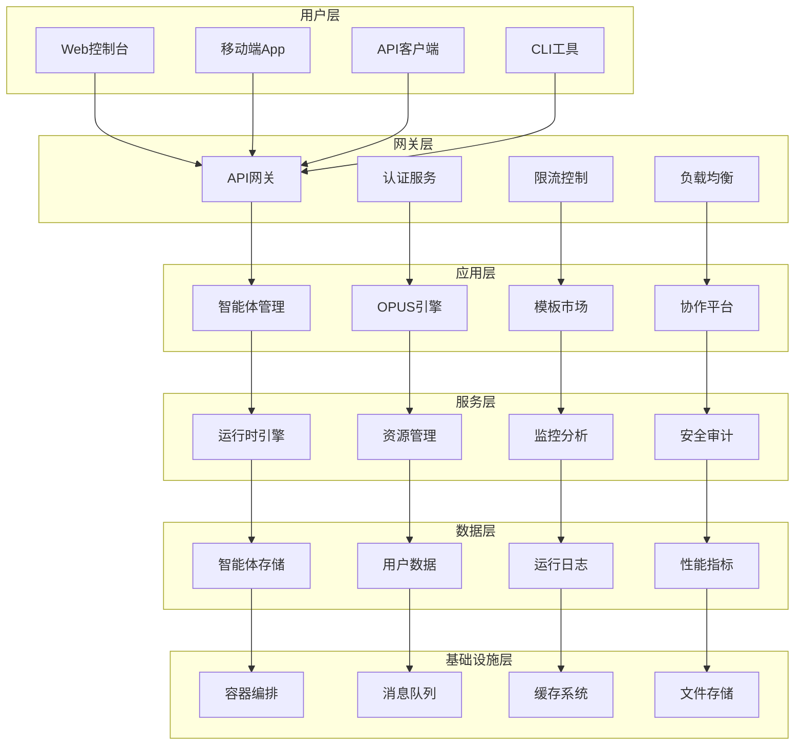

# 智能体产品架构设计

## 🎯 产品定位

基于OPUS框架的智能体产品是一个企业级AI智能体平台，提供从提示词设计到产品部署的完整解决方案，支持大规模智能体的开发、管理和运营。

### 产品愿景
- **智能体即服务(AaaS)**：Agent as a Service平台
- **低代码开发**：可视化智能体构建
- **企业级部署**：支持私有化和云端部署
- **生态化运营**：智能体市场和协作平台

## 🏗️ 整体产品架构

### 系统架构图


### 技术栈选择
```yaml
frontend:
  web: "React 18 + TypeScript + Vite"
  mobile: "React Native + TypeScript"
  ui_framework: "Ant Design + Tailwind CSS"

backend:
  api_gateway: "Kong / Traefik"
  microservices: "FastAPI + Python 3.11"
  auth: "Keycloak / Auth0"
  message_queue: "Redis + Celery"

data:
  database: "PostgreSQL + MongoDB"
  cache: "Redis Cluster"
  search: "Elasticsearch"
  vector_db: "Chroma / Weaviate"

infrastructure:
  orchestration: "Kubernetes"
  service_mesh: "Istio"
  monitoring: "Prometheus + Grafana"
  logging: "ELK Stack"
  deployment: "ArgoCD + GitOps"
```

## 🎨 用户界面设计

### Web控制台架构
```typescript
// 前端架构设计
interface AppArchitecture {
  pages: {
    dashboard: DashboardPage;      // 仪表板
    agents: AgentManagementPage;   // 智能体管理
    marketplace: MarketplacePage;   // 模板市场
    development: DevelopmentPage;   // 开发环境
    deployment: DeploymentPage;     // 部署管理
    analytics: AnalyticsPage;       // 数据分析
  };
  
  components: {
    AgentBuilder: VisualBuilder;    // 可视化构建器
    CodeEditor: MonacoEditor;       // 代码编辑器
    ChatInterface: ChatComponent;   // 对话测试界面
    DeploymentWizard: StepWizard;  // 部署向导
  };
  
  services: {
    agentService: AgentAPIService;
    authService: AuthenticationService;
    deploymentService: DeploymentService;
    monitoringService: MonitoringService;
  };
}
```

### 智能体可视化构建器
```typescript
class VisualAgentBuilder {
  constructor() {
    this.canvas = new AgentCanvas();
    this.toolbox = new ComponentToolbox();
    this.propertyPanel = new PropertyEditor();
  }
  
  // 组件拖拽构建
  handleComponentDrop(component: AgentComponent, position: Position) {
    this.canvas.addComponent(component, position);
    this.updateConnectionGraph();
  }
  
  // 自动生成OPUS代码
  generateOpusCode(): string {
    const components = this.canvas.getComponents();
    return this.opusGenerator.generate(components);
  }
  
  // 实时预览
  previewAgent(): AgentPreview {
    const opusCode = this.generateOpusCode();
    return this.agentPreviewService.render(opusCode);
  }
}
```

### 对话测试界面
```typescript
class ChatTestInterface {
  constructor(private agentId: string) {
    this.chatHistory = [];
    this.agentConfig = this.loadAgentConfig(agentId);
  }
  
  async sendMessage(message: string): Promise<void> {
    // 显示用户消息
    this.addMessage('user', message);
    
    // 发送到智能体
    const response = await this.agentService.chat(this.agentId, {
      message,
      context: this.getContext()
    });
    
    // 显示智能体回复
    this.addMessage('agent', response.content);
    
    // 更新性能指标
    this.updateMetrics(response.metrics);
  }
  
  private getContext(): ConversationContext {
    return {
      history: this.chatHistory.slice(-10),
      sessionId: this.sessionId,
      userId: this.currentUser.id
    };
  }
}
```

## 🚀 核心服务设计

### 智能体管理服务
```python
class AgentManagementService:
    """智能体管理服务"""
    
    def __init__(self):
        self.agent_store = AgentStorageService()
        self.opus_engine = OpusRuntimeEngine()
        self.deployment_service = DeploymentService()
    
    async def create_agent(self, agent_spec: AgentSpec) -> Agent:
        """创建新智能体"""
        # 1. 验证OPUS规范
        validation_result = await self.validate_opus_spec(agent_spec.opus_code)
        if not validation_result.valid:
            raise ValidationError(validation_result.errors)
        
        # 2. 创建智能体实例
        agent = Agent(
            id=generate_agent_id(),
            name=agent_spec.name,
            opus_code=agent_spec.opus_code,
            owner_id=agent_spec.owner_id,
            created_at=datetime.utcnow()
        )
        
        # 3. 保存到存储
        await self.agent_store.save(agent)
        
        # 4. 初始化运行时
        await self.opus_engine.initialize_agent(agent)
        
        return agent
    
    async def update_agent(self, agent_id: str, updates: AgentUpdate) -> Agent:
        """更新智能体"""
        agent = await self.agent_store.get(agent_id)
        
        # 更新OPUS代码
        if updates.opus_code:
            await self.validate_and_update_opus(agent, updates.opus_code)
        
        # 重新部署（如果需要）
        if agent.status == AgentStatus.DEPLOYED:
            await self.deployment_service.redeploy(agent_id)
        
        return agent
    
    async def delete_agent(self, agent_id: str) -> None:
        """删除智能体"""
        # 1. 停止运行时
        await self.opus_engine.stop_agent(agent_id)
        
        # 2. 清理部署
        await self.deployment_service.cleanup(agent_id)
        
        # 3. 删除存储
        await self.agent_store.delete(agent_id)
```

### OPUS运行时引擎
```python
class OpusRuntimeEngine:
    """OPUS运行时引擎"""
    
    def __init__(self):
        self.agent_instances = {}
        self.memory_manager = MemoryManager()
        self.tool_manager = ToolManager()
    
    async def initialize_agent(self, agent: Agent) -> None:
        """初始化智能体运行时"""
        # 1. 解析OPUS代码
        opus_parser = OpusParser()
        components = opus_parser.parse(agent.opus_code)
        
        # 2. 创建运行时实例
        runtime = AgentRuntime(
            agent_id=agent.id,
            identity=components.identity,
            architecture=components.architecture,
            memory=self.memory_manager.create_memory_system(components.memory),
            formats=components.formats,
            workflow=components.workflow,
            constraints=components.constraints
        )
        
        # 3. 初始化工具集成
        if components.architecture.external_tools:
            await self.tool_manager.setup_tools(runtime, components.architecture.external_tools)
        
        # 4. 缓存运行时实例
        self.agent_instances[agent.id] = runtime
    
    async def process_request(self, agent_id: str, request: AgentRequest) -> AgentResponse:
        """处理智能体请求"""
        if agent_id not in self.agent_instances:
            raise AgentNotFoundError(agent_id)
        
        runtime = self.agent_instances[agent_id]
        
        try:
            # 执行工作流
            response = await runtime.execute_workflow(request)
            
            # 记录性能指标
            await self.record_metrics(agent_id, request, response)
            
            return response
            
        except Exception as e:
            # 错误处理和监控
            await self.handle_error(agent_id, request, e)
            raise
```

### 部署管理服务
```python
class DeploymentService:
    """部署管理服务"""
    
    def __init__(self):
        self.k8s_client = KubernetesClient()
        self.registry_client = ContainerRegistryClient()
        self.config_manager = ConfigurationManager()
    
    async def deploy_agent(self, agent: Agent, deployment_config: DeploymentConfig) -> Deployment:
        """部署智能体"""
        # 1. 生成代码工程
        code_generator = OpusCodeGenerator()
        project = await code_generator.generate_project(agent)
        
        # 2. 构建容器镜像
        image_tag = f"{agent.name}:{agent.version}"
        await self.build_and_push_image(project, image_tag)
        
        # 3. 生成Kubernetes配置
        k8s_configs = self.generate_k8s_configs(agent, deployment_config, image_tag)
        
        # 4. 部署到集群
        deployment = await self.k8s_client.apply_configs(k8s_configs)
        
        # 5. 更新智能体状态
        await self.update_agent_status(agent.id, AgentStatus.DEPLOYED)
        
        return deployment
    
    async def scale_agent(self, agent_id: str, replicas: int) -> None:
        """扩缩容智能体"""
        deployment_name = f"agent-{agent_id}"
        await self.k8s_client.scale_deployment(deployment_name, replicas)
    
    async def rollback_agent(self, agent_id: str, version: str) -> None:
        """回滚智能体版本"""
        deployment_name = f"agent-{agent_id}"
        await self.k8s_client.rollback_deployment(deployment_name, version)
```

### 监控分析服务
```python
class MonitoringService:
    """监控分析服务"""
    
    def __init__(self):
        self.metrics_collector = MetricsCollector()
        self.alert_manager = AlertManager()
        self.analytics_engine = AnalyticsEngine()
    
    async def collect_agent_metrics(self, agent_id: str) -> AgentMetrics:
        """收集智能体指标"""
        metrics = await self.metrics_collector.collect(agent_id)
        
        return AgentMetrics(
            agent_id=agent_id,
            request_count=metrics.request_count,
            response_time=metrics.avg_response_time,
            error_rate=metrics.error_rate,
            memory_usage=metrics.memory_usage,
            cpu_usage=metrics.cpu_usage,
            tool_usage=metrics.tool_usage_stats,
            timestamp=datetime.utcnow()
        )
    
    async def analyze_performance(self, agent_id: str, time_range: TimeRange) -> PerformanceAnalysis:
        """分析性能表现"""
        metrics_data = await self.metrics_collector.get_historical_data(agent_id, time_range)
        
        analysis = self.analytics_engine.analyze(metrics_data)
        
        return PerformanceAnalysis(
            agent_id=agent_id,
            performance_score=analysis.overall_score,
            bottlenecks=analysis.identified_bottlenecks,
            optimization_suggestions=analysis.suggestions,
            trend_analysis=analysis.trends
        )
    
    async def setup_alerts(self, agent_id: str, alert_rules: List[AlertRule]) -> None:
        """设置告警规则"""
        for rule in alert_rules:
            await self.alert_manager.create_rule(agent_id, rule)
```

## 🛒 智能体市场设计

### 模板市场架构
```python
class AgentMarketplace:
    """智能体市场"""
    
    def __init__(self):
        self.template_store = TemplateStorageService()
        self.review_service = ReviewService()
        self.recommendation_engine = RecommendationEngine()
    
    async def publish_template(self, template: AgentTemplate) -> Publication:
        """发布智能体模板"""
        # 1. 质量检查
        quality_check = await self.perform_quality_check(template)
        if not quality_check.passed:
            raise QualityCheckFailedError(quality_check.issues)
        
        # 2. 安全扫描
        security_scan = await self.perform_security_scan(template)
        if security_scan.has_vulnerabilities:
            raise SecurityVulnerabilityError(security_scan.vulnerabilities)
        
        # 3. 发布到市场
        publication = Publication(
            template_id=template.id,
            publisher_id=template.creator_id,
            status=PublicationStatus.PUBLISHED,
            published_at=datetime.utcnow()
        )
        
        await self.template_store.publish(publication)
        
        return publication
    
    async def search_templates(self, query: SearchQuery) -> SearchResults:
        """搜索模板"""
        # 语义搜索
        semantic_results = await self.semantic_search(query.text)
        
        # 标签过滤
        filtered_results = self.filter_by_tags(semantic_results, query.tags)
        
        # 排序和分页
        sorted_results = self.sort_results(filtered_results, query.sort_by)
        paginated_results = self.paginate(sorted_results, query.page, query.page_size)
        
        return SearchResults(
            templates=paginated_results,
            total_count=len(filtered_results),
            facets=self.generate_facets(filtered_results)
        )
    
    async def get_recommendations(self, user_id: str) -> List[AgentTemplate]:
        """获取推荐模板"""
        user_profile = await self.get_user_profile(user_id)
        return await self.recommendation_engine.recommend(user_profile)
```

### 协作平台设计
```python
class CollaborationPlatform:
    """协作平台"""
    
    def __init__(self):
        self.workspace_manager = WorkspaceManager()
        self.version_control = VersionControlService()
        self.sharing_service = SharingService()
    
    async def create_workspace(self, workspace_spec: WorkspaceSpec) -> Workspace:
        """创建协作工作空间"""
        workspace = Workspace(
            id=generate_workspace_id(),
            name=workspace_spec.name,
            owner_id=workspace_spec.owner_id,
            members=workspace_spec.initial_members,
            permissions=workspace_spec.permissions
        )
        
        # 初始化版本控制
        await self.version_control.init_repository(workspace.id)
        
        return workspace
    
    async def share_agent(self, agent_id: str, sharing_config: SharingConfig) -> SharingLink:
        """分享智能体"""
        sharing_link = SharingLink(
            agent_id=agent_id,
            permissions=sharing_config.permissions,
            expiry_date=sharing_config.expiry_date,
            access_token=generate_access_token()
        )
        
        await self.sharing_service.create_link(sharing_link)
        
        return sharing_link
    
    async def fork_agent(self, agent_id: str, user_id: str) -> Agent:
        """复制智能体"""
        original_agent = await self.agent_store.get(agent_id)
        
        forked_agent = Agent(
            id=generate_agent_id(),
            name=f"{original_agent.name} (Fork)",
            opus_code=original_agent.opus_code,
            owner_id=user_id,
            parent_id=agent_id,
            created_at=datetime.utcnow()
        )
        
        await self.agent_store.save(forked_agent)
        
        return forked_agent
```

## 📊 数据架构设计

### 数据模型定义
```python
# 核心数据模型
@dataclass
class Agent:
    id: str
    name: str
    description: str
    opus_code: str
    owner_id: str
    workspace_id: Optional[str]
    status: AgentStatus
    version: str
    tags: List[str]
    created_at: datetime
    updated_at: datetime
    deployment_config: Optional[DeploymentConfig]
    metrics: Optional[AgentMetrics]

@dataclass
class AgentTemplate:
    id: str
    name: str
    description: str
    category: str
    opus_code: str
    creator_id: str
    price: Decimal
    license: str
    downloads: int
    rating: float
    reviews: List[Review]
    created_at: datetime

@dataclass
class Workspace:
    id: str
    name: str
    owner_id: str
    members: List[WorkspaceMember]
    agents: List[str]  # agent IDs
    settings: WorkspaceSettings
    created_at: datetime

@dataclass
class Deployment:
    id: str
    agent_id: str
    environment: str
    status: DeploymentStatus
    replicas: int
    resources: ResourceRequirements
    endpoints: List[Endpoint]
    created_at: datetime
```

### 数据存储策略
```yaml
storage_strategy:
  postgresql:
    tables:
      - agents: "智能体基本信息"
      - workspaces: "工作空间信息"
      - deployments: "部署信息"
      - users: "用户信息"
    
  mongodb:
    collections:
      - agent_runs: "智能体运行记录"
      - conversations: "对话历史"
      - metrics: "性能指标"
      - logs: "系统日志"
    
  redis:
    usage:
      - session_cache: "用户会话缓存"
      - agent_cache: "智能体运行时缓存"
      - rate_limiting: "API限流"
      - message_queue: "异步任务队列"
    
  elasticsearch:
    indices:
      - agent_templates: "模板搜索索引"
      - logs: "日志搜索索引"
      - metrics: "指标分析索引"
```

## 🔐 安全架构设计

### 身份认证与授权
```python
class SecurityService:
    """安全服务"""
    
    def __init__(self):
        self.auth_provider = AuthenticationProvider()
        self.rbac_manager = RBACManager()
        self.audit_logger = AuditLogger()
    
    async def authenticate_request(self, request: HTTPRequest) -> AuthContext:
        """请求认证"""
        token = self.extract_token(request)
        
        if not token:
            raise UnauthenticatedError()
        
        user = await self.auth_provider.validate_token(token)
        
        return AuthContext(
            user_id=user.id,
            permissions=await self.rbac_manager.get_permissions(user.id),
            session_id=user.session_id
        )
    
    async def authorize_action(self, context: AuthContext, resource: str, action: str) -> bool:
        """动作授权"""
        return await self.rbac_manager.check_permission(
            context.user_id,
            resource,
            action
        )
    
    async def audit_action(self, context: AuthContext, action: AuditAction) -> None:
        """审计日志"""
        await self.audit_logger.log(AuditEvent(
            user_id=context.user_id,
            action=action.name,
            resource=action.resource,
            timestamp=datetime.utcnow(),
            ip_address=action.ip_address,
            user_agent=action.user_agent
        ))
```

### 智能体安全扫描
```python
class AgentSecurityScanner:
    """智能体安全扫描器"""
    
    def __init__(self):
        self.opus_analyzer = OpusSecurityAnalyzer()
        self.vulnerability_db = VulnerabilityDatabase()
    
    async def scan_agent(self, agent: Agent) -> SecurityScanResult:
        """扫描智能体安全性"""
        scan_result = SecurityScanResult(agent_id=agent.id)
        
        # 1. OPUS代码安全分析
        opus_issues = await self.opus_analyzer.analyze(agent.opus_code)
        scan_result.add_issues(opus_issues)
        
        # 2. 依赖安全检查
        dependencies = self.extract_dependencies(agent.opus_code)
        for dep in dependencies:
            vulnerabilities = await self.vulnerability_db.check(dep)
            scan_result.add_vulnerabilities(vulnerabilities)
        
        # 3. 权限分析
        permissions = self.analyze_permissions(agent.opus_code)
        if self.has_excessive_permissions(permissions):
            scan_result.add_warning("Excessive permissions detected")
        
        return scan_result
```

## 📈 性能优化设计

### 缓存策略
```python
class CacheManager:
    """缓存管理器"""
    
    def __init__(self):
        self.redis_client = RedisClient()
        self.local_cache = LocalLRUCache(max_size=1000)
    
    async def get_agent_runtime(self, agent_id: str) -> Optional[AgentRuntime]:
        """获取智能体运行时（带缓存）"""
        # 1. 检查本地缓存
        runtime = self.local_cache.get(f"runtime:{agent_id}")
        if runtime:
            return runtime
        
        # 2. 检查Redis缓存
        runtime_data = await self.redis_client.get(f"runtime:{agent_id}")
        if runtime_data:
            runtime = self.deserialize_runtime(runtime_data)
            self.local_cache.set(f"runtime:{agent_id}", runtime)
            return runtime
        
        return None
    
    async def cache_agent_runtime(self, agent_id: str, runtime: AgentRuntime) -> None:
        """缓存智能体运行时"""
        # 1. 缓存到本地
        self.local_cache.set(f"runtime:{agent_id}", runtime)
        
        # 2. 缓存到Redis
        runtime_data = self.serialize_runtime(runtime)
        await self.redis_client.setex(
            f"runtime:{agent_id}",
            3600,  # 1小时过期
            runtime_data
        )
```

### 负载均衡与扩展
```python
class LoadBalancer:
    """负载均衡器"""
    
    def __init__(self):
        self.health_checker = HealthChecker()
        self.routing_strategy = RoundRobinStrategy()
    
    async def route_request(self, agent_id: str, request: AgentRequest) -> str:
        """路由请求到最优实例"""
        # 1. 获取可用实例
        instances = await self.get_healthy_instances(agent_id)
        
        if not instances:
            raise NoHealthyInstancesError(agent_id)
        
        # 2. 选择最优实例
        selected_instance = self.routing_strategy.select(instances, request)
        
        return selected_instance.endpoint
    
    async def get_healthy_instances(self, agent_id: str) -> List[AgentInstance]:
        """获取健康的智能体实例"""
        all_instances = await self.instance_registry.get_instances(agent_id)
        healthy_instances = []
        
        for instance in all_instances:
            if await self.health_checker.is_healthy(instance):
                healthy_instances.append(instance)
        
        return healthy_instances
```

## 📱 移动端设计

### React Native应用架构
```typescript
// 移动端应用架构
class MobileApp {
  constructor() {
    this.navigationContainer = new NavigationContainer();
    this.stateManager = new StateManager();
    this.apiClient = new APIClient();
  }
  
  // 主要屏幕组件
  screens = {
    Dashboard: DashboardScreen,
    AgentList: AgentListScreen,
    AgentChat: AgentChatScreen,
    AgentBuilder: AgentBuilderScreen,
    Settings: SettingsScreen
  };
  
  // 离线支持
  async handleOfflineMode() {
    const cachedData = await this.cacheManager.getAllCachedData();
    this.stateManager.loadOfflineState(cachedData);
  }
  
  // 推送通知
  async setupPushNotifications() {
    const token = await this.notificationService.getToken();
    await this.apiClient.registerDeviceToken(token);
  }
}
```

### 移动端特性
```typescript
class MobileFeatures {
  // 语音交互
  async startVoiceChat(agentId: string) {
    const audioRecorder = new AudioRecorder();
    const audioStream = await audioRecorder.start();
    
    const transcription = await this.speechToText(audioStream);
    const response = await this.apiClient.chatWithAgent(agentId, transcription);
    
    await this.textToSpeech(response.content);
  }
  
  // 离线智能体
  async enableOfflineAgent(agentId: string) {
    const agentData = await this.apiClient.downloadAgent(agentId);
    await this.localDB.storeAgent(agentData);
    
    // 启用本地推理
    this.localInference.loadAgent(agentData);
  }
  
  // 位置感知
  async getLocationContext(): Promise<LocationContext> {
    const location = await this.geolocation.getCurrentPosition();
    const placeInfo = await this.placesAPI.getPlaceInfo(location);
    
    return {
      coordinates: location,
      placeName: placeInfo.name,
      placeType: placeInfo.type
    };
  }
}
```

## 🚀 部署架构

### 云原生部署
```yaml
# Kubernetes部署配置
apiVersion: argoproj.io/v1alpha1
kind: Application
metadata:
  name: opus-platform
  namespace: argocd
spec:
  project: default
  source:
    repoURL: https://github.com/opus-platform/k8s-configs
    targetRevision: HEAD
    path: .
  destination:
    server: https://kubernetes.default.svc
    namespace: opus-platform
  syncPolicy:
    automated:
      prune: true
      selfHeal: true
    syncOptions:
    - CreateNamespace=true

---
# 微服务部署
apiVersion: apps/v1
kind: Deployment
metadata:
  name: agent-management-service
spec:
  replicas: 3
  selector:
    matchLabels:
      app: agent-management
  template:
    metadata:
      labels:
        app: agent-management
    spec:
      containers:
      - name: agent-management
        image: opus-platform/agent-management:latest
        ports:
        - containerPort: 8000
        env:
        - name: DATABASE_URL
          valueFrom:
            secretKeyRef:
              name: db-secret
              key: url
        resources:
          requests:
            memory: "512Mi"
            cpu: "250m"
          limits:
            memory: "1Gi"
            cpu: "500m"
```

### 监控和可观测性
```yaml
# Prometheus配置
apiVersion: monitoring.coreos.com/v1
kind: ServiceMonitor
metadata:
  name: opus-platform-metrics
spec:
  selector:
    matchLabels:
      app: opus-platform
  endpoints:
  - port: metrics
    interval: 30s
    path: /metrics

---
# Grafana Dashboard配置
apiVersion: integreatly.org/v1alpha1
kind: GrafanaDashboard
metadata:
  name: opus-platform-dashboard
spec:
  json: |
    {
      "dashboard": {
        "title": "OPUS Platform Metrics",
        "panels": [
          {
            "title": "Agent Request Rate",
            "type": "graph",
            "targets": [
              {
                "expr": "rate(agent_requests_total[5m])"
              }
            ]
          }
        ]
      }
    }
```

## 🔮 未来扩展规划

### AI增强功能
```python
class AIEnhancedFeatures:
    """AI增强功能"""
    
    async def auto_optimize_agent(self, agent_id: str) -> OptimizationResult:
        """智能体自动优化"""
        # 分析性能数据
        performance_data = await self.analytics_service.get_performance_data(agent_id)
        
        # AI优化建议
        optimization_suggestions = await self.ai_optimizer.analyze(performance_data)
        
        # 自动应用优化
        optimized_agent = await self.apply_optimizations(agent_id, optimization_suggestions)
        
        return OptimizationResult(
            original_performance=performance_data.current_metrics,
            optimized_performance=await self.test_performance(optimized_agent),
            applied_optimizations=optimization_suggestions
        )
    
    async def smart_template_recommendation(self, user_query: str) -> List[AgentTemplate]:
        """智能模板推荐"""
        # 理解用户需求
        intent_analysis = await self.nlp_service.analyze_intent(user_query)
        
        # 匹配相似模板
        similar_templates = await self.similarity_engine.find_similar(intent_analysis)
        
        # 个性化排序
        personalized_results = await self.personalization_engine.rank(
            similar_templates,
            user_id=self.current_user.id
        )
        
        return personalized_results
```

### 生态系统集成
```python
class EcosystemIntegration:
    """生态系统集成"""
    
    async def integrate_with_platform(self, platform: str, config: IntegrationConfig):
        """集成外部平台"""
        integration_handlers = {
            "slack": SlackIntegration(),
            "teams": TeamsIntegration(),
            "discord": DiscordIntegration(),
            "whatsapp": WhatsAppIntegration()
        }
        
        handler = integration_handlers.get(platform)
        if handler:
            await handler.setup_integration(config)
            return await handler.test_connection()
        
        raise UnsupportedPlatformError(platform)
    
    async def marketplace_federation(self, external_marketplace: str):
        """市场联邦化"""
        # 连接外部市场
        federation_client = FederationClient(external_marketplace)
        
        # 同步模板库
        external_templates = await federation_client.sync_templates()
        
        # 本地化处理
        localized_templates = await self.localization_service.process(external_templates)
        
        # 更新本地市场
        await self.marketplace.merge_templates(localized_templates)
```

---

*这个智能体产品架构设计为OPUS智能体提供了完整的产品化解决方案，从用户界面到后端服务，从部署运维到生态集成，构建了一个企业级的智能体服务平台。*