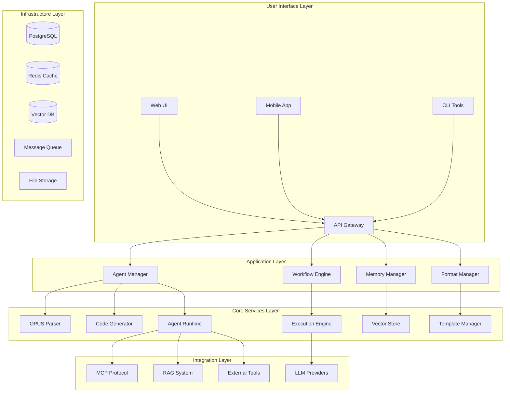

# OPUS Agent Platform Architecture

## 🏗️ System Overview

Converting the OPUS prompt engineering framework into a full agent platform similar to Dify, Coze, and CrewAI.

### Platform Layers



## 🎨 Frontend Architecture

### Technology Stack
```typescript
// Frontend Tech Stack
const FRONTEND_STACK = {
  framework: "React 18 + TypeScript",
  buildTool: "Vite",
  ui: "Ant Design + Tailwind CSS",
  state: "Zustand + React Query",
  router: "React Router v6",
  visualization: "D3.js + Mermaid",
  editor: "Monaco Editor (VS Code)"
}
```

### Key UI Components

#### 1. Agent Builder Interface
```typescript
interface AgentBuilderProps {
  // Visual OPUS component editor
  identityEditor: IdentityEditor;
  architectureDesigner: ArchitectureDesigner;
  memoryConfigurer: MemoryConfigurer;
  formatManager: FormatManager;
  workflowEditor: WorkflowEditor;
  constraintsEditor: ConstraintsEditor;
  
  // Real-time preview
  livePreview: AgentPreview;
  testConsole: TestConsole;
}
```

#### 2. Workflow Designer
```typescript
interface WorkflowDesigner {
  // Visual node-based workflow editor
  nodeTypes: WorkflowNode[];
  connections: WorkflowConnection[];
  
  // OPUS pseudocode integration
  codeView: PseudocodeEditor;
  visualView: FlowchartEditor;
  
  // Testing and debugging
  debugMode: boolean;
  executionTracer: ExecutionTrace[];
}
```

#### 3. Agent Dashboard
```typescript
interface AgentDashboard {
  // Agent management
  agentList: AgentCard[];
  deploymentStatus: DeploymentInfo[];
  
  // Analytics
  performanceMetrics: MetricsWidget[];
  conversationLogs: ConversationLog[];
  
  // Collaboration
  teamWorkspace: TeamWorkspace;
  agentTemplates: TemplateLibrary;
}
```

## 🔧 Backend Architecture

### Core Services

#### 1. Agent Manager Service
```python
from fastapi import FastAPI
from pydantic import BaseModel
from typing import Dict, List, Optional

class AgentManagerService:
    """Central agent management service"""
    
    def __init__(self):
        self.opus_parser = OPUSParser()
        self.code_generator = CodeGenerator()
        self.deployment_manager = DeploymentManager()
    
    async def create_agent(self, opus_content: str) -> Agent:
        """Create agent from OPUS definition"""
        # Parse OPUS content
        ast = self.opus_parser.parse(opus_content)
        components = self.opus_parser.extract_components(ast)
        
        # Generate code
        agent_code = self.code_generator.generate_agent(components)
        
        # Create agent instance
        agent = Agent(
            id=generate_uuid(),
            name=components["identity"]["name"],
            code=agent_code,
            components=components,
            status="created"
        )
        
        await self.save_agent(agent)
        return agent
    
    async def deploy_agent(self, agent_id: str, deployment_config: DeploymentConfig) -> DeploymentResult:
        """Deploy agent to target environment"""
        agent = await self.get_agent(agent_id)
        
        if deployment_config.target == "kubernetes":
            return await self.deploy_to_k8s(agent, deployment_config)
        elif deployment_config.target == "docker":
            return await self.deploy_to_docker(agent, deployment_config)
        elif deployment_config.target == "serverless":
            return await self.deploy_to_serverless(agent, deployment_config)
```

#### 2. OPUS Runtime Engine
```python
class OPUSRuntimeEngine:
    """Enhanced runtime for OPUS agents"""
    
    def __init__(self):
        self.memory_manager = DynamicMemoryManager()
        self.format_manager = FormatManager()
        self.workflow_engine = WorkflowEngine()
        self.tool_manager = ToolManager()
    
    async def process_request(self, agent: Agent, request: AgentRequest) -> AgentResponse:
        """Process user request through OPUS agent"""
        
        # 1. Memory retrieval and context building
        context = await self.memory_manager.retrieve_context(
            agent_id=agent.id,
            query=request.message,
            memory_paths=agent.components["memory"]["paths"]
        )
        
        # 2. Format module activation
        active_formats = self.format_manager.get_active_formats(
            agent.components["formats"],
            request.format_type
        )
        
        # 3. Workflow execution
        result = await self.workflow_engine.execute(
            workflows=agent.components["workflow"],
            context=context,
            formats=active_formats,
            tools=self.tool_manager.get_available_tools(agent)
        )
        
        # 4. Memory storage
        await self.memory_manager.store_interaction(
            agent_id=agent.id,
            request=request,
            response=result,
            memory_updates=result.memory_updates
        )
        
        return AgentResponse(
            message=result.content,
            format=active_formats["interaction"],
            metadata=result.metadata,
            memory_state=result.memory_state
        )
```

#### 3. Memory System
```python
class DynamicMemoryManager:
    """Advanced memory management for OPUS agents"""
    
    def __init__(self):
        self.vector_store = VectorStore()
        self.graph_store = GraphStore()
        self.cache = RedisCache()
    
    async def store(self, agent_id: str, path: str, data: Any, embedding: bool = True) -> None:
        """Store data in agent's memory with dynamic paths"""
        
        memory_key = f"agent:{agent_id}:memory:{path}"
        
        # Store in structured storage
        await self.graph_store.store(memory_key, data)
        
        # Generate embeddings for semantic search
        if embedding and isinstance(data, str):
            vector = await self.generate_embedding(data)
            await self.vector_store.store(memory_key, vector, {
                "agent_id": agent_id,
                "path": path,
                "content": data[:500],  # Preview
                "timestamp": datetime.utcnow()
            })
        
        # Cache recent memories
        await self.cache.set(f"recent:{memory_key}", data, ttl=3600)
    
    async def locate(self, agent_id: str, context: str, paths: List[str] = None) -> List[MemoryItem]:
        """Intelligent memory location using context"""
        
        # Semantic search in vector store
        query_vector = await self.generate_embedding(context)
        similar_memories = await self.vector_store.search(
            vector=query_vector,
            filter={"agent_id": agent_id},
            limit=10
        )
        
        # Path-based retrieval if specified
        if paths:
            path_memories = []
            for path in paths:
                memory_key = f"agent:{agent_id}:memory:{path}"
                data = await self.graph_store.get(memory_key)
                if data:
                    path_memories.append(MemoryItem(path=path, data=data, source="path"))
        
        # Combine and rank results
        return self.rank_memories(similar_memories + path_memories, context)
```

## 🔄 Workflow Engine

### OPUS Pseudocode Execution
```python
class WorkflowEngine:
    """Execute OPUS pseudocode workflows"""
    
    def __init__(self):
        self.pseudocode_parser = PseudocodeParser()
        self.execution_context = ExecutionContext()
        self.state_manager = StateManager()
    
    async def execute(self, workflows: Dict[str, str], context: Dict, formats: Dict, tools: ToolManager) -> WorkflowResult:
        """Execute OPUS workflow"""
        
        # Parse pseudocode to execution tree
        execution_tree = self.pseudocode_parser.parse(workflows)
        
        # Set up execution context
        self.execution_context.set_context({
            "memory": context,
            "formats": formats,
            "tools": tools,
            "state": self.state_manager.get_state()
        })
        
        # Execute workflow tree
        result = await self.execute_tree(execution_tree)
        
        return WorkflowResult(
            content=result.output,
            metadata=result.metadata,
            memory_updates=result.memory_updates,
            tool_calls=result.tool_calls
        )
    
    async def execute_tree(self, tree: ExecutionTree) -> ExecutionResult:
        """Recursively execute workflow tree"""
        results = []
        
        for node in tree.nodes:
            if node.type == "function_call":
                result = await self.execute_function(node)
            elif node.type == "conditional":
                result = await self.execute_conditional(node)
            elif node.type == "loop":
                result = await self.execute_loop(node)
            elif node.type == "tool_call":
                result = await self.execute_tool_call(node)
            
            results.append(result)
            
            # Update execution context with result
            self.execution_context.update(result)
        
        return self.combine_results(results)
```

## 🎨 Visual Agent Builder

### Component Editors

#### 1. Identity Editor
```typescript
const IdentityEditor: React.FC = () => {
  const [identity, setIdentity] = useAgentStore(state => [state.identity, state.setIdentity]);
  
  return (
    <Card title="Agent Identity">
      <Form layout="vertical">
        <Form.Item label="Professional Role">
          <TextArea 
            value={identity.role}
            onChange={(e) => setIdentity({...identity, role: e.target.value})}
            placeholder="Define the agent's professional identity..."
          />
        </Form.Item>
        
        <Form.Item label="Constraints">
          <TagEditor 
            tags={identity.constraints}
            onChange={(constraints) => setIdentity({...identity, constraints})}
            placeholder="Add behavioral constraints..."
          />
        </Form.Item>
        
        <Form.Item label="Application Scenarios">
          <ScenarioSelector
            scenarios={identity.scenarios}
            onChange={(scenarios) => setIdentity({...identity, scenarios})}
          />
        </Form.Item>
      </Form>
    </Card>
  );
};
```

#### 2. Architecture Designer
```typescript
const ArchitectureDesigner: React.FC = () => {
  const [architecture, setArchitecture] = useAgentStore(state => [state.architecture, state.setArchitecture]);
  
  return (
    <Tabs>
      <TabPane tab="Knowledge Base" key="knowledge">
        <KnowledgeEditor 
          knowledge={architecture.knowledge}
          onChange={(knowledge) => setArchitecture({...architecture, knowledge})}
        />
      </TabPane>
      
      <TabPane tab="Core Skills" key="skills">
        <SkillsEditor
          skills={architecture.skills}
          onChange={(skills) => setArchitecture({...architecture, skills})}
        />
      </TabPane>
      
      <TabPane tab="External Tools" key="tools">
        <ToolsIntegration
          tools={architecture.tools}
          onChange={(tools) => setArchitecture({...architecture, tools})}
        />
      </TabPane>
      
      <TabPane tab="RAG System" key="rag">
        <RAGConfiguration
          rag={architecture.rag}
          onChange={(rag) => setArchitecture({...architecture, rag})}
        />
      </TabPane>
    </Tabs>
  );
};
```

#### 3. Memory Configurator
```typescript
const MemoryConfigurator: React.FC = () => {
  const [memory, setMemory] = useAgentStore(state => [state.memory, state.setMemory]);
  
  return (
    <Space direction="vertical" size="large" style={{width: '100%'}}>
      <Card title="Memory Architecture">
        <MemoryTreeEditor 
          paths={memory.paths}
          onChange={(paths) => setMemory({...memory, paths})}
        />
      </Card>
      
      <Card title="Memory Operations">
        <MemoryOperationsEditor
          operations={memory.operations}
          onChange={(operations) => setMemory({...memory, operations})}
        />
      </Card>
      
      <Card title="Storage Strategy">
        <StorageConfigEditor
          config={memory.storage}
          onChange={(storage) => setMemory({...memory, storage})}
        />
      </Card>
    </Space>
  );
};
```

## 🔧 Integration Systems

### MCP (Model Context Protocol) Integration
```python
class MCPIntegration:
    """MCP protocol integration for external tools"""
    
    def __init__(self):
        self.mcp_client = MCPClient()
        self.tool_registry = ToolRegistry()
    
    async def register_mcp_server(self, server_config: MCPServerConfig) -> None:
        """Register MCP server"""
        await self.mcp_client.connect(server_config.url)
        
        # Discover available tools
        tools = await self.mcp_client.list_tools()
        
        # Register tools in agent platform
        for tool in tools:
            await self.tool_registry.register(Tool(
                name=tool.name,
                description=tool.description,
                schema=tool.input_schema,
                handler=self.create_mcp_handler(tool)
            ))
    
    def create_mcp_handler(self, tool: MCPTool) -> Callable:
        """Create handler for MCP tool"""
        async def handler(params: Dict) -> Dict:
            return await self.mcp_client.call_tool(tool.name, params)
        return handler
```

### RAG System Integration
```python
class RAGSystem:
    """Advanced RAG system for knowledge augmentation"""
    
    def __init__(self):
        self.vector_store = VectorStore()
        self.chunker = DocumentChunker()
        self.embedder = EmbeddingService()
        self.retriever = HybridRetriever()
    
    async def ingest_documents(self, documents: List[Document], agent_id: str) -> None:
        """Ingest documents for agent's knowledge base"""
        
        for doc in documents:
            # Chunk document
            chunks = self.chunker.chunk(doc.content)
            
            # Generate embeddings
            for chunk in chunks:
                embedding = await self.embedder.embed(chunk.text)
                
                # Store in vector database
                await self.vector_store.store(
                    id=f"agent:{agent_id}:doc:{doc.id}:chunk:{chunk.id}",
                    vector=embedding,
                    metadata={
                        "agent_id": agent_id,
                        "document_id": doc.id,
                        "chunk_id": chunk.id,
                        "text": chunk.text,
                        "source": doc.source
                    }
                )
    
    async def retrieve(self, query: str, agent_id: str, k: int = 5) -> List[RetrievedChunk]:
        """Retrieve relevant chunks for query"""
        
        # Generate query embedding
        query_embedding = await self.embedder.embed(query)
        
        # Hybrid retrieval (semantic + keyword)
        results = await self.retriever.retrieve(
            query_vector=query_embedding,
            query_text=query,
            filter={"agent_id": agent_id},
            k=k
        )
        
        return results
```

## 📱 Deployment Architecture

### Container Orchestration
```yaml
# kubernetes/agent-platform.yaml
apiVersion: apps/v1
kind: Deployment
metadata:
  name: opus-agent-platform
spec:
  replicas: 3
  selector:
    matchLabels:
      app: opus-agent-platform
  template:
    metadata:
      labels:
        app: opus-agent-platform
    spec:
      containers:
      - name: api-server
        image: opus-platform/api:latest
        ports:
        - containerPort: 8000
        env:
        - name: DATABASE_URL
          valueFrom:
            secretKeyRef:
              name: db-credentials
              key: url
        resources:
          requests:
            memory: "512Mi"
            cpu: "250m"
          limits:
            memory: "1Gi"
            cpu: "500m"
      
      - name: agent-runtime
        image: opus-platform/runtime:latest
        ports:
        - containerPort: 8001
        env:
        - name: REDIS_URL
          value: "redis://redis:6379"
        resources:
          requests:
            memory: "1Gi"
            cpu: "500m"
          limits:
            memory: "2Gi"
            cpu: "1000m"
```

### Auto-scaling Configuration
```yaml
# kubernetes/hpa.yaml
apiVersion: autoscaling/v2
kind: HorizontalPodAutoscaler
metadata:
  name: opus-agent-platform-hpa
spec:
  scaleTargetRef:
    apiVersion: apps/v1
    kind: Deployment
    name: opus-agent-platform
  minReplicas: 3
  maxReplicas: 20
  metrics:
  - type: Resource
    resource:
      name: cpu
      target:
        type: Utilization
        averageUtilization: 70
  - type: Resource
    resource:
      name: memory
      target:
        type: Utilization
        averageUtilization: 80
```

## 🔒 Security & Monitoring

### Security Framework
```python
class SecurityManager:
    """Comprehensive security management"""
    
    def __init__(self):
        self.auth_service = AuthService()
        self.rbac = RBACManager()
        self.audit_logger = AuditLogger()
        self.scanner = SecurityScanner()
    
    async def secure_agent_execution(self, agent: Agent, request: AgentRequest, user: User) -> SecurityResult:
        """Secure agent execution pipeline"""
        
        # 1. Authentication & Authorization
        if not await self.auth_service.verify_token(request.token):
            raise UnauthorizedError("Invalid token")
        
        if not await self.rbac.check_permission(user, f"agent:{agent.id}:execute"):
            raise ForbiddenError("Insufficient permissions")
        
        # 2. Input validation and sanitization
        sanitized_request = await self.sanitize_request(request)
        
        # 3. Agent code security scan
        scan_result = await self.scanner.scan_agent_code(agent.code)
        if scan_result.has_vulnerabilities:
            raise SecurityError(f"Agent contains vulnerabilities: {scan_result.issues}")
        
        # 4. Audit logging
        await self.audit_logger.log_execution(user, agent, sanitized_request)
        
        return SecurityResult(
            approved=True,
            sanitized_request=sanitized_request,
            security_context=SecurityContext(user=user, agent=agent)
        )
```

### Monitoring & Analytics
```python
class MonitoringService:
    """Comprehensive monitoring and analytics"""
    
    def __init__(self):
        self.metrics_collector = MetricsCollector()
        self.alerting = AlertingService()
        self.analytics = AnalyticsEngine()
    
    async def track_agent_performance(self, agent_id: str, execution_time: float, memory_usage: int, success: bool) -> None:
        """Track agent performance metrics"""
        
        metrics = {
            "agent_id": agent_id,
            "execution_time": execution_time,
            "memory_usage": memory_usage,
            "success": success,
            "timestamp": datetime.utcnow()
        }
        
        await self.metrics_collector.collect(metrics)
        
        # Check for performance issues
        if execution_time > 30.0:  # 30 seconds threshold
            await self.alerting.send_alert(
                type="performance",
                message=f"Agent {agent_id} execution time exceeded threshold: {execution_time}s"
            )
        
        # Update analytics
        await self.analytics.update_agent_stats(agent_id, metrics)
```

## 🚀 Getting Started

### Installation
```bash
# Clone the repository
git clone https://github.com/your-org/opus-agent-platform.git
cd opus-agent-platform

# Install dependencies
pip install -r requirements.txt
npm install

# Set up environment
cp .env.example .env
# Edit .env with your configuration

# Start services
docker-compose up -d

# Run migrations
alembic upgrade head

# Start the platform
python -m uvicorn src.main:app --reload
```

### Creating Your First Agent
```bash
# Using CLI
opus-cli create-agent --input my-agent.opus --name "My First Agent"

# Using API
curl -X POST http://localhost:8000/api/v1/agents \
  -H "Content-Type: application/json" \
  -d '{
    "name": "My First Agent",
    "opus_content": "...",
    "deployment_config": {
      "target": "docker",
      "resources": {"memory": "512Mi", "cpu": "250m"}
    }
  }'
```

This architecture provides a comprehensive foundation for converting your OPUS framework into a production-ready agent platform comparable to industry leaders like Dify, Coze, and CrewAI.